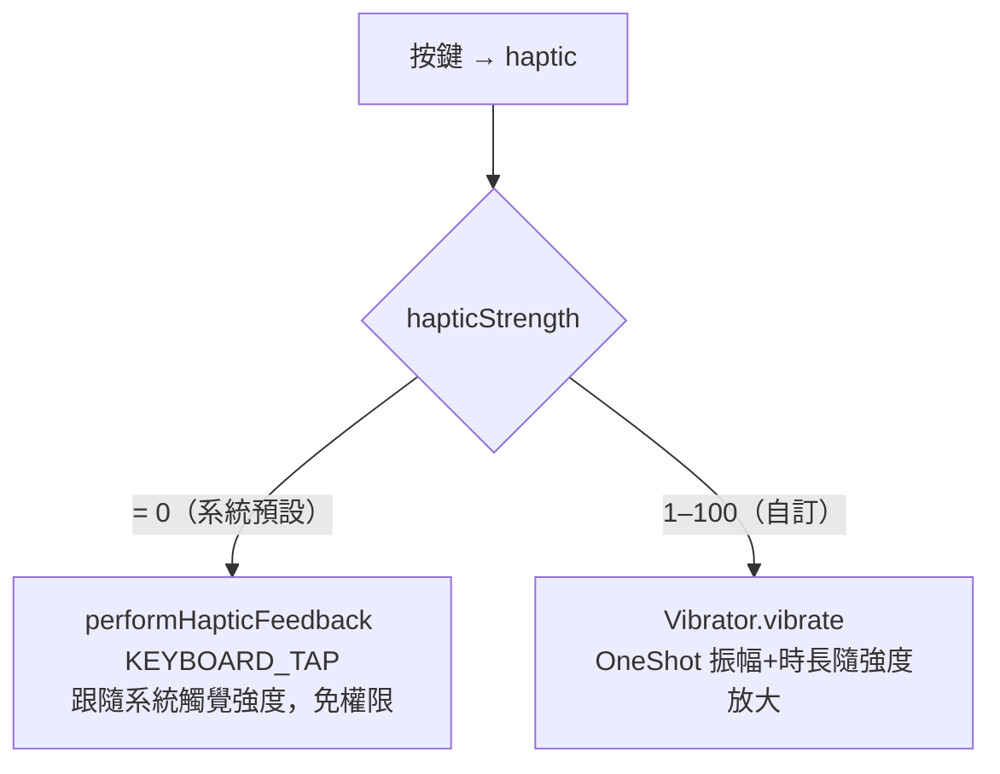

2026-09-02

# 設定頁新增震動強度滑桿（issue #4）

## 需求

Issue #4 第一點除了「按下才震」（已另修，見 [haptic-on-touch-down]），還提到
「震動感偏弱無法調強弱」— 手機系統觸覺已調最強仍嫌弱。

## 為什麼原本調不了

全鍵盤震動走 `View.performHapticFeedback(KEYBOARD_TAP)`。這個 API 的強度
完全由系統觸覺設定決定，app 端無法加碼 — 系統調到最強就是上限。要能自訂
強度，得改用 `Vibrator.vibrate(VibrationEffect)` 自己指定振幅與時長。

## 做法

- `Prefs.hapticStrength`（0–100）：**0 = 系統預設**（沿用 `KEYBOARD_TAP`，
  維持舊行為與不需權限的路徑）；**1–100 = 自訂**，映射
  `amplitude = 255 * s / 100`（1–255）、`duration = 8 + s*24/100`（8–32ms）。
  振幅與時長都放大 — 有振幅控制的馬達兩者都吃；on/off 馬達只吃時長，
  仍能感受強弱差。映射函式 `customHapticEffect(strength)` 放 Prefs.kt，
  設定頁試震與 IME 共用同一份。
- 設定頁「按鍵觸覺回饋」開關下方加滑桿（0–100）；放開滑桿
  （`onStopTrackingTouch`）以目前強度試震一下，讓使用者邊調邊感受。
- `OhMyBiasImeService.haptic()` 依強度分流；`vibrator` 惰性快取
  （API 31+ 走 `VibratorManager.defaultVibrator`，以下走 `Vibrator`）。

## 一個上線前才會踩到的坑：VIBRATE 權限

`Vibrator.vibrate()` 需要 `android.permission.VIBRATE`；`performHapticFeedback`
不需要，所以專案原本整份 manifest 連一條 `uses-permission` 都沒有。第一版
忘了補，滑桿放開試震時直接
`SecurityException: Neither user nor current process has android.permission.VIBRATE`
崩潰（`onStopTrackingTouch` → `Vibrator.vibrate`）。補上
`<uses-permission android:name="android.permission.VIBRATE" />` 後正常。

## 驗證

模擬器沒有實體馬達，但 `dumpsys vibrator_manager` 會記錄每筆震動的效果與
發起 app。強度設 100 時，鍵面按壓與滑桿放開試震都送出
`Step{amplitude=1.0, frequencyHz=0.0, duration=32}`（`opPkg=info.plateaukao.ohmybias`）
— 即自訂 OneShot，而非系統預設路徑的 `Prebaked{effect=CLICK}`。
（驗證過程一度把 Prebaked CLICK 誤判為修正無效，實為當下前景輸入法是
Gboard `opPkg=com.google.android.inputmethod.latin` — 冷啟後預設輸入法被
系統退回，重設回本鍵盤後即見自訂效果。）`testDebugUnitTest` 全過。

[haptic-on-touch-down]: ./ohmybias-android-haptic-on-touch-down.md
