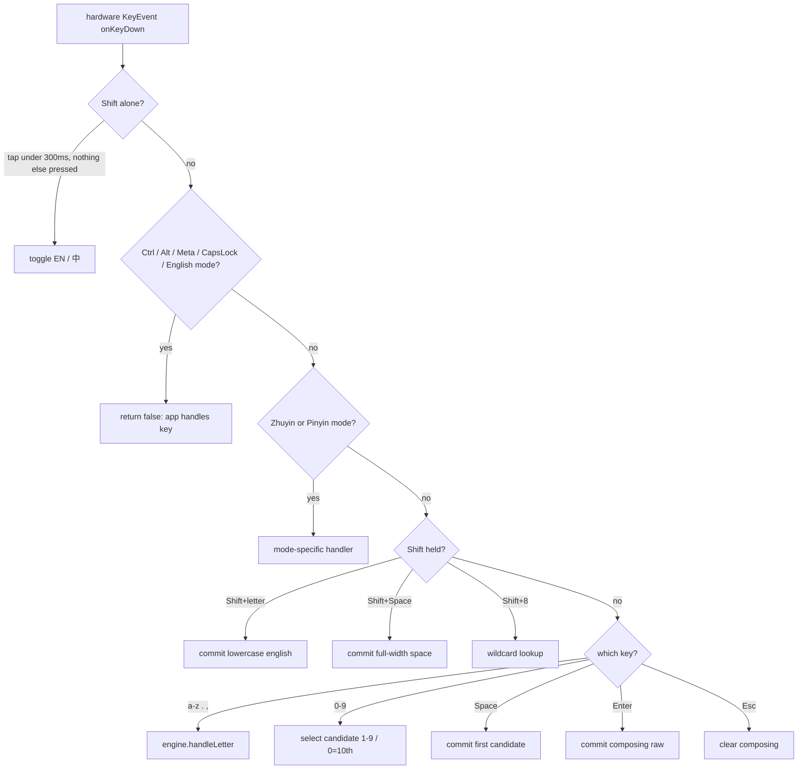
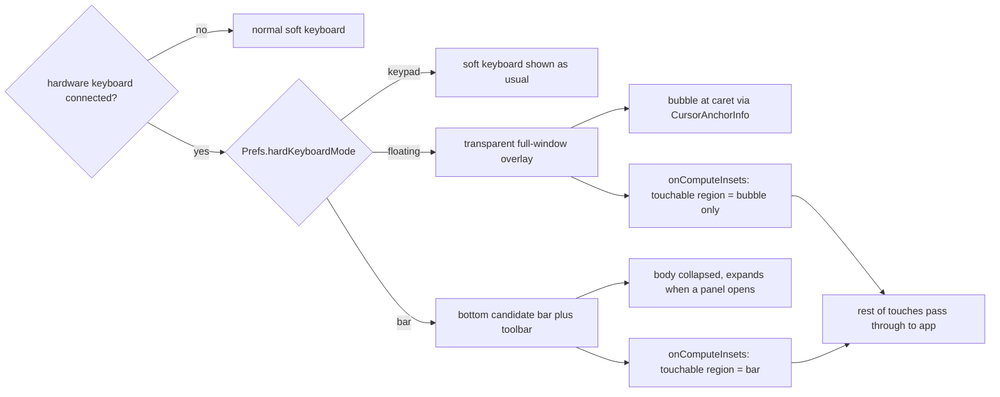

2026-08-27

# 實體鍵盤支援：三種畫面模式＋按鍵直通引擎

## 這是什麼、為什麼

OhMyBias 米 過去只處理軟體鍵盤的觸控事件；接上藍牙／USB 實體鍵盤時，實體按鍵完全繞過 `InputEngine`，等於中文組字失效。這次補上完整的實體鍵盤路徑，並讓使用者依情境選畫面。

動機是實體鍵盤的使用者「會盲打」：他不需要一整塊軟體鍵盤佔掉半個螢幕，多半也不需要聯想詞來打斷節奏。所以除了讓實體按鍵能組字，還要能把 IME 的視覺干擾降到最低。設定頁「實體鍵盤」提供三種畫面（切換即時生效）：

- **keypad** — 照常顯示軟體鍵盤（實體＋軟體並用）。
- **floating** — 只在游標旁浮出組字／候選氣泡，其餘畫面全透明。
- **bar** — 螢幕底部固定一條候選列＋工具列，鍵盤本體平常收起。

## 按鍵語意（對齊 macOS 上游）

`HardwareKeyHandler` 把 `KeyEvent` 轉成引擎呼叫，語意一對一抄自 macOS 版 `YabomishInputController.handleWithNewEngine`，不自創行為：

幾個刻意的設計點：

- **單按 Shift 切換中英**：在 `onKeyUp` 判斷，需按下到放開 <300ms、且期間沒觸發別的鍵（`pendingShiftToggle` 在任何其他 `onKeyDown` 被清掉）。與 macOS 版的 `flagsChanged` 計時邏輯同義。
- **放行給 app 一律回 `false`**：英文模式、CapsLock 亮著、含 Ctrl/Alt/Meta 修飾、方向鍵、Tab —— 都不吞，讓宿主 app 拿到原生按鍵。組字中遇到要放行的鍵，先 `flushComposing()`（有候選送首選、否則 `handleEscape`）再放行。
- **吞掉的鍵在 keyUp 一併吞**：`consumed` HashSet 記住 down 時吞過的 keyCode，`onKeyUp` 對應吞掉，避免 app 收到孤兒的 up 事件。
- **數字選字用畫面標號（1–9、0＝第10）**，不直接用 `%selkey` 位置 —— 部分字表 selkey 從 0 起算會差一格。

## 三種畫面怎麼實作

關鍵限制：Android IME 沒有「浮動視窗」這種原生型態，IME 視窗就是貼在螢幕底部的一塊。要做出「游標旁的氣泡」與「不干擾 app 版面」，靠的是**把 IME 根視圖撐滿整個視窗但透明，再用 `onComputeInsets` 精準回報可觸區與內容高度**。

- **根視圖撐滿**：`ImeRootLayout` 把框架給的 `AT_MOST` 高度改成 `EXACTLY` 撐滿，這樣浮動層才有整個視窗的空間擺氣泡；一般（keypad）模式不撐、維持 `WRAP_CONTENT`。
- **可觸區與內容高度**：覆蓋模式的 `onComputeInsets` 把 `contentTopInsets`／`visibleTopInsets` 設到「底部面板頂」（floating 面板收起時＝視窗底），這樣 app 的版面不會被整片透明視窗推上去；`touchableInsets = REGION`，region 只 union 面板與氣泡矩形，其餘觸控穿透到 app。
- **游標位置**：floating 模式 `requestCursorUpdates(IMMEDIATE|MONITOR)`，在 `onUpdateCursorAnchorInfo` 把 `insertionMarker` 經 matrix 轉成容器座標擺氣泡；游標在畫面外或欄位不回報就退回貼底置中。切輸入框當下的 request 偶爾回 `false`（連線尚未 active），於是在 `onUpdateSelection` 補要一次。
- **強制顯示**：三種模式都覆寫 `onEvaluateInputViewShown`／`onShowInputRequested` 回 `true`，無視系統「實體鍵盤時顯示虛擬鍵盤」開關 —— 否則使用者把它關掉後，連組字氣泡都看不見。
- **Back 鍵**：floating 模式的視窗幾乎看不見，Back 不該被它默默吃掉去收視窗；組字中當 Esc、否則放行給 app。

## 聯想與軟鍵盤分開

新增 `Prefs.suggestWithHardKeyboard`（預設**關**），攔在 Android 層的 `engineDidSuggest`：`hardKeyboardPresent() && !suggestWithHardKeyboard` 時直接 return，不顯示聯想。之所以攔在平台層而非引擎，是因為「有沒有接實體鍵盤」是 Android 的 `Configuration` 狀態，`InputEngine` 是跨平台共用碼不該知道。此開關仍受聯想總開關 `suggestEnabled` 節制。

## 設定頁精簡

實體鍵盤新增的說明本身很長，順手把整頁縮短：模式選擇改**下拉選單**（收合時只顯示目前選項）、使用說明／指令速查改**點開才展開的收合區**、分類標題**放大加粗**（13sp → 17sp bold，原本與內文同大不明顯），最底部加**版本列** `vX.Y.Z © Daniel Kao`（版號由 `packageManager` 讀取）。

## 驗證

模擬器（回報有硬體鍵盤）實測三模式：組字／數字選字／Shift 切換／Enter 原樣上屏、氣泡跟游標、聯想氣泡、底列面板展開收合、透明穿透、toast、聯想開關的開關兩態。JVM 引擎測試 52/52 通過。

一次 code review 抓到兩個真問題並已修：floating 的 toast 在游標貼齊螢幕頂、退回下方擺放時多加了一個自身高度（off-by-h）；以及一個 dead field。其餘為風格建議，保留原樣。
