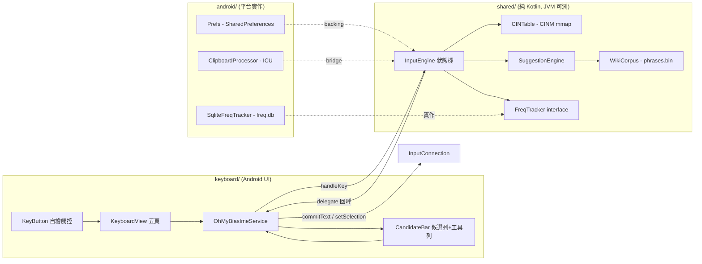

2026-08-15

# OhMyBias 米 Android 移植：引擎、鍵盤 UI、設定頁

`~/src/ohmybias-android` 新專案 — 把 iOS 版嘸蝦米輸入法（`ohmybias-ios`）完整移植到
Android（InputMethodService）。純 Kotlin、零第三方執行期依賴，單一 APK 內含 IME service
與設定 Activity。引擎層與 iOS `Shared/` 一對一對應，之後上游修正可雙向同步。

## 架構與平台對應

關鍵移植決策：

- **單一 APK 取代 App Group**：iOS 的鍵盤 appex 與容器 app 需經 App Group 共享資料；
  Android 的 IME service 與 Activity 本來就同 process，資料統一放 `filesDir/shared/`，
  整層共享機制直接消失。
- **二進位格式不變**：CINM（liu.bin）與 PHMM（phrases.bin）與 iOS 位元組相同，檔案可
  跨平台搬移。mmap 以 `FileChannel.map` + `MappedByteBuffer`（LE、容許非對齊）包成
  `BinData`，對應 iOS 的 `Data(mappedIfSafe)` + `loadUnaligned`。
- **FreqTracker 抽成 interface**：iOS 直接用 SQLite3 C API；Android 把 unigram/bigram
  加權排序與 pinned 前置放在 interface default method（與 iOS 數學相同），儲存層分成
  `SqliteFreqTracker`（android.database.sqlite，freq.db 三表同 iOS）與
  `MemoryFreqTracker`（JVM 測試）。引擎因此在主機 JVM 上可測 —
  iOS `Tests/main.swift` 的 14 個案例移植成 13 個 JUnit 測試，全綠。
- **簡繁轉換**：iOS 的 `StringTransform("Hans-Hant")` → Android `android.icu.text.Transliterator`
  （minSdk 29 起內建），行為等價、仍零依賴。
- **鍵盤 UI 全自繪**：iOS 用 UIStackView 約束；Android 版 `KeyboardView` 自訂 ViewGroup
  手動排版（首列定單位寬、第二列同寬置中、含空白鍵的排其他鍵用上一排單位寬），
  `KeyButton` 自繪＋自行處理觸控（點按/上下滑手勢/長按選單/⌫ 連刪/空白鍵游標拖曳），
  視覺與 sweetlime 線稿風一致。
- **liu.cin 版權紅線不變**：只能使用者匯入（SAF）、on-device 編譯，絕不隨附。

## 模擬器驗證（Pixel_7_API_34，經軟體鍵盤實點）

以合成測試字表驗證核心流程全部通過：組字→候選→空白送出、萌典聯想（臺→灣/北市…藍字
點選上屏）、VRSF 快選、注音查碼（ㄅㄚ→字頻排序候選→上屏自動退出）、字頻學習
（`,,UNPINhj` 後連選乎三次 → 乎 前移）、成對標點（「」游標置中 — 後續注音字落在引號內
證明）、`,,` 指令 toast、中英切換＋shift、九宮格數字頁、符號面板（分類切換/插入/返回）。

## 過程中抓到的 bug：clipChildren=false 會讓 drawColor 越界

候選列（含工具列）完全不顯示，但版面 dump 顯示一切正常（位置、尺寸、visibility 都對）。
根因：為了讓長按氣泡凸出按鍵範圍，鍵盤根視圖設了 `clipChildren=false` — 此時子視圖
`onDraw` 的 canvas 剪裁範圍**超出自身邊界**，`KeyboardView.onDraw` 用 `canvas.drawColor()`
畫背景就把整個 IME 視窗（含上方候選列）刷成白色蓋掉了。修正：改畫
`drawRect(0, 0, width, height)` 有界矩形。此約束已記入專案 CLAUDE.md。

另補：`,,ZH` 等指令切換引擎模式後，iOS 靠後續 delegate 回呼換頁、時機不穩 — Android 版
在每次 `handleKey` 後統一 `syncPageWithEngine()`，行為更確定。

## 後續

剩餘驗證清單（長按選單、`,,H/S/TO/PYS/RS/V`、深色模式、emoji/顏文字面板、SAF 匯入等）
與 README 見專案 `PLAN.md`，由進行中的 loop 迭代繼續。
