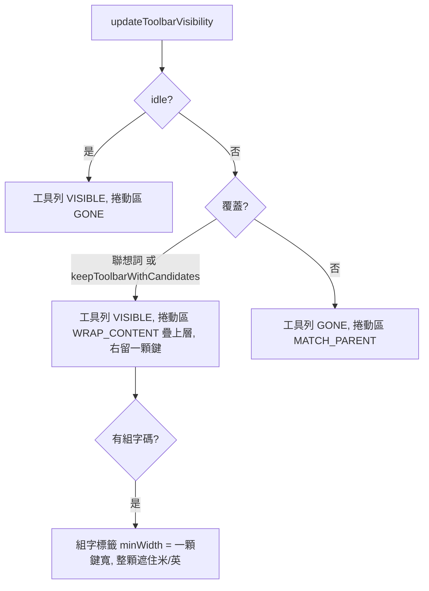

2026-08-21

# OhMyBias 米 Android：「組字候選時保留工具列」選項

## 做什麼

設定頁新增開關**「組字候選時保留工具列」**（預設關）。開了之後，打字中的
組字候選不再把工具列整條換掉，而是像聯想列一樣**覆蓋**在工具列上：候選有多寬
就蓋多寬，右側固定留一顆鍵，蓋不到的工具列鍵（收折鍵盤 ∨、設定、剪貼…）
打字打到一半也點得到。

這是緊接著「聯想列覆蓋工具列」（見 ohmybias-android-suggestion-overlay-toolbar）
的下一步：使用者希望**組字候選**也有同樣的行為，但候選是輸入的主體、整條寬
的顯示對多數人還是比較好讀，所以做成選項而不是直接改預設。

## 怎麼做

`CandidateBar.updateToolbarVisibility` 的覆蓋條件從「聯想詞」擴成
「聯想詞 **或** `Prefs.keepToolbarWithCandidates`」；幾何（`applyOverlayGeometry`）
完全共用。

### 組字標籤壓在第一顆鍵上

聯想列出現時沒有組字碼，所以之前不用管；組字候選則左邊一定有 `pa` 這種碼，
位置正好是工具列第一顆鍵（米/英），兩者會疊在一起透出字。處理：

- 組字標籤改在工具列**之後**加進 FrameLayout（疊上層、先收觸控），高度
  MATCH_PARENT、底色與列同色 — 不透明才遮得住。
- 覆蓋模式下標籤 `minWidth` 撐到一顆鍵寬減 2dp（標籤左緣 10dp、工具列左緣 8dp），
  整顆米/英遮掉；候選從標籤右緣 + 8dp 開始。
- `applyComposingMargin` 併入 `applyOverlayGeometry`，因為 minWidth 會改變標籤量測
  寬度；`onSizeChanged` 拿到真實寬度後一併修正。

打字中點工具列鍵是安全的：編輯類動作（貼上、全選、復原…）本來就先
`engine.handleEscape()`；面板切換只換鍵盤頁；收折鍵盤走 `onFinishInputView`
清掉組字 — 模擬器上 `pa` 組字中按 ∨，鍵盤收起、再開是乾淨的工具列。

### 驗證

模擬器 Pixel_7_API_34：預設關 → `p → 備` 整條佔滿；切開 → `p`、`pa` 候選覆蓋在
工具列上，右側 ∨ 可點、收折後重開無殘留；送字後的聯想列覆蓋行為不變。
