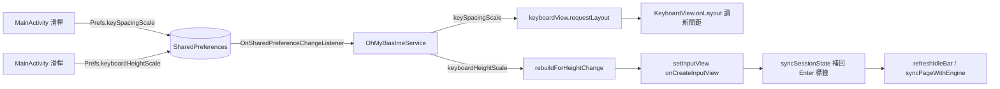

2026-08-22

# OhMyBias Android：新增「按鍵間距」設定，並讓高度／間距即時生效

## 為什麼

鍵盤鍵面之間的留白一直是寫死的常數，藏在 `KeyboardView.onLayout` 裡：

```kotlin
val padTop = dp(6f); val padBottom = dp(6f); val padSide = dp(3f)
val rowSpacing = dp(8f); val keySpacing = dp(5f)
```

在窄螢幕上這些縫加起來吃掉不少可按面積 —— 一排十顆鍵就有九道 5dp 的鍵距，
加上左右內縮，實際落在指頭下的鍵面比看起來小。使用者已經可以調鍵盤「高度」，
卻不能調這個，於是提出：間距能不能比照高度也做成滑桿？

同時暴露出第二個問題：高度滑桿標的是「重開鍵盤生效」。要比較兩個值就得
收鍵盤、再點輸入框、再滑回設定頁，來回好幾趟才調得出滿意的數字。間距如果
也這樣，會更難調 —— 間距是一格一格看差別的東西，非即時反饋幾乎沒法用。

## 怎麼做

### 一個係數涵蓋所有分頁

所有按鍵分頁（字母／數字／符號／注音／九宮格）都走同一段 `onLayout`：
`rowsOfButtons` 建好後由那五個常數決定排版。因此只要新增一個縮放係數
`Prefs.keySpacingScale`（0–150%，預設 100%）乘上去，就一次涵蓋全部頁面，
不必逐頁改。符號／emoji／顏文字面板走的是 `CollectionPanelView`，不受影響。

值得留意的是縮小間距的**副作用正是想要的效果**：`rowHeight` 由
`(h - padTop - padBottom - rowSpacing * (rowCount - 1)) / rowCount` 算出，
所以間距調小時鍵盤總高度不變、省下來的空間全部長進鍵面。0% 就是鍵與鍵完全貼合。

### 即時生效：同 process 的偏好監聽

IME 與設定頁在同一個 APK、同一個 process（`filesDir/shared` 那套設計的延伸好處），
所以不需要 broadcast 或 AIDL —— `SharedPreferences.OnSharedPreferenceChangeListener`
就夠了。註冊在 `onCreate`、`onDestroy` 解除；因為 SharedPreferences 對 listener
只保 weak reference，必須用欄位持有它，不能寫成匿名 lambda 直接傳進去。

兩個偏好的處理路徑刻意不同：



間距便宜：`onLayout` 每次都重讀 `Prefs.keySpacingScale`，一個 `requestLayout()`
就好，按鍵物件、組字狀態、目前分頁全部原封不動。

高度貴：既有註解早就寫明「直接改 layoutParams IME 視窗不會可靠重量測」，
所以沿用 `onStartInputView` 那條已知可行的路徑 —— `setInputView(onCreateInputView())`
整組重建。重建的代價是新的 `KeyboardView` 帶著預設值出生，實測時 Enter 鍵
從「完成」變回預設的 `⏎`，因為 `returnKeyLabel` 是建構後才由 session 設定的。
補一句 `syncSessionState(shouldOfferSwitching() && !Prefs.hideGlobeKey,
returnLabel(currentInputEditorInfo))` 就把 Enter 標籤與 🌐 鍵狀態接回來；
組字狀態本來就活在 `engine` 裡，`refreshIdleBar` / `syncPageWithEngine` 負責把畫面補齊。

## 驗證

模擬器（`Pixel_7_API_34`）實機路徑，不是只跑單元測試：鍵盤開著的狀態下拖
按鍵間距 45%→142%、鍵盤高度 137%→98%，鍵盤都當場改變形狀，不需要收起再開。
高度重建之後用 IME 按鍵實際打字（`ah` → 候選 `感`）確認 delegate 接線沒斷、
Enter 鍵維持「完成」。`testDebugUnitTest` 通過。

一個已知的邊界：拖滑桿當下鍵盤若正顯示在同一個畫面上，會即時跟著變；但若在
設定頁改完之後直接點原本就已經 focus 的輸入框，Android 不見得會再發一次
`onStartInputView`。偏好監聽這條路徑不依賴那個回呼，所以這個情況也已經涵蓋 ——
這正是選監聽器而不是在 `onStartInputView` 裡比對舊值的原因。
