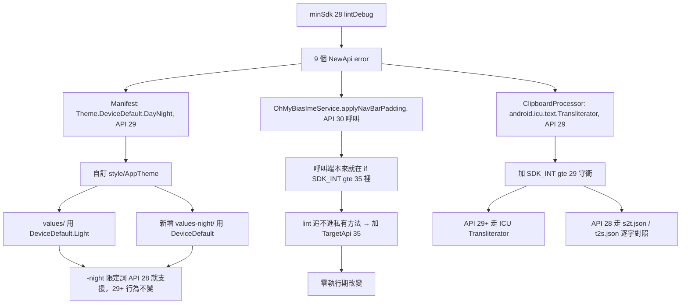

2026-08-22

# OhMyBias 米 Android：minSdk 29 → 28，支援 Android 9

## 為什麼

使用者問「最低支援到哪個 Android？Android 9 能跑嗎？」——不能，`minSdk = 29`
（Android 10）。接著的問題是「那要支援的話成本多少？」

先量再答：在 HEAD 開一個 detached worktree，把 `minSdk` 改成 28，跑
`:app:lintDebug`。結果只有 **3 處** API 29+ 用法（9 個 lint error，但集中在三個
地方），沒有任何第三方依賴的 minSdk 下限問題——本專案零執行期依賴，這點幫了大忙。

## 三個阻擋點與修法

改動總計 6 檔、+49 −8 行。

### 1. 主題

`@android:style/Theme.DeviceDefault.DayNight` 是 API 29 才有的。改成自訂
`@style/AppTheme`：`values/themes.xml` 繼承 `Theme.DeviceDefault.Light`、
`values-night/themes.xml` 繼承 `Theme.DeviceDefault`。

關鍵是 `-night` 這個資源限定詞比 API 29 老得多（`Configuration.UI_MODE_NIGHT_YES`
一直都在），所以 Android 9 靠開發者選項或 `cmd uimode night yes` 切過去時一樣會
命中深色那份。29+ 的行為和原本的 `DayNight` 完全一致。

### 2. IME 導覽列 insets

`applyNavBarPadding()` 裡有 `WindowInsets.Type.navigationBars()`、
`getInsets()`、`maximumWindowMetrics`，都是 API 30。但這是誤報：兩個呼叫端
（`onWindowShown()` 和 `onCreateInputView()`）本來就包在 `if (SDK_INT >= 35)` 裡，
lint 只是不會把版本守衛傳播進私有方法。

加 `@TargetApi(35)` 收工。用 `android.annotation.TargetApi` 而不是
`androidx.annotation.RequiresApi` ——本專案零第三方依賴，而 `android.annotation`
是平台公開 API（同檔案已經在用 `@SuppressLint`）。lint 會建議改用 `@RequiresApi`
「把需求傳播給呼叫端」，但那需要 androidx，且此處呼叫端已經守好了，warning 可接受。

### 3. 簡繁轉換 —— 這裡有個意外

原本 `ClipboardProcessor` 用 `android.icu.text.Transliterator`（一對一對應 iOS
的 `StringTransform("Hans-Hant")`）。SDK 的 `api-versions.xml` 標這個類別
`since = 29`，所以 lint 擋下。

第一直覺是「Android 9 沒這個類別 → 簡繁轉換會失效，這是唯一真正的功能損失」。
**實測推翻了這個假設。**

建了一版把守衛寫死 `useIcu = true`（等同原始程式碼）裝到 Android 9 上，跑
`,,VS`（剪貼簿繁→簡）：正常回傳「会」，沒有 crash，logcat 也沒有 hidden-API
警告。原因是 `android.icu` 這套 ICU4J 從 API 24 就在 ART 裡，`Transliterator`
只是到 API 29 才從 @hide 放進**公開 SDK**——那個 29 是編譯期的門檻，不是類別
存在的門檻，而 API 28 對這類 greylist 成員仍然放行。

（附帶一提：如果類別真的不存在，後果會比「不轉換」嚴重。缺類別丟的是
`NoClassDefFoundError`，屬於 `Error` 不是 `Exception`，原本那個
`catch (e: Exception)` 接不到，會直接讓 IME 崩掉。）

即使如此還是保留了守衛 + fallback，理由是取捨不是必要：AOSP 模擬器放行不代表
各家 OEM 的 Android 9 ROM 都放行 greylist，靠 hidden API 本來就不是能寫進
production code 的保證。加了守衛 lint 自然乾淨，不必用 `@SuppressLint` 把問題
壓下去。

fallback 用的是 app 早就隨身附著的 `s2t.json` / `t2s.json` ——`CINTable` 拿它們
做候選排序和 `,,TS` / `,,ST` 指令，`ClipboardProcessor` 只是沒用到而已。逐 code
point 查表、查不到原樣保留，約 40 行純 Kotlin，零新資產。方向確認過：
`s2t` 是簡→繁（国→國），對應 `toTraditional`；`t2s` 反之。

## 驗證

沒有 API 28 的 system image，新裝 `system-images;android-28;google_apis;arm64-v8a`
（2.6 GB）並建 `Pixel_API_28` AVD。

`sim-use` 在這裡用不了——它的 device bridge APK 本身 `minSdk 30`，裝不進
Android 9（`INSTALL_FAILED_OLDER_SDK`）。改用 adb + `uiautomator dump` +
`screencap` 手動驅動。

全程走軟鍵盤（IME）而非 `adb shell input text`，因為後者繞過 IME、會遮掉
「鍵盤根本沒彈出」「游標看不見」這類真正的 bug：

| 驗證項 | 結果 |
|---|---|
| 設定頁渲染（新 `@style/AppTheme`） | 通過 |
| 深色模式（`values-night/`） | 通過，與 `DayNight` 同效果 |
| liu.cin on-device 編譯 | 通過，「已載入：嘸蝦米 7（最長碼 4）」 |
| 點輸入框 → 軟鍵盤彈出、游標可見 | 通過 |
| 敲 `m`+`n` → 候選 `1 米 2 釆 3 闌` → 空白鍵送出 | 通過 |
| 送出後聯想（PHM2 `phrases.bin` mmap） | 通過，飯 苬 糧 粉 粒 |
| `,,VS` 剪貼簿繁→簡（會→会） | 通過 |
| crash buffer | 空 |

`assembleDebug` / `lintDebug` / `testDebugUnitTest` 在 minSdk 28 下全綠，
lint 零 `NewApi` error。

驗證用的 liu.cin 是從既有模擬器撈的（有版權，不進 repo、不留在暫存目錄）。

## 值得記下來的

**lint 的 `NewApi` error 分兩種，成本差很多。** 三處裡有兩處（主題、insets）
是純編譯期問題，改完零行為差異；只有一處牽涉真正的平台能力。先跑 lint 拿到
清單、再逐項判斷是「誤報」「換寫法」還是「真的沒有」，比憑印象估「降 minSdk
很麻煩」準得多。

**`api-versions.xml` 的 `since` 是公開 SDK 的門檻，不是 runtime 存在的門檻。**
兩者可以差好幾個版本。要知道實際行為只能跑跑看——這次跑了，結論從「唯一的
功能損失」變成「沒有功能損失」。
