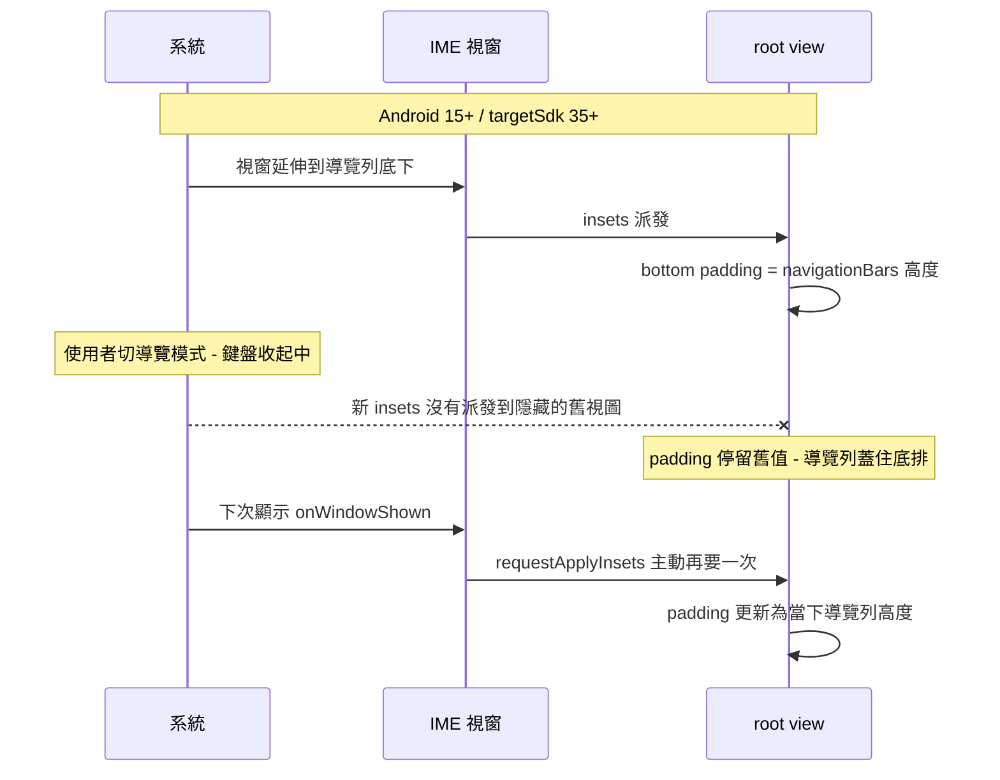

2026-08-17

# OhMyBias Android：Android 15/16 導覽列蓋住鍵盤最下排（0.3.1 hotfix）

## 什麼壞了

使用者回報鍵盤最下排被系統導覽列蓋住。Android 16（API 36）模擬器重現：
3 鍵導覽最嚴重 — 半透明導覽列整條壓在空白鍵那排上，按空白會按到 Home；
手勢導覽則是 pill 疊在底排。Android 14 以下完全正常。

## 根因

Play 上架時把 targetSdk 升到 36。Android 15（API 35）起，系統對 targetSdk 35+
的 app **強制 edge-to-edge，IME 視窗也包含在內**：鍵盤視窗延伸到螢幕最底、
畫在導覽列後面，框架不再自動把 IME 排在導覽列上方 — 吃 `navigationBars`
inset 變成 IME 自己的責任。所以只有升上 Android 15/16 的使用者中獎。

第一版修法（root 掛 insets listener 墊 bottom padding）驗證通過後又被使用者
抓到破口：**在鍵盤收起時切換導覽模式**（手勢 ↔ 3 鍵），隱藏中的舊視圖收不到
新 insets 派發，padding 停在舊值，導覽列又蓋回來。補上 `onWindowShown` 主動
`requestApplyInsets()` 才閉環：

兩處都以 `Build.VERSION.SDK_INT >= 35` 版本閘門包住 — 舊系統框架仍會自動
避開導覽列，維持原行為零風險。padding 讀的是系統當下回報的 inset 值而非
寫死高度，未來版本（API 37+）導覽列高度改變、甚至消失（inset = 0）都自動
跟上；Android 17 preview（API 37.0）模擬器亦驗證。

## 驗證

- 新建 AVD `Pixel_8_API_36`（Android 16）與 `Pixel_8_API_37`（Android 17
  preview），供日後新系統驗證
- API 36：手勢／3 鍵兩種導覽、以及「鍵盤收起時切換導覽模式再打開」的
  交叉情境（兩個方向）全部正確
- API 34 回歸：外觀與修法前完全相同（版本閘門未啟動）
- 實體 Pixel 9 Pro XL（Android 16）亦裝入 debug 版供實機測試
- 隨 0.3.1 hotfix 發佈（versionCode 4）
