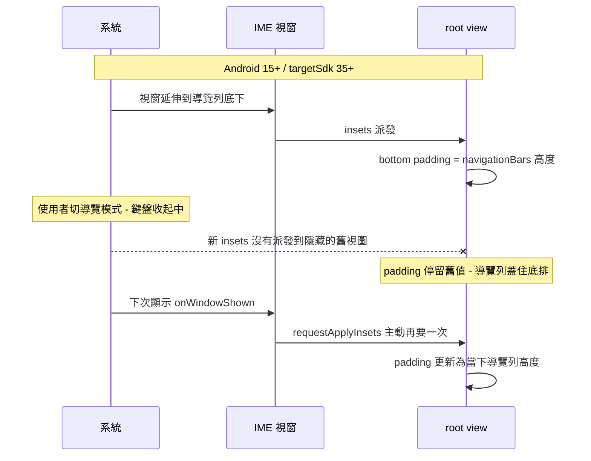

2026-08-17

# OhMyBias Android：Android 15/16/17 導覽列蓋住鍵盤最下排（0.3.1 hotfix）

## 什麼壞了

使用者回報鍵盤最下排被系統導覽列蓋住。Android 16（API 36）模擬器重現：
3 鍵導覽最嚴重 — 半透明導覽列整條壓在空白鍵那排上，按空白會按到 Home；
手勢導覽則是 pill 疊在底排。Android 14 以下完全正常。

## 根因（三層，逐一被使用者實測抓出來）

**第一層 — edge-to-edge 強制**：Play 上架時把 targetSdk 升到 36。Android 15
（API 35）起，系統對 targetSdk 35+ 的 app 強制 edge-to-edge，IME 視窗也包含
在內：鍵盤視窗延伸到螢幕最底、畫在導覽列後面，框架不再自動把 IME 排在導覽列
上方。修法：root 掛 insets listener，把導覽列高度墊成 bottom padding
（`SDK_INT >= 35` 閘門，舊系統框架仍自動避開、維持原行為）。

**第二層 — 切換導覽模式後 padding 不更新**：在鍵盤收起時切換手勢 ↔ 3 鍵，
隱藏中的舊視圖收不到新 insets 派發，padding 停在舊值，導覽列又蓋回來。
修法：`onWindowShown` 直接讀 `rootWindowInsets` 套 padding 並
`requestApplyInsets()`，每次顯示都跟上當下值。

**第三層 — Android 17 換了 inset 歸屬**：Pixel 9 Pro XL（Android 17）上
仍被「收鍵盤箭頭＋手勢 pill＋地球」飾件列壓住。logcat 實測 IME 視窗的
inset 值：`navigationBars` 只剩 54px（手勢 pill），飾件列的 108px 只算在
`tappableElement`（`systemBars` 亦 108）。修法：padding 改取
`navigationBars ∪ tappableElement` 聯集（`getInsets` 對聯集自動取每邊最大值），
三代通用 — A15/16 手勢模式 tappable=0、3 鍵模式 tappable=nav，行為不變；
A17 取到 108 整條讓開。讀的是系統當下回報值而非寫死高度，未來導覽列改高度
或消失都自動跟上。

## 驗證與教訓

- API 36 模擬器（新建 AVD `Pixel_8_API_36`）：手勢／3 鍵、以及「收起時切換
  導覽模式再打開」交叉情境（兩方向）全部正確；API 34 回歸無影響
- Android 17 為實體 Pixel 9 Pro XL 實測（`Pixel_8_API_37` AVD 已建好備用，
  該 image 首次開機過慢未及使用）
- **教訓：手機同時裝著 Play 版（`info.plateaukao.ohmybias.g`）與 debug 版
  （`info.plateaukao.ohmybias`）兩個套件** — adb 裝了新 APK 不代表在測它，
  作用中輸入法可能還是另一個套件。先 `settings get secure default_input_method`
  確認，再 `ime set` 切到要測的那個。這次因此空轉了兩輪 log 抓不到的除錯。
- 隨 0.3.1（versionCode 4）上傳 Play internal 軌
