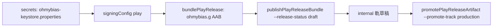

2026-08-16

# ohmybias-android：Google Play 上架準備 — playRelease 變體、GPP、targetSdk 36

首個 Google Play 發佈通道。做法整套沿用 einkbro／calliplus 的既有模式
（見 `einkbro-play-store-build-type.md`、`calliplus-gradle-play-publisher.md`），
差異只在這個 app 更單純：零權限、無 FileProvider、無硬編碼 package 字串，
`.g` 尾碼稽核一次就過。

## 變體與簽章

- `playRelease` build type：`initWith(release)`＋`applicationIdSuffix = ".g"` →
  裝置上是 `info.plateaukao.ohmybias.g`，與 GitHub 版（自家 OHMYBIAS keystore 簽）
  **並存**，簽章互不衝突。GitHub 版使用者（含開發機自己）不需移除重裝。
- 簽章用與 einkbro/calliplus 共用的 upload key；秘密一律在
  `~/.secrets/ohmybias-keystore.properties`（storeFile/storePassword/keyAlias/
  keyPassword/playCredentials），repo 內連 gitignored 副本都沒有。
  檔案不存在時 playRelease 退回 debug key — CI 與其他協作者照常可 build。
- 產出的 AAB 已驗證：applicationId `.g`、簽章為 2018 Daniel Studio upload 憑證
  （與 Play Console 期望的 upload key 一致）。

## 發佈管線（Gradle Play Publisher 3.12.1）

- `defaultToAppBundles` + 預設 `internal` 軌；上 production 一定要明講
  （`--track production` 或 promote）— 防呆同 calliplus。
- `playConfigs` 關閉 `release` 變體，聚合任務不會誤傳不存在的 applicationId。
- 首次上架 app 還是 console 草稿 → 上傳要帶 `--release-status draft`。
- 第一次 `publishPlayReleaseBundle` 撞 `PERMISSION_DENIED`：服務帳戶
  （play-publisher@calliplus）的權限是**逐 app 授予**的，新 app 要先在
  Play Console「使用者與權限」把它加進來。

## targetSdk 36 與 edge-to-edge

Play 自 2026-08-31 起強制 target API 36，距今兩週 — 以 35 送審沒有意義，
直接全域升 compileSdk/targetSdk 36（AGP 8.10.1 原生支援）。行為面盤點：

- **Edge-to-edge 強制**（Android 15+，target 36 起無 opt-out）：設定頁
  MainActivity 的 ScrollView 加 `WindowInsets` listener，以 systemBars +
  displayCutout insets 當 padding；API 29 裝置無此強制、維持原樣。
  IME 鍵盤視窗本身不受 activity edge-to-edge 影響。
- **Predictive back**：app 無任何 onBackPressed/KEYCODE_BACK 攔截，不需處理
  （einkbro 當時要 opt-out 是因為它攔 back 鍵做瀏覽器上一頁）。

## 商店素材

- Listing 文案入 repo（`app/src/main/play/`，GPP 版面）：zh-TW 預設 + en-US。
  文案開頭就講清楚 **liu.cin 版權（行易）**：app 不含字表、使用者自行匯入、
  on-device 編譯不外傳 — 上架審查與法務風險的關鍵段落。
- 512 icon 與 1024×500 feature graphic 由 app 內 adaptive icon 素材程式化合成
  （PIL：漸層背景 + 前景裁 72/108 安全區放大，文字 PingFang TC 依寬度 auto-fit）。
- `PRIVACY.md`（中英）：零權限（連網路都沒有）、零收集；並解釋 Android 對
  所有第三方 IME 的「可能收集輸入內容」制式警告為何不適用。
  Console 隱私權政策欄填 repo 的 GitHub URL — 這也是本次 commit 需要立即
  push 的原因（URL 要先存在才能填）。

## 尚待完成

- 手機截圖（listing 至少 2 張）— 模擬器擷取後入 repo 讓 GPP 一併上傳。
- 使用者在 console 完成：服務帳戶授權、資料安全表單（無收集）、內容分級、
  廣告聲明（無）。
- 首次 `publishPlayReleaseBundle --release-status draft` 於授權後重跑。
