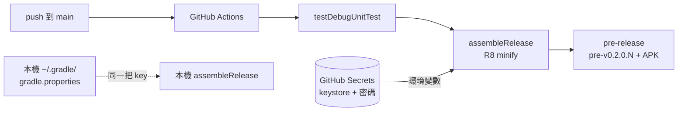

2026-08-15

# GitHub Actions：每次 push 自動發 pre-release（release APK ＋ 固定簽章）

## 這是什麼

push 到 main 就自動：跑 JVM 引擎測試 → 組 **release APK**（R8 minify）→ 以
`pre-v{version}.{run_number}` 為 tag 發 GitHub pre-release 並附上 APK。
從手機瀏覽器點開 Releases 頁就能下載最新 build 直接覆蓋安裝。

## 簽章設計 — 為什麼不是 debug build

第一版直接 `assembleDebug`，馬上撞到兩個問題：

1. **不是 release**：沒過 R8、APK 肥一倍，跟實際發佈的東西不是同一份。
2. **簽章不固定**：CI runner 每次自動生成新的 debug keystore，每個 build 簽章都不同 —
   使用者要先解除安裝才能裝新版，完全不能用。

正解是一把**正式 release keystore**，而且**金鑰絕不進 repo**：

- `keytool` 生成 `~/keystores/ohmybias-release.jks`（repo 外），密碼隨機生成。
- CI 端：keystore base64 與密碼放 GitHub Secrets（`KEYSTORE_B64` /
  `KEYSTORE_PASSWORD` / `KEY_ALIAS` / `KEY_PASSWORD`），workflow 還原成暫存檔、
  以環境變數餵給 Gradle。缺任一 secret 時**直接 fail**，不會默默退回 debug key
  發出簽章不對的 APK。
- 本機端：同一組參數寫在 `~/.gradle/gradle.properties`（也在 repo 外），
  所以本機 `assembleRelease` 與 CI 用同一把 key。
- `app/build.gradle.kts` 的 signing config 依序讀環境變數 → gradle property，
  兩者皆無（別人 clone、乾淨機器）退回 debug key，開發不受影響。

結果：CI build、本機 release build 簽章完全一致，任何一個 pre-release APK 都能直接
覆蓋安裝更新，不用解除安裝。

## 其他細節

- `concurrency` group 設在 ref 上、`cancel-in-progress: true`：連續 push 時舊 run 直接取消，
  只留最新的 pre-release build。
- tag 用 run number 保證唯一（`pre-v0.2.0.3`），APK 檔名同款
  （`ohmybias-v0.2.0-pre.3.apk`），版本號從 `build.gradle.kts` 的 `versionName` 抓。
- 第一版 debug build 發出的 pre-release 已連 tag 一併刪除。
- 一次性代價：手機上既有的 debug 簽章版本，第一次改裝 release 簽章 APK 時需解除安裝
  一次，之後永遠固定。keystore 記得備份 — 掉了簽章就斷了。
