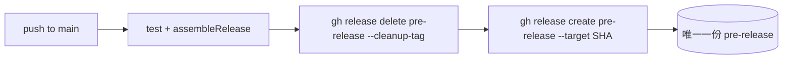

2026-08-16

# ohmybias-android：pre-release 改為固定 tag，永遠只保留一份

## 問題

前一版 CI（`prerelease.yml`）每次 push 到 main 都用 `pre-v{版本}.{run_number}`
開一個**新** tag 發 pre-release，結果 GitHub Releases 頁面上 pre-release 越積越多
（已累積 pre.2、pre.3、pre.4 三份）。預期行為是：pre-release 只該有一份，
新 build 出來就覆蓋舊的 — 它本來就是「最新開發版」的滾動快照，不是歷史存檔。

## 修法

改用**固定 tag `pre-release`**：發佈步驟先把舊的 release 連同 tag 刪掉，
再於當前 commit 重建，因此任何時刻最多只存在一份 pre-release。

實作細節：

- 捨棄 `softprops/action-gh-release`，改直接呼叫 runner 內建的 `gh` CLI —
  softprops 遇到既有 tag 只會「更新」release，不會把 tag 移到新 commit，
  舊 APK 資產也會殘留；刪掉重建才是乾淨的覆蓋。
- `gh release delete pre-release --cleanup-tag -y || true`：`--cleanup-tag`
  連遠端 tag 一起刪；`|| true` 讓第一次（尚無 pre-release）不會失敗。
- `gh release create pre-release --target "$GITHUB_SHA"`：tag 重建在本次 commit 上。
- release **標題**仍帶 run number 與 short SHA（`v0.2.0 pre.5 (70808d3)`），
  所以雖然 tag 固定，仍一眼看得出是哪個 build。
- commit message 經 `COMMIT_MSG` 環境變數傳入、`printf` 組 notes，
  避免訊息裡的引號/反引號被 shell 展開。
- workflow 原有的 `concurrency: cancel-in-progress` 保住了刪除／重建不會
  被兩個並行 run 交錯。

## GitHub 端清理

既有的 `pre-v0.2.0.2`、`pre-v0.2.0.3`、`pre-v0.2.0.4` 三份 pre-release
已用 `gh release delete --cleanup-tag` 手動清除（release 與 tag 都刪）；
本次 push 觸發的 CI 隨即發出第一份固定 tag 的 `pre-release`。
正式版 release（`v0.1.0`、`v0.2.0`）不受影響。
