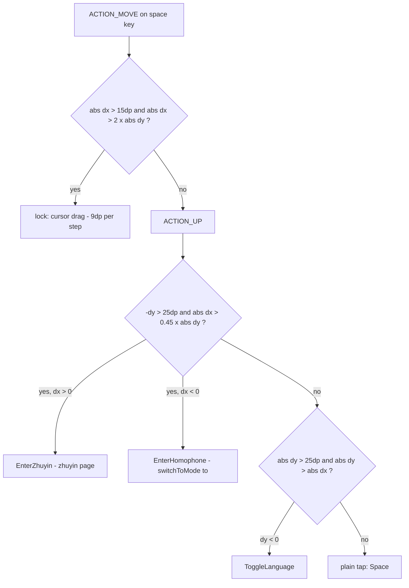

2026-08-22

# OhMyBias Android：空白鍵左上／右上滑手勢，與「左右滑」說明文字修正

## 什麼壞了

使用者回報空白鍵「左上滑」「右上滑」沒作用，總是被當成「左右滑」。

## 根本原因

設定頁的「空白鍵手勢」說明是 2c1608c 把 `,,H` 指令拿掉時，從引擎裡原封不動搬到
`MainActivity` 的；而那段文字本身又是從 yabomish（macOS）的 `,,H` 原文繼承來的，
描述的是另一套鍵盤皮膚的行為：

```
左右滑：循環切換 米→英文→數字→符號
上滑：中↔英快速切換
右上滑：注音查碼　左上滑：同音字查詢
```

Android 版的空白鍵觸控碼自初版移植（044ba86）起就沒改過，實際只做了兩件事：
`ACTION_MOVE` 裡 `|dx| > 15dp && |dx| > |dy|` 就鎖定成**游標拖曳**，
`ACTION_UP` 裡 `|dy| > 25dp && |dy| > |dx|` 且向上才觸發 `ToggleLanguage`。
沒有任何斜向分支；而且斜向上滑的前 15dp 通常水平分量略大，一到門檻就被鎖成
游標拖曳，`ACTION_UP` 提早 return，根本不會進到手勢判定。所以不是回歸，
是說明文字一直在描述不存在的功能；「左右滑循環切換頁面」也同樣從未存在
（左右是移動游標，同 iOS 版）。

## 怎麼修

使用者選擇「實作手勢」而非「改文字就好」，同時把左右滑那行改成實際行為。



- **游標拖曳鎖定收窄**：`|dx| > |dy|` 改成 `|dx| > 2|dy|`（離水平約 27° 內）。
  45° 左右的斜向上滑永遠不會滿足，會留到放開時判定；真正的水平拖曳手感不變。
  這個判斷每個 MOVE 事件都用「相對起點的總位移」重算，所以彎曲的路徑也不會中途被鎖。
- **`ACTION_UP` 先判斜向**：上移超過 `swipeThreshold`（25dp）且 `|dx| > 0.45|dy|`
  （離垂直約 24° 以上）就算斜向，依 dx 正負分左上／右上。不滿足才落回原本的純上／下判定，
  所以其他鍵的上下滑行為不受影響（`swipeUpLeft`/`swipeUpRight` 只有空白鍵有設）。
- **`KeySpec` 新增 `swipeUpLeft`／`swipeUpRight`**，空白鍵分別掛 `EnterHomophone`／
  `EnterZhuyin`，一樣走 `swipeEntry(up = true)` 受皮膚 `swipeUpEnabled` 控制。
- **`KeyAction.EnterHomophone`** 是新的；IME 端對應 `engine.switchToMode("to")`，
  引擎早就有這個入口（`,,TO` 用的同一條路）。`EnterZhuyin` 沿用 Enter 鍵上滑的現成處理。
- 說明文字：「左右滑：循環切換…」→「左右拖曳：移動游標」。

## 驗證

API 34 模擬器被另一個 session 同時拿去測 einkbro（`uid 2000` 每半分鐘 `am start` 一次），
點擊會落到別的 App，改在 API 28 AVD（`Pixel_API_28`，port 5556）重跑完整序列：
純上滑切英文（⇧ 鍵出現）→ 打 `ab` → 水平拖曳游標到句首 → 打 `c` 得 `cab`；
左上滑出「同音字模式」toast；右上滑切到注音頁並出「注」toast。
API 34 上左上／右上也各驗過一次。`testDebugUnitTest` 45 項通過。

iOS 版有同樣的觸控邏輯（`KeyboardView.swift:627`），但依慣例未動跨平台程式碼。
