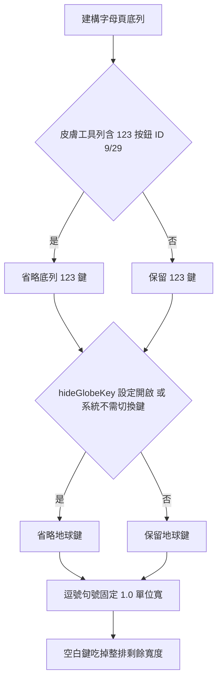

2026-08-15

# OhMyBias Android：空白鍵最大化 — 底列 123/🌐 可省略、標點固定標準鍵寬

## 這次改了什麼、為什麼

字母頁底列原本固定是 `[123] [🌐] [,] [空白] [.] [⏎]`。三個問題疊在一起，讓空白鍵比實際可用的小很多：

1. **123 鍵重複**：皮膚工具列（候選列空閒時顯示）常常已經有一顆 123 按鈕（sweetlime 按鈕 ID 9 或 29），底列再放一顆是浪費。
2. **🌐 鍵不是人人需要**：常用輸入法只有兩三個的人，換輸入法頻率極低，卻永遠佔一格。
3. **逗號句號被皮膚放大**：sweetlime 的 `spaceKeyLayout` 選項（'1' 空白最小、標點 1.4 倍寬）本意是「空白鍵小的時候拿標點消化剩餘寬度」，但它反而跟空白鍵搶寬度。

這版的原則定為一句話：**空白鍵永遠優先吃剩餘寬度**。具體三個變更：

- 工具列含 123（ID 9/29）時，底列自動省略 123 鍵。
- 新增設定「隱藏 🌐 鍵（空白鍵加寬）」（`Prefs.hideGlobeKey`）；為了隱藏後仍換得了輸入法，工具列「米/英」按鈕加上長按手勢，開系統輸入法選單（新 `KeyAction.ShowImePicker`，直接 `showInputMethodPicker()`，不像 🌐 點按那樣先嘗試切到下一個輸入法）。
- 逗號句號一律標準鍵寬（1.0 單位），不再讀 `spaceKeyLayout` 的放大倍率。

## 決策流程

省略鍵之後不需要另外調整任何寬度：`KeyboardView.onLayout` 對含空白鍵的排本來就是「其他鍵 = 倍率 x 上一排單位寬、空白鍵吃剩餘」，鍵少了、剩餘自然全進空白鍵。

## 實測（Pixel 7 模擬器，1080px 寬，像素實測）

| 情境 | , | 空白 | . |
|---|---|---|---|
| 改版前（滿排、皮膚標點 1.4 倍） | 145 | 368 | 145 |
| 滿排（標點回歸 1.0） | 104 | 449 | 104 |
| 工具列有 123（底列省 123） | 104 | 564 | 104 |
| 再開「隱藏 🌐 鍵」 | 104 | 679 | 104 |

兩鍵都省時空白鍵 368 → 679，將近一倍。

## 過程中的兩個插曲

- 第一版只在「有鍵被省略時」才把標點壓回 1.0，滿排仍尊重皮膚的 1.4 倍設定；使用者明確表示標點永遠不該加寬、空白鍵永遠優先，故改為無條件 1.0。
- 模擬器驗證時發現：`Switch` 切換偏好後立刻 `adb shell am force-stop`，`SharedPreferences.apply()` 的非同步寫入可能來不及落盤，設定會靜默遺失 — 測試腳本在 force-stop 前要留緩衝時間。

## 相關

- 米/英長按開輸入法選單是隱藏 🌐 鍵的配套：入口不因隱藏而消失（Android IME 政策上也必須保留切換輸入法的途徑）。
- iOS 版（ohmybias-ios）同步移植此行為，另見對應 ADR。
