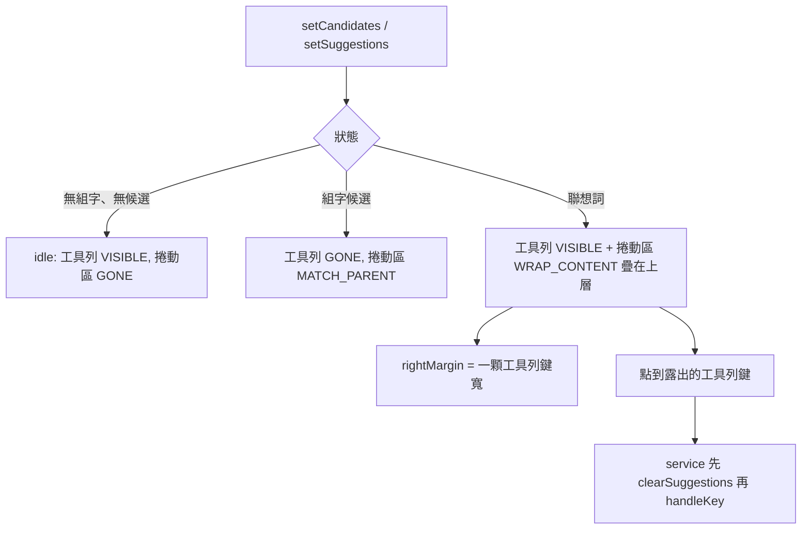

2026-08-21

# OhMyBias 米 Android：聯想列改為覆蓋在工具列上，右側固定留一顆鍵寬

## 做什麼

候選列（`CandidateBar`）現在分兩種佔用方式：

- **組字候選**（正在打碼）：整條佔滿，工具列讓位（GONE）— 和以前一樣。
- **聯想詞**（剛送出一個字、引擎給的聯想）：**覆蓋**在工具列上，
  捲動區只有內容那麼寬，而且**右側永遠留一顆工具列鍵的寬度**不覆蓋。

於是聯想再長也吃不掉最右邊那顆鍵 — 通常是「收折鍵盤 ∨」這種隨時要點得到的鍵 —
使用者不必先把聯想收掉才能收鍵盤。

## 為什麼

以前聯想一出來就把工具列整條換掉。聯想列是「順手給的」，不是使用者主動要的，
卻把工具列鎖住，想收鍵盤還得多一步；蓋不到的地方明明空著卻也點不到。

## 怎麼做

- **疊層順序**：`FrameLayout` 後加的 child 在上層、也先收到觸控，所以改為
  先加 `toolbarStack`、後加 `scrollView`。捲動區補上與整條列同色的底色，
  否則字縫間會透出底下的工具列圖示。
- **覆蓋幾何**（`applyOverlayGeometry`）：覆蓋模式把 `scrollView` 改成
  `WRAP_CONTENT` + `rightMargin = toolbarSlotWidth()`；捲動區沒蓋到的地方
  觸控自然落到工具列。一顆鍵的寬度 = 可用寬度 / 工具列鍵數（等權重平分），
  尚未 layout 時先用 48dp 近似，`onSizeChanged` 拿到真實寬度後修正。
- **service 端**：`onToolbarKey` 先 `clearSuggestions()` 再 `handleKey()`。
  不然按收折鍵後，下次開鍵盤還留著上一輪的過期聯想。

組字候選刻意不走覆蓋 — 候選是使用者正在選的主體，需要整條寬度。
