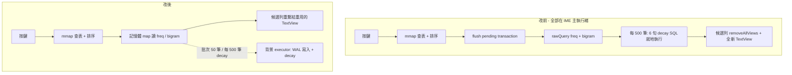

2026-08-15

# ohmybias-android：自 sweetlime 移植效能作法 — 鍵擊路徑零 SQLite

## 背景

把 sweetlime（LIME HD fork）當效能教科書掃了一遍，重點是它三個效能 commit
（`56c12b4` DB/查詢、`3719818` 繪製/送字路徑、`5301af3` 工具列/候選列覆疊）。
對照 ohmybias-android 的現況後發現：ohmybias 的 mmap 二進位字表本身已勝過
sweetlime 整層 SQLite 字典，但**鍵擊路徑上的字頻學習、視圖重建、主題解析**
三塊正好是 sweetlime 修過、而 ohmybias 還踩著的坑。這次一口氣移植可直接套用的作法。

## 最大的一塊：SqliteFreqTracker 重構

改前每個按鍵都會經過 `sortedWithContext` → 2 次 `rawQuery`，而且**查詢前先
flush pending transaction**（讓學習立即生效），等於批次寫入完全被讀取路徑打穿；
每 500 筆的 decay 更是 6 句 SQL（含兩次全表排序刪除）就地在鍵擊路徑執行。
另外 `flushAll()` 從未被呼叫 — 未滿 50 筆的 pending 會隨 process 死亡遺失。

改法（取自 sweetlime 的 learning executor + WAL + 分層快取思路，但更進一步）：

- 三表（freq/bigram/pinned）啟動時整份載入記憶體（decay 修剪機制讓表上限約
  5000 列/表，記憶體成本無虞）。**記憶體是即時權威資料、DB 是持久層**。
- `queryFreq`/`queryBigram` 純走記憶體 map — 鍵擊路徑零 SQLite。
- 寫入照舊批次 50 筆，但丟到單執行緒背景 executor（`THREAD_PRIORITY_BACKGROUND`，
  單執行緒同時保住寫入順序）；decay 記憶體端同步套因子、DB 端排進 executor
  （順序上先 flush pending 再 decay，兩邊「先加後衰減」一致）。
- `enableWriteAheadLogging()` — 學習寫入不再擋任何讀取。
- `onFinishInputView`/`onDestroy` 呼叫 `flushAll()`（限時等待 executor 完成）—
  收鍵盤即落盤，學習資料不再怕 process 被殺。
- 啟動載入也在 executor 上跑；查詢端用 CountDownLatch 限時等待首次載入
  （實務上載入遠快於第一個按鍵，不會真的等）。

## 視圖與繪製

- **KeyboardTheme 解析快取**：原本每個 palette 屬性都是 computed getter →
  每次 KeyButton `onDraw` 做 8 次 JSON 查找＋十六進位字串解析。改為每
  （皮膚世代 × 深淺色）解析一次進 `Resolved` 快取；`SkinSettings` 加
  `generation` 計數當失效依據（sweetlime 的字級/度量快取思路）。
- **onStartInputView 短路**：原本無條件 `reloadKeys()` — 每次切輸入框整面
  按鍵重新配置。新 `syncSessionState()` 只在 🌐 鍵有無、Enter 標籤、皮膚世代
  實際改變時重建（sweetlime `initOnStartInput` 的比對短路）。連帶三個配套修正：
  `isEnglishMode` 改為變更時就地重建的 setter（原本靠每次 session 的無條件
  reload 事後修正殘留的 英/⇧ 鍵）；常用語面板停留時仍強制重讀（設定頁可能改過
  user_phrases.txt）；`showPage` 同頁免重建。
- **CandidateBar 視圖重用**：`setCandidates` 原本每鍵擊 `removeAllViews()` +
  全新 TextView（含 listener/LayoutParams）。改為池化重繫結、多餘的隱藏備用；
  內容與上次相同（常見的 idle 清空）直接 return。`setComposing` 未變不量測、
  margin 未變不重設 layoutParams。
- **連刪/長按節奏**對齊 sweetlime 手感：400ms 起跑、50ms/字（原 500/80）。

## 啟動與雜項

- **CINTable 反查表背景預熱**：整表 reverse map 是 lazy 建立、成本高（走遍所有
  entry）— 原本第一個用到查碼提示/注音同音字的按鍵會整個卡住。service onCreate
  後丟背景執行緒預熱（sweetlime `prefetchCache` 思路）；lazy getter 補上
  `@Volatile` + 建表鎖，雙執行緒安全。
- **assets 複製**：原本每次啟動把六個資料檔全部讀進 heap 比對長度。改為記
  APK `lastUpdateTime`，未變且檔案齊全就整段跳過；全數複製成功才記 stamp。
- **DebugLog lambda 延遲建構**：原本插值字串在 `isEnabled()` 判斷前就建好 —
  debug 關閉時每鍵擊仍白付字串組建。`log(msg: () -> String)` inline 化後歸零。

## 刻意不搬的

sweetlime 的 `QueryDispatcher`（可取消的非同步候選查詢）沒搬 — SQLite 退出
鍵擊路徑後剩 mmap 二分搜尋＋排序，同步跑就夠快，為此引入非同步架構得不償失。
sweetlime 自己的反面教材也記著別學：無上限快取、每鍵擊一個 `java.util.Timer`、
字串拼接 SQL（打穿 statement cache）、無法用索引的 ORDER BY。

## 驗證

- `./gradlew testDebugUnitTest` 全綠。
- 模擬器實測（透過 IME 軟鍵盤、非 adb input）：開鍵盤 → 中英切換 → 打碼出候選
  → 空白上屏兩次「對對」；收鍵盤後 `freq.db-wal`/`-shm` 出現（WAL 生效）、
  拉出 DB 確認 `a|對|2` 落盤、舊學習資料完整保留；logcat 無 crash/ANR。
