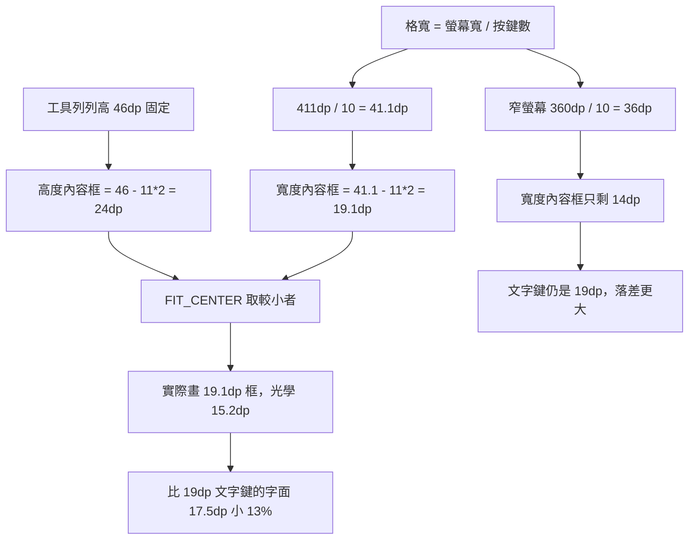

2026-08-22

# OhMyBias 米 Android：工具列圖示被格寬壓小

## 壞掉的是什麼

使用者看了 Android 9 的鍵盤截圖後問：「為什麼 Android 9 上工具列的圖示這麼小？」

先驗證是不是版本差異。同皮膚（10 顆工具列鍵）、同 411dp 寬、同 420dpi，
兩台模擬器逐像素量墨水高度：

| | Android 9 (API 28) | Android 14 (API 34) |
|---|---|---|
| 工具列圖示（⚙） | 15.2 dp | 15.2 dp |
| 工具列文字鍵（米） | 17.5 dp | 17.5 dp |
| 鍵面字母 q | 30.5 dp | 30.5 dp |

**完全一樣。** 不是 Android 9 的問題——圖示本來就偏小，只是使用者剛好在
Android 9 的截圖上第一次注意到。

## 根因：`FIT_CENTER` 取的是寬高較小者

`CandidateBar` 的工具列圖示是 `ImageView` + `ScaleType.FIT_CENTER`，四邊各內縮
11dp。原本的註解只推導了高度：

> `11dp 內縮 → 圖示畫 24dp（46dp 列高 - 兩側 11dp）；Material Symbols 24dp 框
> 內建 2-3dp 留白，光學高度 ~19dp，與旁邊 19sp 文字鍵同一級`

高度那邊算得沒錯，但 `FIT_CENTER` 會同時受寬度限制，而**格寬不是常數**：



11dp 是絕對值，格寬卻隨螢幕寬與按鍵數變動，所以這個誤差在窄螢幕上會放大。
360dp 寬的手機（很多舊機都是）配同樣 10 顆鍵，圖示框只剩 14dp。

## 修法

水平方向不留內縮，讓高度成為唯一限制：

```kotlin
val ip = dp(12f)
iv.setPadding(0, ip, 0, ip)   // 原本 setPadding(ip, ip, ip, ip) 且 ip = 11dp
```

`FIT_CENTER` 本來就會把圖示置中在格內，所以水平留 0 不會讓圖示貼邊；
`LayoutParams` 沒動，觸控範圍仍是整格。

上下改 12dp 而非沿用 11dp，是為了讓圖示框落在 **22dp** 而不是 24dp。三種值
在模擬器上實拍比對過：

| 設定 | 圖示框 | 光學高度 | 圖示 / 文字鍵 |
|---|---|---|---|
| 原本 11dp 四邊 | 19.1dp | 15.2dp | 0.87（明顯偏小） |
| 0 / 11dp | 24dp | 20.6dp | 1.17（反而壓過文字鍵） |
| **0 / 12dp** | **22dp** | **18.3dp** | **1.04（齊平）** |

24dp 框雖然是 Material Symbols 的原生尺寸，但放在 19dp 文字鍵旁邊會變成圖示
主導；22dp 框的光學高度 18.3dp 對上「米」的字面 17.5dp 剛好齊平，也正好命中
原註解想要的「~19dp」。

## 驗證

兩台模擬器都裝了修正版，逐像素量測一致（⚙ 15.2 → 18.3dp），Android 9 上點
☺ 圖示確認面板照常開啟、觸控範圍沒縮。

順帶發現：Android 9 的 emoji 面板有少數字元顯示成豆腐方框，那是 API 28 隨附的
emoji 字型較舊、缺較新的 code point，與本次改動無關。

## 值得記下來的

**`FIT_CENTER` 的尺寸推導一定要兩個方向都算。** 這個 bug 的註解把高度算得很仔細
（列高、Material Symbols 的內建留白、對齊文字級數都想到了），卻預設寬度不會是
瓶頸——而在「等分格 × N 顆按鍵」的版面裡，寬度幾乎必然先卡住。

**絕對值的 padding 配上比例式的容器寬度會放大誤差。** 格寬隨螢幕與按鍵數浮動時，
固定 dp 的內縮吃掉的比例也跟著浮動，旁邊尺寸固定的文字元素就會顯得對不齊。
