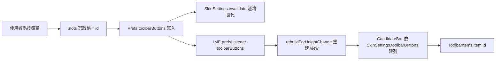

2026-08-31

# OhMyBias Android：設定頁「自訂工具列」— 10 格點選指定，覆寫皮膚 toolbarButtons

## 這是什麼

鍵盤候選列上方的工具列（設定／中英／123／符號／Emoji／…）原本只能透過匯入
`.cskin` 皮膚檔來決定內容與順序 — 要換一顆按鈕得先到鍵盤外觀編輯器網站
（ohmybias-skin）重新匯出、再回 App 匯入。這次在設定頁「主題」區塊下加了
「自訂工具列」入口，點進去是獨立畫面 `ToolbarSettingsActivity`，直接在手機上排。

## 操作模型：照抄 ohmybias-skin 網站

第一版做成「清單＋↑↓✕＋可加入 chips」被打回 — 使用者要的是和網站
（`app.js` `renderToolbarPanel`）一致的體驗：

- 上方**固定 10 格**（cskin `toolbarButtons` 就是 10 格，不足補 0 佔位），
  點一格選取（accent 框＋淡底）；
- 下方是**按鈕表**（4 欄，圖示＋名稱，順序同網站 `TOOLBAR_ITEMS`），點一顆就填進
  選取的格子，選取自動前進到下一格；
- 「空白佔位」也在表裡，用來留空格；
- 「還原預設工具列」清掉自訂、回到皮膚定義。

每次指定**立即生效**，不需儲存鍵 — IME 與設定頁同 process，改完回設定頁的
測試輸入框就看得到。

## 覆寫怎麼接進既有皮膚機制

工具列來源一直是 `SkinSettings.toolbarButtons`（`shared/` 層，禁止 Android API），
`CandidateBar` 建構時讀一次，`KeyboardView` 也靠它決定底列要不要留 `123` 鍵
（工具列已有 9/29 就省掉）。要讓「設定頁自訂」蓋過皮膚、又不把 SharedPreferences
拉進 shared 層，作法是：

- `SkinSettings.Companion.toolbarOverride: (() -> List<Int>?)?` — 平台端注入的 lambda，
  `Prefs.install` 時掛上 `{ Prefs.toolbarButtons }`（同 `DefaultPreferences.backing` 的注入手法）；
- `toolbarButtons` 改為 getter：覆寫非空就用覆寫，否則用皮膚原值（改名 `skinToolbarButtons`，
  設定頁狀態列要顯示「跟隨主題（N 顆）」用得到）；
- `Prefs.toolbarButtons` setter 寫完偏好順手 `SkinSettings.shared.invalidate()`
  遞增世代 — 既有的「皮膚世代變了就整組重建」路徑（`onStartInputView`、
  `KeyboardView.syncSessionState`）自然接手；同 process 立即反應則靠 IME 的
  `prefsListener` 多聽一個 `"toolbarButtons"` key。

JVM 測試裡 `toolbarOverride` 為 null，`toolbarButtons` 行為與從前完全相同，
既有的 cskin 解析測試不用動。

## 按鈕定義表抽出成 `ToolbarItems`

ID → 文字／圖示／動作的對照表原本是 `CandidateBar` 的 private 函式；設定頁要畫
同一套圖示與名稱，所以抽成 `keyboard/ToolbarItems`：

- `item(id)`：與從前一致（做不到的 ID 回 null → 空格）；
- `selectable`：設定頁按鈕表的順序，同網站 `TOOLBAR_ITEMS`（29/30 是 9/7 的同義備用 ID
  不列，皮膚帶進來仍照常運作）；
- `label(id)`：含「空白佔位」與「（不支援 #n）」的顯示名。

## 驗證

Pixel_7_API_36 模擬器（sim-use）：開設定頁 → 自訂工具列 → 點第 9 格 → 點「簡繁切換」
（選取前進到第 10 格）→ 點「空白佔位」；回設定頁狀態列變「工具列：自訂（10 顆）」，
點測試輸入框，鍵盤工具列第 9 顆是「簡」、第 10 顆留空。再進去按「還原預設工具列」，
10 格回到皮膚預設、`OhMyBiasPrefs.xml` 裡 `toolbarButtons` 鍵消失。
