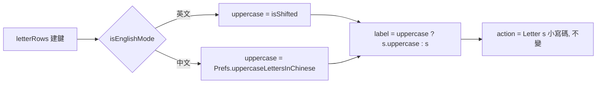

2026-08-21

# OhMyBias 米 Android：「米模式字母鍵顯示大寫」選項

## 做什麼

設定頁「輸入」區新增開關**「米模式字母鍵顯示大寫」**（預設關）。開啟後，
中文（米）模式的 26 個字母鍵面改顯示 `Q W E R T …` 大寫；英文模式不受影響，
仍依 shift 決定大小寫。

嘸蝦米字根表慣用大寫、實體鍵帽也是大寫，不少使用者看慣了大寫鍵面 —
iOS 版早有這個選項（`Prefs.uppercaseLettersInChinese`），這次一對一移植過來，
SharedPreferences 鍵名與 iOS 相同。

## 怎麼做

**只動鍵面標籤，不動送出的碼。**`KeySpec.label` 依條件大寫，`KeyAction.Letter(s)`
一律是小寫碼，所以引擎端完全沒變 — 模擬器上點大寫的「A」鍵，組字列仍是 `a → 對`。

### 設定頁改完回鍵盤要重建鍵面

`syncSessionState` 在每次 `onStartInputView` 被呼叫，只有鍵面實際會變才整面
`reloadKeys()`（🌐 鍵有無、Enter 標籤、皮膚世代）。這裡比照皮膚世代的做法：
`reloadKeys()` 記下建鍵當下的偏好值 `builtUppercaseLetters`，`syncSessionState`
發現與目前 `Prefs` 不同就重建。使用者在設定頁切開關、再點回輸入框，鍵面立即換成
大寫／小寫，不必重啟鍵盤。

### 驗證

模擬器 Pixel_7_API_34、真實 liu.cin：開關預設關 → 鍵面小寫；切開 → 回輸入框鍵面大寫、
點「A」組字 `a → 對`；英文模式 shift 前後 `q`/`Q` 如常；切關 → 回輸入框鍵面恢復小寫。
