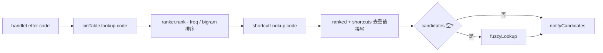
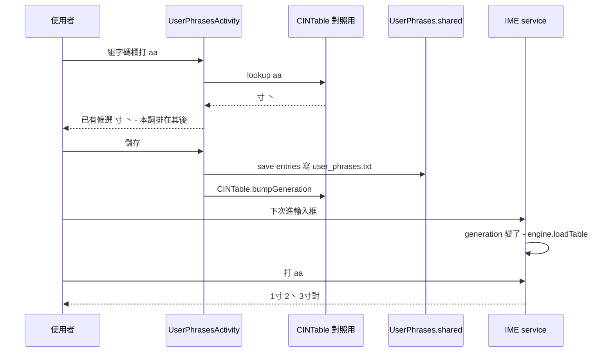

2026-08-23

# ohmybias-android：常用語可設自訂組字碼，直接打碼叫出

Commit `c65e8da`。

## 做了什麼

常用語原本只能開 ♥ 面板點選。現在每句常用語可以設一個自訂組字碼（例如 `qqqq` → 高茂原），
用鍵盤直接打碼就出現在候選列，不必開面板。設定頁的常用語編輯從對話框改成全螢幕編輯器，
每列「詞＋組字碼＋刪除」，組字碼一邊打一邊對照字表：

- ✓ 未被使用 — 打碼直接出現本詞（「唯一候選自動送出」開著會直接上屏）
- ⚠ 已有候選（列出撞到的字）— 本詞排在其後
- ✗ 不合法字元／`,,` 前綴（那是指令前綴）
- 兩句常用語同碼時互相提示，都會列出

## 引擎端怎麼接

引擎其實早就有 `tables/*.txt` overlay 機制，但 overlay 會排在字表候選**之前**，
而這次的需求明確是「碼被用走時排在既有候選之後」。所以沒有重用 overlay，
而是在 `CINTable` 快照上另開一份 `shortcuts` map，`lookup()` 完全不動（對照用、
聯想用、反查用的呼叫端都不受影響），只在 `InputEngine.refreshCandidates` 排完字頻後接尾：

接在 `ranker.rank` 之後而不是之前，捷徑詞就不參與字頻／bigram 排序 — 位置固定可預期，
使用者選了幾次也不會跑到字表的字前面。`hasPrefix`／`validNextKeys`／`maxCodeLength`
則要算進捷徑碼，否則組字狀態機會把 `x`（只有捷徑 `xm` 以它開頭）當成沒有下一鍵。

快照是「發佈後唯讀」的設計，所以儲存後不在原快照上改 map，而是走既有的
`CINTable.bumpGeneration()` → IME 下次進輸入框整份 `loadTable()`（同 liu.cin 匯入）。
mmap 加掃一次 code 長度很便宜，不值得為了省這一步破壞不可變性。

## 檔案格式

`user_phrases.txt` 一行 `詞` 或 `詞<TAB>組字碼`。舊檔（無碼）原樣相容；不合法的碼在
解析時丟掉、詞保留。單字常用語以前會被整行跳過（長度 < 2 的過濾），現在保留在面板與
捷徑裡，只是不進聯想表 — 聯想是「首字＋餘字」，單字本來就沒意義。

## 密碼類欄位暫切英文直通

做編輯器時撞到的問題：組字碼欄要打 `xm`，但作用中的鍵盤就是嘸蝦米自己，字母鍵會組字。
解法是欄位用 `visiblePassword` 型別，IME 端 `onStartInputView` 看到密碼類 variation
（password／visiblePassword／webPassword）就 `setEnglishMode(true)`，但**不寫**
`Prefs.lastEnglishMode`，離開欄位換回使用者原本的中英狀態；在這種欄位按中英切換也不記偏好。
這同時是密碼欄位本來就該有的行為 — 密碼不該經過組字。

## 取捨

- 捷徑碼比字表最長碼長（嘸蝦米 4）會拉高 `maxCodeLength`，「滿碼頂字上屏」觸發點跟著後移。
  編輯器限 8 字元；沒再特別處理，因為要讓捷徑打得出來就必須算進去。
- `wildcardLookup`（`*` 模式）沒接捷徑；同音字／注音／Pin 模式也不接。捷徑只在一般組字路徑出現。
- 常用語面板順序維持 `sorted()`，沒改成檔案順序 — 編輯器沒有拖曳排序，改了也只是換一種任意順序。

## 驗證

JVM 單元測試 7 條（格式來回、碼驗證、字表捷徑查詢、獨佔碼唯一候選、撞碼排最後、
autoCommit 直接上屏、長碼拉高 maxCodeLength）。模擬器 Pixel_7_API_34 真字表用 sim-use
走 IME 全程：組字碼欄鍵盤切英、詞欄切回米；`a` 提示「已有候選 對」、`qqqq` 提示未被使用；
儲存後測試欄打 `qqqq`＋空白出 高茂原、打 `aa` 候選 `1寸 2丶 3寸對`；面板「設定」鍵開編輯器。
