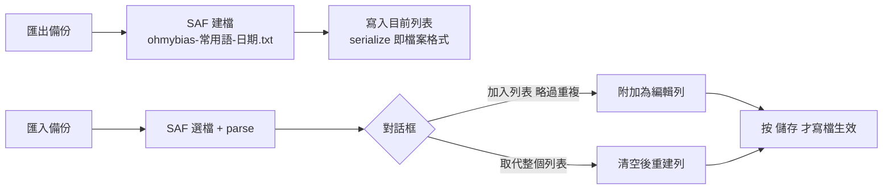

2026-09-02

# 常用語備份匯出／匯入（issue #5）

## 這是什麼

issue #5 除了兩個顯示 bug，還提了功能需求：設定與常用語資料的備份。
本次先做常用語部分 — 常用語設定頁新增「匯出備份」「匯入備份」，
使用者可以把自訂詞（含組字碼捷徑）存成檔案、換機或重灌後匯回。

## 設計

**備份格式直接用儲存格式本身。** 常用語存在 `user_phrases.txt` — 純文字、
一行一詞、詞與組字碼以 Tab 分隔。備份檔就是這個格式：

- 不用另發明 JSON schema，`UserPhrases.parse` / `serialize` 現成可用；
- 純文字可用任何編輯器手改、手動整批建詞再匯入；
- 與 iOS 版共用同一套 shared 引擎格式，未來跨平台搬移零成本。

**匯入不直接寫檔。** 匯入的詞只加進編輯列表，使用者過目後按「儲存」
才真正生效 — 沿用編輯器原本的 dirty/save 模型，匯錯檔案按「取消」就能反悔。

細節：

- 匯出的是**目前編輯器內容**（含尚未儲存的編輯）— 所見即所得。
- 覆寫既有檔案用 `openOutputStream(uri, "wt")` 截斷 — 預設模式蓋較長的
  舊檔會留殘尾。
- 附加匯入以（詞＋碼）整筆去重；列表只剩一列全空白（剛開的空編輯器）時
  先清掉，匯入的詞排最前。
- 選檔 `type = "*/*"` — 雲端硬碟常回報不準的 MIME。
- 讀寫都在背景執行緒（同 MainActivity 匯入 liu.cin 的做法）— 來源可能是
  雲端硬碟，時間不定。

## 驗證

API 36 模擬器全流程實測：匯出檔 byte-exact（`早安您好\tzz\n測試詞\n高雄市\tkh\n`）；
匯入含 1 新 + 1 重複的檔案 → 「已加入 1 筆（略過重複 1 筆）」；「取代整個列表」
還原到備份內容；儲存後 `user_phrases.txt` 正確。引擎 JVM 測試全過。

設定（偏好／皮膚）備份是 issue #5 的另一半，尚未做。
