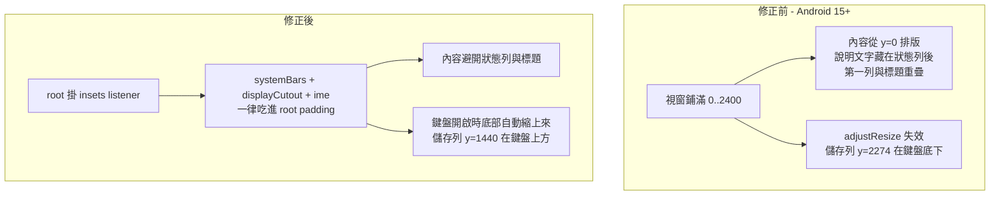

2026-09-02

# 常用語設定頁 edge-to-edge insets 修正（issue #5）

## 症狀

使用者回報（[issue #5](https://github.com/plateaukao/ohmybias-android/issues/5)）常用語設定頁兩個問題：

1. 最上面一列輸入框沒有完全顯示 — 說明文字整段不見、第一列被削掉上半截。
2. 常用語加到滿屏後，下方的列與「取消／儲存」列被鍵盤蓋住。

在 API 36 模擬器完整重現：內容從 y=0 排版，說明文字藏在狀態列（0–136px）後面、
第一列輸入框與視窗標題重疊；鍵盤開啟後（IME 佔 y=1566–2400）activity 視窗仍是
全高，儲存列停在 y=2274，完全在鍵盤底下。

## 根因

targetSdk 36 在 Android 15+ **強制 edge-to-edge**：視窗鋪滿整個螢幕、系統列透明，
系統不再自動幫內容避開狀態列／導覽列，manifest 的 `adjustResize` 也失效 —
鍵盤高度改以 ime() insets 通知，app 得自己處理。

`MainActivity` 與 `ToolbarSettingsActivity` 都已掛 `setOnApplyWindowInsetsListener`
把 systemBars 吃進 padding，**`UserPhrasesActivity` 是唯一漏掉的畫面** — 它是後來
新增的全螢幕編輯器，沒有跟上這個 pattern。

## 修法

`UserPhrasesActivity.onCreate` 比照 MainActivity 在 root 掛 listener，差別是多加
`WindowInsets.Type.ime()` — 這個畫面滿是輸入框，鍵盤高度必須吃進 bottom padding，
底部列與 ScrollView 才會自動縮上來（設定頁沒這需求，只吃 systemBars）：

- `systemBars() | displayCutout() | ime()` → `root.setPadding(...)`，回傳 CONSUMED。
- `SDK_INT >= 30` 才掛：API 28/29 無強制 edge-to-edge，`adjustResize` 照舊可用。

## 驗證

- API 36 模擬器：說明文字從 y=21 移到 y=304（標題下方完整顯示）；鍵盤開啟時
  儲存列從 y=2274 升到 y=1440（鍵盤頂 y=1566 之上）；加到 9 列塞滿畫面後列表
  正常捲動，焦點列與新增按鈕都在鍵盤上方；並透過軟鍵盤實際點鍵確認輸入有效。
- API 34 迴歸測試：版面相同、無雙重 padding，鍵盤 resize 照常。

issue 的第三點（設定＋常用語備份功能）是獨立 feature，另行處理。
