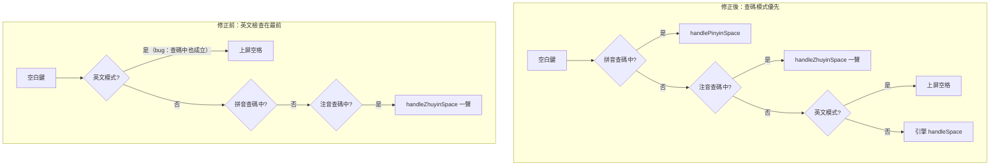

2026-09-02

# 英打切注音查碼後，空白鍵直接上屏組不出一聲字（issue #6）

## 壞掉的行為

GitHub issue #6：由英打模式切到注音查碼，輸入注音符號後按空白（一聲），
組不出一聲的字 — 空白直接上屏成一個空格。其他聲調都正常。

## 根因

進注音／拼音查碼**不清英文模式旗標**，這本身是對的設計：查碼是暫時狀態，
選完字（或退出）要回到原本的英打模式。引擎層也早就這樣認定 —
`currentModeLabelImpl` 把注音模式排在英文模式前面判斷。

問題出在 service 層的按鍵分派沒有跟上這個優先序：`handleSpaceKey()` 把
`isEnglishMode` 檢查排在 `isZhuyinMode` 之前，所以英打＋注音查碼並存時，
空白鍵走了英文直通（`commitToEditor(" ")`），永遠到不了 `handleZhuyinSpace()`
（一聲查碼）。聲調鍵是獨立的 `ZhuyinTone` KeyAction、不經空白鍵分派，
所以二三四輕聲都沒事 — 正好符合回報「其他聲調不會有這個問題」。

## 修法：三處把查碼模式排到英文模式前

同一類排序錯誤在三個入口，一起修：

1. **`OhMyBiasImeService.handleSpaceKey()`** — 注音／拼音檢查移到英文檢查前。
2. **`OhMyBiasImeService.handleBackspaceKey()`** — 同類 bug：英打＋注音查碼時
   退格會刪編輯框文字，而不是清注音槽；補上注音分支（進 `engine.handleBackspace`，
   引擎內已有注音退格邏輯）排在英文檢查前。
3. **`HardwareKeyHandler.onKeyDown()`** — 實體鍵盤同類 bug：英文模式一律
   `return false` 放行給系統，注音／拼音查碼在英打下整個失效。改成
   `isEnglishMode && !isZhuyinMode && !isPinyinMode` 才放行。

引擎層（shared/）完全沒動 — 這是純 service 層分派順序的修正，
與 iOS 上游的引擎一對一對應不受影響。

## 驗證

Pixel_7_API_34 模擬器、軟鍵盤實打（非 adb input text）：英打 → Enter 鍵上滑
進注音查碼 → 點 ㄅㄚ → 按空白（一聲）→ 候選列正確列出 巴 cl/cll、八 b、
吧 ocl、芭 rcl，欄位沒有被塞空格；退出查碼後英文空白鍵照常輸出空格。
`testDebugUnitTest` 全過。

備註：iOS 版 `KeyboardViewController` 的 `handleSpaceKey` 有一模一樣的排序
問題，另行在 ohmybias-ios 修。
