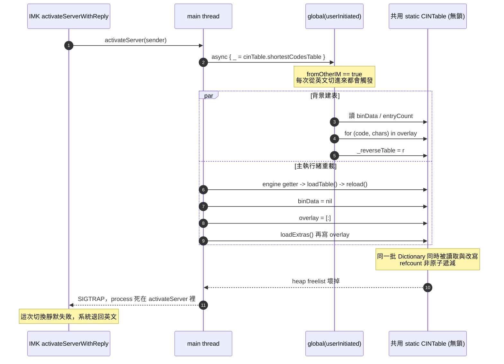
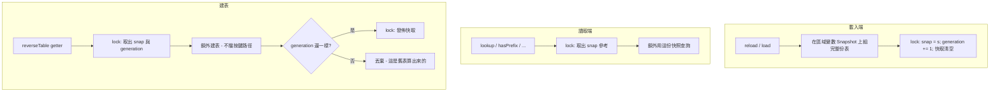

2026-08-21

# 切輸入法偶爾靜默失敗 — CINTable 無鎖競態寫壞 heap

## 壞掉的是什麼

從英文切回 OhMyBias 時，偶爾整次切換沒有反應：系統退回英文，使用者得再按一次
Ctrl+Space。看起來像是「輸入法沒吃到切換事件」，實際上是輸入法 process 死在切換途中。

一開始的假設是「吃太多記憶體被 jetsam 殺掉」——實測排除：跑了一小時的 process
physical footprint 44.5 MB、peak 207.7 MB，沒有任何 jetsam / CPU-limit 擊殺紀錄，
`runningboardd` 還明確記著 `Ignoring CPU limits because this process is not CPU limit managed`。
macOS 桌面不會為了 200 MB 殺 process。

真正的死因是 heap corruption：

```
libmalloc: BUG IN CLIENT OF LIBMALLOC: memory corruption of free block
EXC_BREAKPOINT / SIGTRAP
```

而且 crash 堆疊正好落在切輸入法的路徑上：

```
libsystem_malloc   _xzm_xzone_malloc_freelist_outlined   <- 偵測到 free block 被寫壞
swift_allocObject
URL.init(fileURLWithPath:)
CINTable.loadBin(path:)
CINTable.reload()
InputEngine.loadTable()
OhMyBiasInputController.engine.getter                    <- 第一次取用 engine
OhMyBiasInputController.activateServer(_:)               <- 切進 OhMyBias
-[_IMKServerLegacy activateServerWithReply:]
```

記憶體是「被寫壞」，不是「用太多」。

## 根因

`activateServer` 在主執行緒上先丟一個背景工作去建 `shortestCodesTable`，四行之後又在
主執行緒上碰 `engine` getter → `InputEngine.loadTable()` → `cinTable.reload()`。
`CINTable` 是 `static let` 的共用實例卻沒有任何同步 —— 兩條執行緒同時讀寫同一批
Swift Dictionary，refcount 非原子遞減，malloc 的 free list 就此壞掉。
（`InputEngine` 有 `NSRecursiveLock`，但那是 per-engine，保護不到共用的 `CINTable`。）



背後還有三個彼此放大的問題：

1. **重複載表**。`static let cinTable` 的初始化器已經 `reload()` 過，但每個 controller
   第一次取 `engine` 時又 `loadTable()` → `reload()`。IMK 是「每個 client app 一個
   controller」，等於**每換一個 app 就整表重載一次** —— 也就是每換一個 app 就開一次
   競態視窗。
2. **無謂的預熱**。反查表只有注音／同音模式、簡碼（`.sp`）／長碼（`.sl`）模式、以及
   「顯示字碼提示」會用到，一般打字路徑完全不碰；卻在每次從別的輸入法切進來時就丟到
   背景整份重建。那份表正是 peak footprint 207 MB 的來源，而多數使用者從來用不到。
3. **死碼**。`lastAppliedKeyboardLayout` 宣告後從未使用，原本該有的「同一個 layout 就
   不要重複套用」判斷不見了。

## 怎麼修

核心是把 `CINTable` 改成**不可變快照＋整份原子替換**，而不是加一把大鎖。

加鎖的直覺解法在這裡會踩到另一個坑：建反查表要走遍整張表、耗時以秒計，若整段建表都
握著鎖，主執行緒的按鍵查詢就會卡在背景建表後面。所以拆成兩段——鎖只保護「取出參考」
與「發佈」這兩個瞬間，耗時的建表在鎖外用手上那份快照做。



`Snapshot` 是一個放了 `binData`、四個位移、`overlay`、`t2s`/`s2t`、`selKeys`、
`maxCodeLength` 的 struct；所有二進位讀取與查詢方法都掛在它上面，成為純函式。
載入端永遠在區域變數上組好一整份才換掉，讀取端拿到的必定是某一份完整的表 ——
沒有「binData 已經清空但 overlay 還是舊的」這種中間態。`generation` 計數器讓重載後
的舊快取自動失效，也讓慢一步算完的建表結果被丟棄（否則會一直給舊表的字根提示）。

其餘四項：

- **移除 `InputEngine.loadTable()`** 與 engine getter 裡的 `reload()`。字表由
  `static let cinTable` 初始化器載一次，重載入口只剩 `,,RL`、匯入字表、偏好設定改擴充表。
- **反查表改回真 lazy**：拿掉 `activateServer` 與匯入後的背景預熱。真的用到才建。
  匯入完成的訊息本來用 `shortestCodesTable.count`（會順手把整份反查表建起來），
  改成只掃一次碼表把 codepoint 收進 Set 的 `distinctCharCount`。
- **補回 `lastAppliedKeyboardLayout`**，但改成 per-controller（`overrideKeyboard` 是
  對 client 設定的，static 會讓第二個 app 永遠套不到）。從別的輸入法切回來時仍一律重套
  ABC 佈局 —— 對方可能改過佈局 —— 只有 app 之間切換才跳過。
- **接起 `reloadTables` 通知**。修上一項時發現：`ShortcutTab` / `InputTab` 改完擴充表
  會發 `info.plateaukao.ohmybias.reloadTables`，但**從來沒有人收**。它一直是靠「換 app
  就重載」矇混過去的；那條路一拿掉就會真的失效，所以在 `AppDelegate` 明確接起來。

## iOS 與 Android

同一份 `CINTable` 在三個平台各有一份，所以順手查了另外兩個：

- **iOS 不受影響**。`CINTable` 只有主執行緒碰得到 —— `KeyboardViewController` 那幾個
  `releaseOptionalCaches()` 呼叫全在 UIKit callback 上，`FreqTracker.bgQueue` 與
  `RecentEmojis.writeQueue` 是各自獨立的 SQLite／檔案佇列，不碰字表。沒有第二條執行緒
  就沒有競態，維持原樣。
- **Android 有同樣的病，症狀不同**。`onStartInputView` 偵測到設定頁換了字表時會在主執行緒
  `loadTable()` → `reload()`，同時再開一條 `warmUpReverseCache` 執行緒。Android 版已經
  有 `@Volatile` ＋ `cacheLock` ＋ `loadGeneration`，但那把鎖只罩住建表那一段，**罩不到
  載入端** —— `reload()` 照樣就地把 `binData`/`entryCount`/`overlay` 清空再重填。JVM 是
  managed memory，不會壞 malloc free list，但會讀到 `binData` 還在而 `entryCount` 已歸零
  （字根提示給錯字）、`readChars` 越界，或 overlay 邊填邊走的
  `ConcurrentModificationException`。改法比照 macOS：私有的 `Snap` 類別、`@Volatile`
  單次指派發佈、快取以「當時那份 Snap 的參考」認親。

Android 有一點不同：那裡的建表若握著 `cacheLock`，發佈快照的主執行緒就會卡在背景預熱
後面，而 IME 主執行緒卡住就是 ANR。所以 `buildLock` 只序列化建表，`publish()` 完全不碰
它。Android 的背景預熱是有意為之（`onCreate` 就開一條低優先權執行緒，避免第一次用到的
那個按鍵卡住），且不與主執行緒的重載共用鎖，所以保留 —— 沒有跟著 macOS 一起拿掉。
