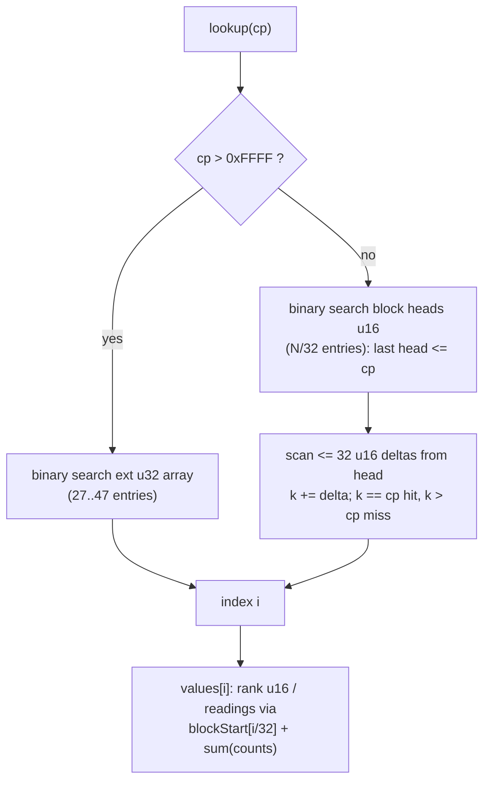

2026-08-22

# OhMyBias：資料表 v2 格式 — 四個 .bin 在 APK 內 497 → 266 KB（Android release APK 767 → 534 KB）

## 做了什麼

上一個 ADR（`ohmybias-android-apk-size-collections-asset`）把 dex 壓下來之後，APK 有 66% 是
四個 mmap 資料檔。這次不刪資料、不動功能，只改**表示法**：

| 檔案 | APK 內（deflate 後） | v2 格式 | 省法 |
|---|---|---|---|
| `phrases.bin` | 251 → 170 KB | PHM2 | 詞不再重複存首字（首字就是鍵）；UTF-32 → UTF-16 |
| `zhuyin_data.bin` | 151 → 61 KB | ZYM2 | 反查表（原檔 81%）其實是正查表的反向索引，只存音節索引 |
| `char_freq.bin` | 54 → 26 KB | CFM2 | 只用於排序 → 存 dense rank u16，不存 u32 頻次 |
| `pinyin_data.bin` | 40 → 8 KB | PYM2 | 1342 音節中 1338 個字表與某注音音節逐字相同 → 存別名 |

`phrases.bin` 是 Android / iOS 共用的同一份檔，iOS `WikiCorpus.swift` 讀取端同步改（ohmybias-ios `72b7f39`）；
其餘三檔是 Android 專屬（iOS 仍讀 JSON），可自由改。Android commit：`3186291`。

## 為什麼這樣省

先用 Python 把四個檔解開看內容，再模擬各種編碼算 deflate 後大小，才動手：

- **phrases.bin**：65,363 個詞全是 2–3 字、鍵是詞首字，每詞卻以 u8 長度 + UTF-32 **含首字**存放。
  光「去掉首字 + UTF-16」就從 251 KB 到 174 KB；再試頻次排名 varint 等花招只多省 2 KB，不值得。
- **zhuyin_data.bin**：`char_to_zhuyins` 對全部 10,285 個字都恰是 `zhuyin_to_chars` 的反向集合，
  唯一額外資訊是**讀音順序**（常用在前，如 三 → ㄙㄢ、ㄙㄚ、ㄙㄢˋ；1,814 個多音字中 337 個順序與
  反向展開不同）。所以反查只存 u16 音節索引，不重複存 UTF-8 注音字串＋6B valIdx。
- **pinyin_data.bin**：只有 `yu1`–`yu4` 例外（ㄧㄡ＋ㄩ 合併表），其餘全是注音音節的別名。
- **char_freq.bin**：`sortByFreq` 只比大小，dense rank 保留同分（v1 同頻次 → v2 同 rank，排序穩定性不變）。

第一版 ZYM2 / CFM2 出來是 91 / 45 KB，比估的 71 / 26 差很多——**排序過的固定寬度 codepoint 鍵陣列
幾乎壓不動**（每筆都獨一無二，deflate 找不到重複）。解法是「CPKT」區塊差值鍵表：32 筆一區塊，
區塊首鍵存絕對值 u16，區塊內存與前一鍵的差 u16（CJK 相鄰字差值多半是 1–5，高位元組全零，
deflate 壓得很好），非 BMP 的 27–47 個字另存 u32 段。查詢仍是二進位搜尋，只是分兩層：

反查表的「讀音起點」陣列同樣用區塊前綴和（每 32 字存一個 u16 起點 + 每字 u8 讀音數）取代每字 u16 起點，
單調遞增的 u16 序列在 deflate 眼裡也是不可壓的。

沒做的：deflate 以外的壓縮（xz/brotli/zstd）— Android `java.util.zip` 沒有，零第三方依賴是專案規則，
所以只能在表示法上動腦。

## 效能

全部仍是 mmap 零 heap、零解析，載入時間不變。JVM 微基準（同一支測試跑 v1 與 v2 兩棵樹，
走 `ZhuyinLookup` / `WikiCorpus` 公開 API）：每次查詢都在個位數 µs，差異 ±1–2 µs
（注音／拼音查詢略快：音節索引變小；頻次排序與詞組略慢：≤32 筆差值掃描與首字字串接回），
離一個 60 Hz frame 的 16,000 µs 差三個數量級。

## 正確性怎麼保證

- 產生器 `tools/gen_data_bins.py`（重寫，格式規格在檔頭）從 iOS 的 JSON 源頭建 ZYM2/PYM2/CFM2；
  `tools/convert_phrases_v2.py` 把 PHMM 機械轉成 PHM2 — 萌典詞組的原始建檔腳本已不存在，
  只能由 v1 轉，轉檔時斷言每詞首字 == 鍵、鍵已排序。
- 一支獨立的 Python 參考讀取端（照 Kotlin 邏輯寫）對 v1/v2 **逐鍵**比對：全部 1,351 音節、
  10,285 反查字、1,342 拼音、7,072 詞首字（65,363 詞）、13,417 字的頻次兩兩順序；另外對
  U+3000–U+A000 全段與非 BMP 區間逐點探針，確認 CPKT 沒有假命中／假未命中。
- Android `DataBinsV2Test` 釘住邊界：非 BMP 鍵（𠁥 U+20065 走 ext 段）、surrogate pair 合成一字、
  三 的讀音順序、`yu2` 內嵌 vs `ba1` 別名、同頻次同 rank、PHM2 首字接回與三字詞、非 BMP 詞鍵 𣘨。
  iOS `Tests/main.swift` 補同樣的 PHM2 斷言（97/97）。
- PYM2 header 記建檔時 ZYM2 的音節數，讀取端核對不符就當沒有拼音資料 — 別名是跨檔索引，
  兩檔不同版會指錯字。
- 模擬器經 IME 實打：`te` → 臺 出聯想 灣／北市／中／南市；`,,zh` 注音頁 ㄅㄚ → 巴／八／吧／芭。

## 後續

iOS 仍隨附 `zhuyin_data.json` / `pinyin_data.json` / `char_freq.json`（約 610 KB raw）；
把 `DataMaps.kt` 移植成 Swift 就能吃到同一份 ZYM2/PYM2/CFM2，是另一件獨立的工作。
