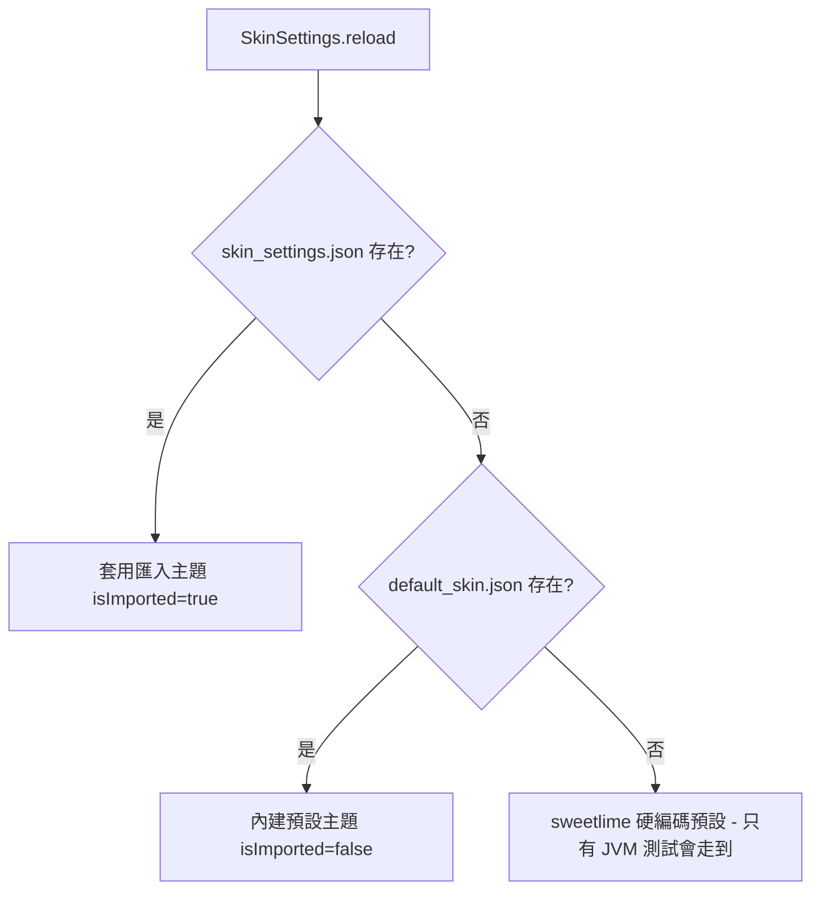
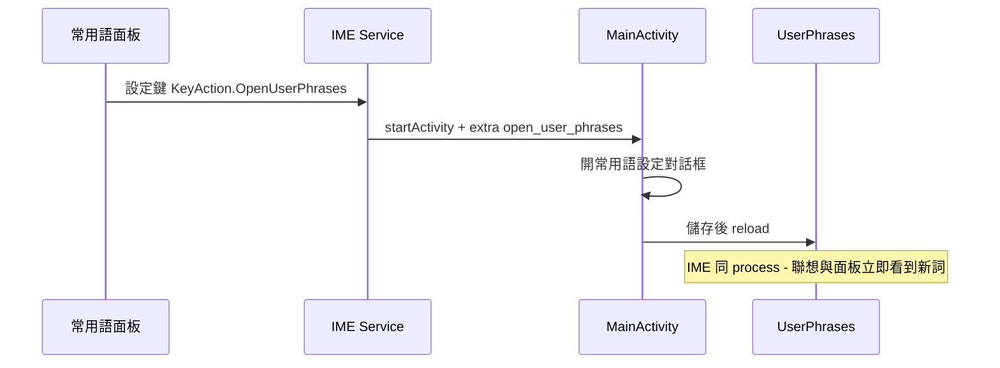

2026-08-17

# OhMyBias：內建預設主題＋常用語面板設定鍵＋用語統一

一批相關的 UX 改動，橫跨三個 repo 四個 commit：Android `272a618`（預設主題）、
`a468b45`（常用語面板＋用語）、skin 網站 `4ff1f4a`、iOS `465bd03`。

## 內建預設主題（Android `272a618`）

使用者設計的黑白 cskin 要成為**出廠預設** — 不只是新安裝的初始外觀，
「還原內建」也要還原到它。第一版做法（首啟種檔＋一次性旗標）語意不對：
還原後會退到 sweetlime。改為 fallback 鏈：

`assets/default_skin.json`（內容即使用者的 cskin，名稱「預設主題」，工具列
原封不動 — 曾自作主張加游標鍵被退回）併入 `OhMyBiasApp.copyAssetsIfNeeded`
的清單，隨每次 APK 安裝／更新複製到 sharedDir，預設主題因此跟著版本走。
`TestEnv` 複製的是固定清單、不含此檔，JVM 測試仍走 sweetlime 預設值，
既有斷言不受影響。

## 常用語面板「設定」鍵＋儲存即生效（Android `a468b45`）

♥ 常用語面板左欄「常用語」分類下方新增「設定」鍵，從鍵盤直達編輯：

順手修了一個真實痛點：`UserPhrases` 是常駐 singleton，只在開 ♥ 面板、
`,,RL`、process 重啟時重讀檔案，而設定頁「儲存」只寫檔 — 所以新增詞後
聯想一直不出現，要重開鍵盤才生效。修法一行：儲存後 `UserPhrases.shared.reload()`
（設定頁與 IME 同 process，立即生效）。

## 用語統一（三 repo）

- 「皮膚」→「主題」：Android 設定頁區塊標題、「目前主題：」、套用/還原訊息；
  skin 網站欄位「主題名稱」、新皮膚預設名「我的主題」。
- 「自訂詞（user_phrases.txt）」→「常用語設定」：Android 與 iOS 的設定頁
  按鈕、對話框/頁面標題都不再露出檔名；hint 改為說明雙重用途 —
  同一份 `user_phrases.txt` 既是 ♥ 面板內容也是聯想自訂詞。
- skin 網站另補一個小連動：預覽下方的淺/深色 chip 現在也會把配色面板切到
  對應那套（原本只有「編哪套就預覽哪套」單向）。

## 驗證

模擬器 `pm clear` 模擬新安裝：初啟即「目前主題：預設主題」、黑白鍵盤；
按「還原內建」刪除匯入檔後狀態與外觀不變（fallback 生效）。面板設定鍵
實點走通整條路徑；儲存後立即打字可見新詞聯想。`testDebugUnitTest` 全過；
網站行為在瀏覽器實測 chip 雙向連動。
