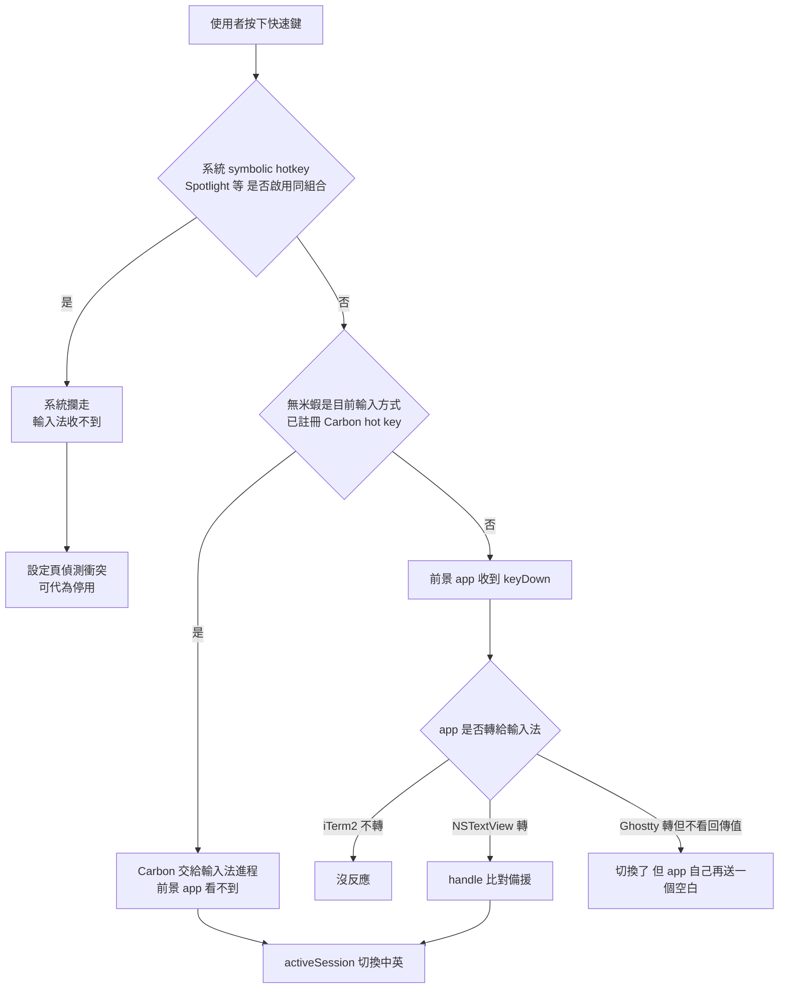

2026-08-25

# OhMyBias：中／英切換可自訂快速鍵（全域 hot key）

## 做了什麼

設定 →「輸入」新增「中／英文切換」區塊：

- 可以另外指定一組快速鍵（⌃Space、⌘Space、⌥⇧E、F13⋯）切換英文模式；原本的「單擊 Shift 切換」保留，但可以關掉。
- 快速鍵可直接錄製，或從「常用組合」選單挑。沒有 ⌘⌃⌥ 的組合只接受 F 鍵（⇧A 在英文模式是大寫 A，不能被搶走）。
- 若該組合正被系統快速鍵佔用（Spotlight、切換輸入方式、指揮中心⋯），跳對話框詢問要不要代為停用系統那一組。

## 為什麼最後是「全域 hot key」而不是在 `handle()` 裡比對

第一版很直覺：在 `OhMyBiasInputController.handle(_:client:)` 收到的 keyDown 裡比對 keyCode＋修飾鍵，符合就 `toggleEnglishMode()`、回傳 `true`。TextEdit 之類的 NSTextView client 沒問題，但實機一試就在兩類 app 上翻船：

- **iTerm2**：⌘ 組合根本不交給輸入法，自己當 key equivalent 處理掉 → 快速鍵完全沒反應。
- **Prowl**（內嵌 libghostty）：Ghostty 的 `keyDown` 呼叫 `interpretKeyEvents`（沒有回傳值），事後看輸入法沒有 `insertText`，就把按鍵自己重新編碼送進 pty → 模式切換了，**但多出一個空白**。

根本問題是 IMK 輸入法只看得到 client 願意轉給 input context 的按鍵，而每個 app 對 ⌘ 組合的處理都不一樣；終端機更是會在輸入法「吞掉」按鍵之後照樣送字。這條路不可能對所有 app 都對。

改用 Carbon `RegisterEventHotKey`：系統在按鍵送到前景 app **之前**就攔下交給註冊的進程，前景 app 完全看不到那一下 — 不需要輔助使用權限，Alfred／Raycast 的 ⌘Space 就是這樣做的。只在無米蝦是目前輸入方式時註冊（`activateServer` 註冊、`deactivateServer` 取消、偏好變更重註冊、錄製期間暫停），其他輸入法在用時不搶鍵。`handle()` 裡的比對留作備援。

## 系統快速鍵衝突：偵測與代為停用

- **偵測**用 Carbon `CopySymbolicHotKeys`：回傳目前**實際生效**的清單（含從未寫進 plist 的預設值），比 `com.apple.symbolichotkeys` plist 可靠。
- **停用**要寫 plist 的 `AppleSymbolicHotKeys.<id>.enabled`，所以還得知道 id：先在 plist 找同鍵位的項目，找不到再對照內建的預設鍵位表（60 ⌃Space、64 ⌘Space、32 ⌃↑⋯）。寫完跑 `activateSettings -u` 讓系統重讀，再用 Carbon 讀一次確認；沒生效就提示登出再登入，不假裝成功。
- 系統快速鍵優先於 Carbon hot key（Alfred 也得請使用者停掉 Spotlight 的 ⌘Space），所以這段在改成全域註冊後仍然需要。
- 別的 app 用 `RegisterEventHotKey` 註冊同一組時，兩邊都註冊得成功（實測不會回 `eventHotKeyExistsErr`），只有一邊收得到 — 偵測不了，設定頁只能文字提醒。

## 錄製欄在輸入法進程裡的兩個坑

設定視窗住在輸入法進程（`LSUIElement`／accessory policy），跟一般 app 不一樣：

1. **點不下去**：hit-test 落到裡面的 label（`NSTextField`），它的 `acceptsFirstMouse` 是 false；app 未作用中時那一下只拿來啟用 app，`mouseDown` 根本不會來，看起來像停用。改為 `hitTest` 一律回自己＋`acceptsFirstMouse` 回 true。
2. **錄不到 ⌘Space**：`PushSymbolicHotKeyMode(kHIHotKeyModeAllDisabled)` 只在本進程是前景 app 時有效，輸入法進程常常不是 → 系統照樣攔走（還順手切換了輸入方式）。這類組合本來就錄不到，所以另外給「常用組合」選單直接挑；按鍵改走 local event monitor，不靠 first responder（SwiftUI 的 focus 系統會收回去）。

## 順手修的舊 bug

按 ⌘⇧S 之類的組合時，若先放 ⌘、再放 Shift，`handleNewEngineFlagsChanged` 會把「Shift 單獨按住的那一小段」當成單擊而切換英文。現在 Shift 一旦與 ⌘⌃⌥ 並用，直到全部放開前都不視為單擊。

## 沒做的事

英文模式換選單列圖示：圖示屬於 input mode，得在 Info.plist 多宣告一個 mode、用 `selectMode` 切換、由 `setValue(_:forTag:client:)` 回推狀態。使用者評估後決定不要。
