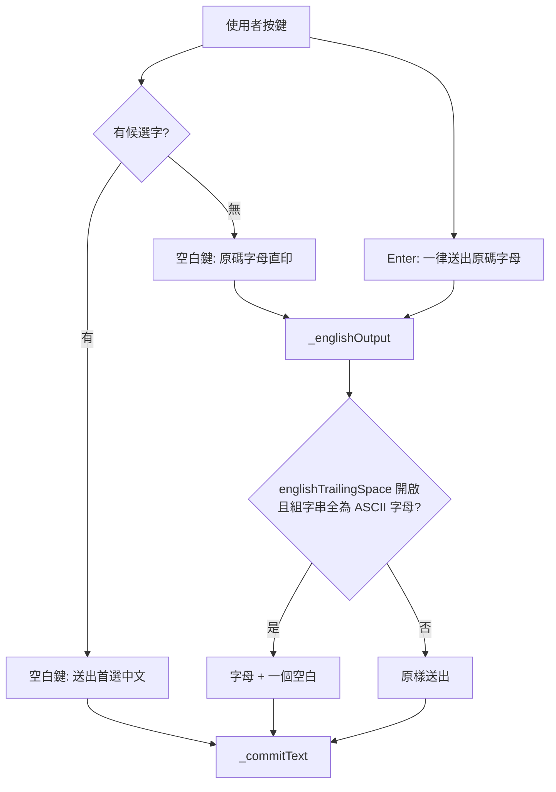

2026-08-21

# OhMyBias：英文直印自動補空白（新選項）與設定顯示版本號

## 英文補空白

v0.4.0 把「無候選字時清空組字串」改成「可續打、空白鍵原樣送出字母」，讓嘸蝦米模式下不用切英數就能打英文單字。實際用起來還缺一步：送出 `hello` 之後游標貼著字尾，要接著打下一個字得自己按一次空白鍵——但那一按會被輸入法吃掉（組字串已空，`handleSpace` 直接 return，讓系統送出空白），節奏上多一拍且容易漏。

所以新增偏好 `englishTrailingSpace`（預設關閉）：開啟後，英文直印送出的字母尾端自動補一個空白。兩個直印出口都適用——空白鍵在無候選字時送出原碼，以及 Enter 一律送出原碼。

實作集中在 `InputEngine._englishOutput(_:)`，兩個出口各包一層：

```
handleSpace() 無候選字分支：_commitText(_englishOutput(_composing))
handleEnter()：              _commitText(_englishOutput(_composing))
```



### 為什麼要限定「純 ASCII 字母」

直印出口送出的不一定是英文。組字串可能含 `*`（萬用字元查詢查無結果）、`,`（標點還沒進 `,,` 指令狀態）等等；這些情況補空白只是製造垃圾字元。`_englishOutput` 因此先檢查 `text.allSatisfy { $0.isASCII && $0.isLetter }`，不符就原樣回傳。這也讓「補空白」的語意跟選項名稱一致：補的是**英文單字**後面的空白，不是任何直印內容後面的空白。

### 使用者原本問的「超過 4 個字母」

需求描述裡把「查無中文字」和「超過 4 個字母」列成兩種情況，但引擎裡它們不是兩條路。碼長超過 `maxCodeLength` 時，只有在**有候選字**的情況下才會自動送出首選並以新鍵重新組字；無候選字時 v0.4.0 已經允許無限續打。所以「打超過 4 個字母」最後仍然是靠空白鍵或 Enter 送出，走的就是上面那兩個出口，不需要第三個處理點。

### 為什麼是設定選項而不是預設行為

補空白對「連打多個英文單字」很順，但對「打一個英文詞再接中文」「英文後面直接接標點」反而多一個要刪的空白。兩種用法都合理，且各自的使用者不會想每次切換，所以做成偏好、預設維持 v0.4.0 的行為（不補），開啟才改變。

## 設定顯示版本號

先前版本號只寫進 debug log（`AppDelegate` 啟動時 `DebugLog.log("OhMyBiasIM: build=…")`），設定視窗任何地方都看不到。使用者回報問題時無從對照自己裝的是哪一版。

在說明分頁「原始碼」連結上方加一行版本，取 `CFBundleShortVersionString`，build 號不同時附在括號裡。`ohmybias.sh` 把 `CFBundleVersion` 設成 `VER.時間戳.commit hash`，所以格式化時先把重複的 `VER.` 前綴切掉，顯示成 `0.4.0（build 20260821.1348.6c5977c）`，一行就同時給出人看的版本與給我看的 commit。

## 測試

引擎測試原本都用 `InputEngine()` 預設偏好（`DefaultPreferences` → `UserDefaults.standard`），沒辦法測「選項開啟」的路徑。`IMEPreferences` 協定本來就是為了注入而存在，只是還沒有測試替身，所以補了 `Tests/Stubs/MockPreferences.swift`。

四個新案例：開啟時空白鍵直印補空白、開啟時 Enter 直印補空白（且刻意用「有候選字」的碼 `ab`，確認 Enter 送的是原碼不是中文）、關閉時維持原樣、組字串含 `*` 時不補。全部 90 個測試通過。
