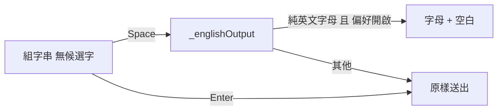

2026-08-29

# OhMyBias：英文補空白只對空白鍵生效，Enter 送出原碼不補空白

## 問題

0.5.0 加入的「英文補空白」偏好，會在米模式下英文直印（組字串查無候選字、把打到一半的字母原樣送出）時於尾端補一個空白，方便連續打英文單字。當時把「無候選字按空白鍵」與「按 Enter 送出原碼」視為同一件事，兩條路徑都經 `_englishOutput` 補空白。

實際使用上兩者意圖不同：按空白鍵是「這個英文字打完了，接著打下一個字」，補空白省一鍵；按 Enter 則常是要換行、送出表單或當作結尾，多出來的空白反而礙事。

## 修正

`InputEngine.handleEnter` 改為直接 `_commitText(_composing)`，不再經過 `_englishOutput`；補空白只留在 `handleSpace` 的無候選字分支。

`_englishOutput` 的判斷條件（偏好開啟、純 ASCII 字母）不變。測試 `testEnglishTrailingSpaceOnEnter` 改為斷言 Enter 不補空白（含有候選字與無候選字兩種情況），設定卡片說明改為「空白鍵直印英文後加空白」。
