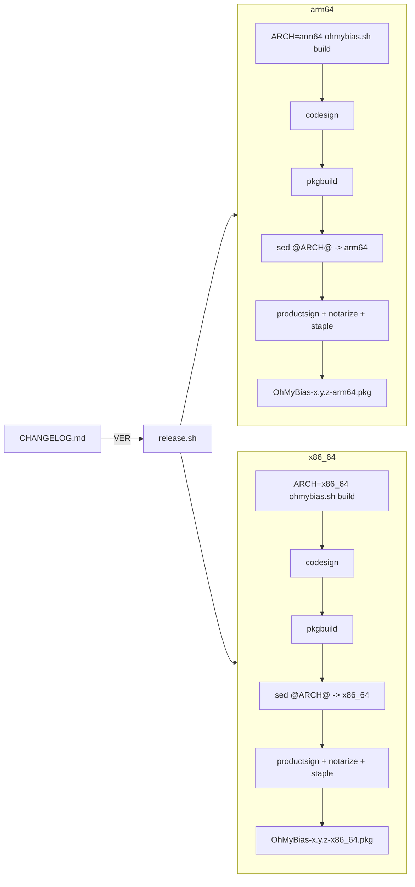

2026-08-23

# OhMyBias：release 改為 arm64／x86_64 各出一個 pkg，支援 Intel Mac

## 做什麼

OhMyBias 原本只出 Apple Silicon 版（`swiftc -target arm64-apple-macos14.0`、pkg `hostArchitectures="arm64"`）。這次讓 2019 以後的 Intel iMac（能跑 macOS 14 Sonoma）也能裝：`release.sh` 對 arm64 與 x86_64 各跑一輪 build → 簽 → pkg → 公證 → staple，產出 `OhMyBias-x.y.z-arm64.pkg` 與 `OhMyBias-x.y.z-x86_64.pkg`。既然程式碼完全沒動，0.6.0 的 Intel 版直接用同一份程式碼補出來，上傳到既有的 v0.6.0 GitHub Release。

## 為什麼幾乎零成本

事前掃過 sources：沒有任何 `#if arch`、沒有 `@available`、`liu.bin` 格式在 `CINCompiler`／`DataExt` 明確用 `.littleEndian` 讀寫（兩種架構都是 little-endian）、mmap 行為相同。唯一的 macOS 14 依賴是 `PrefsStore` 的 `@Observable`，而 Sonoma 本來就是最低需求，2019 iMac 跑得了。真正卡在架構的只有三處字串：`ohmybias.sh` 的 `-target`、`pkg/distribution.xml` 的 `hostArchitectures`、以及 README 的下載說明。先在 scratchpad 用 `-target x86_64-apple-macos14.0` 交叉編譯一次確認能過，再動腳本。

## 怎麼做

- **`ohmybias.sh`**：新增 `ARCH` 環境變數（`arm64`／`x86_64`，預設 `uname -m`），`-target "${ARCH}-apple-macos14.0"`。開發日常不受影響；`ARCH=x86_64 ./ohmybias.sh build` 即可交叉編譯。
- **`release.sh`**：原本的線性流程包成 `release_arch ARCH`，每個架構有自己的 `$TMP/$ARCH` 工作目錄。`./release.sh` 出兩種，`./release.sh x86_64` 只出一種（這次補 0.6.0 就是這樣用）。build 完用 `lipo -archs` 驗證 binary 架構真的對，避免 `ARCH` 沒傳進去而出錯架構的 pkg。
- **`pkg/distribution.xml`**：`hostArchitectures="@ARCH@"`，release.sh 用 sed 代入後再交給 productbuild。

## 為什麼分兩個 pkg 而不是 universal binary

swiftc 一次只能編一種 target，universal 得編兩次再 `lipo -create`——多一步，換來的是使用者不用選。但分開出有個實際好處：pkg 的 `hostArchitectures` 讓 Installer 在裝錯架構時直接擋下（Intel 機上開 arm64 pkg 會說不支援），這是 universal 給不了的保險。再加上 Apple Silicon 使用者佔絕大多數，多一個選項的負擔很小，就選了分開出。

## 0.6.0 補 Intel 版的順序

先 commit 腳本變更再跑 release，讓 `CFBundleVersion` 的 git hash（`0.6.0.20260823.1311.7c76e91`）指向真的能重現這個 build 的 commit。release.sh 的版本號來自 CHANGELOG 第一個 `## [x.y.z]`，新加的 `## 未發佈` 段沒有方括號、不會被抓走，所以直接出的就是 0.6.0。公證通過、staple 後用 `spctl -a -t install` 確認 `Notarized Developer ID` accepted，再 `gh release upload v0.6.0`，release notes 補上兩個 pkg 的選法。

既有的 arm64 資產維持 `OhMyBias-0.6.0.pkg` 檔名不改（連結不要斷）；從下一版起兩個都帶架構後綴。

## 沒驗證的部分

手邊沒有 Intel Mac，x86_64 版只驗到「交叉編譯成功、binary 架構正確、pkg 公證通過」，沒有在 Intel 機上實際裝過跑過。IMK 輸入法行為不該因架構而異，但真有問題得靠使用者回報。
