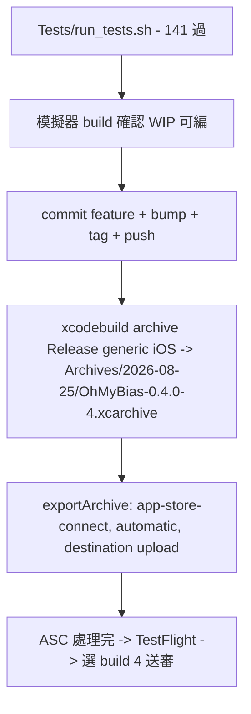

2026-08-25

# OhMyBias iOS 0.4.0（build 4）發布準備

自 v0.3.0（2026-08-20）以來累積 7 個 commit：常用語自訂組字碼、密碼／ASCII 欄位英文直通、
大寫字母鍵偏好、按鍵按下邊框色、注音／拼音／字頻與 phrases.bin 改 mmap 二進位、
容器 app 不再隨附資料檔、App Store 上傳前置（iPad 第四個旋轉方向、`ITSAppUsesNonExemptEncryption`）。

`MARKETING_VERSION` 0.3.0→0.4.0、`CURRENT_PROJECT_VERSION` 3→4（兩個 target 同步），
CHANGELOG 補上 `[0.4.0]`，commit `5b0c684`、tag `v0.4.0`。

## 流程（沿用 EinkBro iOS 的 headless 配方，見 `einkbro-ios-first-appstore-upload.md`）

本專案是純 Xcode 專案，不需要 `xcodegen generate`；其餘一樣：



Export options 放在 `build/ExportOptions.plist`（gitignored）：`method: app-store-connect`、
`signingStyle: automatic`、`destination: upload`、`teamID: 3WD42GF27D`、
`manageAppVersionAndBuildNumber: false`（版本號由 pbxproj 決定，不讓 Xcode 自動加）。
認證走 Xcode 已登入的 Apple ID（Account Holder），不需要 API key。

Claude Code auto mode 的 classifier 擋下了 `destination: upload` 那一步（對外發布的動作），
所以上傳由使用者自己跑：

```
xcodebuild -exportArchive \
  -archivePath ~/Library/Developer/Xcode/Archives/2026-08-25/OhMyBias-0.4.0-4.xcarchive \
  -exportOptionsPlist build/ExportOptions.plist -exportPath build/export \
  -allowProvisioningUpdates
```

## 上傳後在 App Store Connect 要手動做的事

1. 第一次上架：先在 ASC 建 app 記錄（bundle `info.plateaukao.ohmybias`，SKU 建議 `ohmybias-ios`，
   主要語言繁體中文）— 沒有記錄上傳會回 `missingApp`。
2. 等 build 4 處理完（TestFlight 分頁），回答出口合規（Info.plist 已標示不使用自訂加密，通常不再問）。
3. App Store 分頁建 0.4.0 版本：選 build 4、貼 CHANGELOG `[0.4.0]` 當「此版本的新功能」、
   截圖（6.9" 與 13" iPad 各一組）、隱私政策 URL、App 隱私問卷（鍵盤 extension 請求
   `RequestsOpenAccess`，要說明剪貼簿指令 `,,V` 的用途且資料不離開裝置）。
4. 審查備註要說明：liu.cin 由使用者自行匯入、app 不隨附 — 審查員需要一份 .cin 才測得到中文輸入，
   附測試步驟（設定 → 一般 → 鍵盤 → 新增 OhMyBias 米 → 允許完整取用）。

## 上傳結果（20:27）

`UPLOAD SUCCEEDED with no errors, 1 warning`，Delivery UUID `5725bc72-79be-48ec-b477-bdfebaf5c532`。
警告 90737「Missing Document Configuration」：宣告了 `CFBundleDocumentTypes`（.cskin 關聯）就得補
`LSSupportsOpeningDocumentsInPlace`。app 用 `startAccessingSecurityScopedResource` 直接讀原檔套用皮膚、
不複製進 Inbox，所以填 `YES`（commit 在 v0.4.0 之後，下一個 build 生效；build 4 不受影響）。

build 上傳後先出現在 TestFlight 分頁（Processing），處理完（10–30 分鐘、Apple 會寄信）才會進
App Store 分頁的 build 選單。
