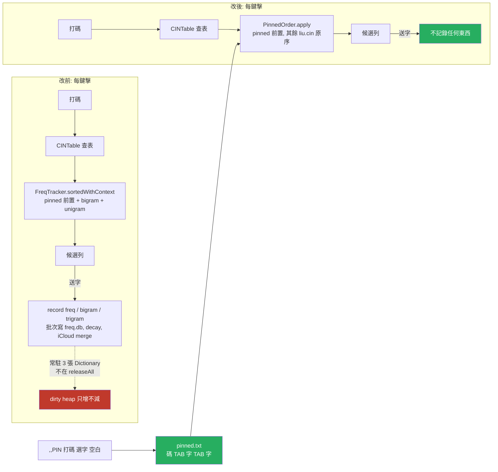

2026-09-03

# ohmybias iOS／Android：移除字頻學習（FreqTracker），`,,PIN` 固定排序改存 pinned.txt

## 起點：鍵盤 extension 為什麼「有時候」撞記憶體上限

這輪先做了一次完整的記憶體盤點（iOS 鍵盤 extension 的 dirty memory 上限依機型 60–77MB，
UIKit 基線就吃掉 38–45MB）。結論是這個行程是一個**棘輪**：Swift 的 `free` 不把頁面還給系統 —
在 macOS host 上實測，建好 FreqTracker 形狀的三張字典 +3.7MB，全部清空後 footprint 一個 byte
都沒退，`malloc_zone_pressure_relief` 也沒用。所以每一次短暫的高峰都變成永久基線，
「有時候」被 jetsam 只是看那一個 session 剛好疊了幾個高峰。

盤點裡有一項跟其他都不一樣：**FreqTracker 是唯一從鍵盤啟動就常駐、又不在任何釋放路徑上的東西。**
反查表、繁簡表、注音表都是 lazy 且 `releaseAll` 會放；SwiftUI 只在點齒輪時載；字形快取會 drain。
FreqTracker 一啟動就把 freq／bigram／pinned 三表整份讀進 `[String: [String: Int]]`，
每次送字都記 unigram＋bigram＋trigram，ADR `ohmybias-ios-settings-panel-and-memory` 量過打 4000 字
+3MB，而且沒有設定可以關 — 使用者以為關掉「聯想詞」就關了它，其實那是另一個功能。

## 它到底換來什麼

追完唯一的讀取路徑，答案是：**同碼字的順序**。`CandidateRanker.rank` 的第一步
`sortedWithContext` 把候選依「pinned 前置 → 上一字的 bigram → 這個碼的 unigram」重排。
嘸蝦米多數碼只有一個候選，所以多數鍵擊在排一個長度為 1 的陣列；`topBigrams`／`bigramBoost`
從上游帶過來卻沒有任何呼叫者。

使用者的決定：字頻學習整個拿掉，但 `,,PIN` 要留。

## SQLite 還是記憶體字典？其實都不是重點

順便回答了「改回 SQLite 查詢會不會比較好」— host 上量 18k 列：

| 存放方式 | heap | 每鍵擊查詢（freq＋bigram） |
|---|---|---|
| 巢狀 Swift Dictionary（原本） | +2.12 MB | 0.24 µs |
| SQLite `WITHOUT ROWID`＋`cache_size=-64`＋`mmap_size=8MB` | +0.14 MB | 6.4 µs（write-through upsert 22 µs） |

兩者對 16ms 一幀都看不見。當初 sweetlime 移植改成記憶體，是為了躲 `bgQueue.sync` 的執行緒切換
與「未滿批次的 pending 查不到」的正確性 bug，兩者都能不靠常駐字典解決。真正的差別是**頁面種類**：
Dictionary 是 jetsam 會算、放掉也不退的 dirty heap；mmap 過的檔案是 kernel 隨時可丟的 clean page。
但既然功能本身要拿掉，這條路就不用走了。

## 改法

兩個 repo 逐行對應地改：

- **刪掉** `FreqTracker`（iOS：SQLite3 C API＋iCloud merge；Android：interface＋`SqliteFreqTracker`
  ＋`MemoryFreqTracker`）、`freq.db` 路徑常數、`MemoryBudget.freqTracker` 預算、
  `scheduleBackgroundTasks`／`flushAll` 掛點、`,,RS` 指令與 ⚙ 面板的「重置字頻」按鈕
  （連帶拿掉只為它存在的兩段確認 destructive 機制）。iOS 測試 runner 不再 `-lsqlite3`。
- **新增 `PinnedOrder`**（iOS `Shared/`、Android `shared/`）：純文字 `pinned.txt`，一行一碼
  `碼<TAB>字<TAB>字…`。一字一欄，所以非 BMP 字不需要 Android 舊版那套 surrogate 編解碼
  （`PinnedCodecTest` 隨之刪除）。啟動整份讀進小字典（通常幾筆），`,,PIN` 確認／`,,UNPIN`
  即寫檔。沒有檔案時用內建預設 `hj → 手乎`，跟舊 DB 的 `INSERT OR IGNORE` 一樣；使用者 unpin
  後檔案存在、預設不會再回來。兩平台格式相同、檔案可互通。
- **`CandidateRanker.rank`** 的第一步從 `sortedWithContext` 換成 `pinnedOrder.apply`：固定的字
  依指定順序排前，其餘維持 liu.cin 原序，不增減候選。`prev` 參數沒人用了，一併拿掉。
- 引擎的 pin-mode 狀態機（`,,PIN` → 打碼 → 選字 → 空白確認 → toast）原封不動，只是儲存層換掉。
- 文件：README／CLAUDE.md／隱私權頁（iOS 拿掉「字頻學習資料」與 iCloud 同步兩句；Android
  「字頻統計」改「固定排序」）／`,,` 指令速查。Android `PLAN.md` 是歷史里程碑紀錄，不動。

## 驗證

- iOS `Tests/run_tests.sh` 164 passed（新增 `testPinnedOrder`：解析含非 BMP 字的檔案、序列化往返、
  預設值、引擎 `,,PIN` → 選乎 → 空白 → 再打 hj 時乎排第一 → `,,UNPINhj` 還原字表原序、寫檔落盤）。
- iOS 模擬器兩個 target 建置通過；簽章後裝到使用者的 iPhone 17 Pro。
- Android `testDebugUnitTest` 全過（新增 `EngineTest.pinnedOrder`，同一套流程用打 `,,pin` 走）。

## 沒做的

- **不搬舊的固定排序。** 之前存在 freq.db `pinned` 表裡的設定要重設一次；為了讀一張幾筆的表
  再把 SQLite 連回來不划算。
- **不刪殘留的 freq.db。** App Group／filesDir 裡的舊檔很小、無害，不加清理碼。
