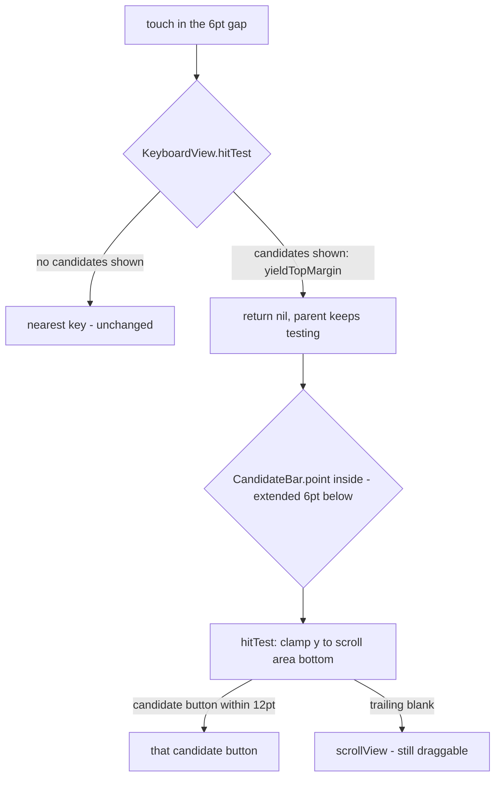

2026-08-30

# OhMyBias iOS：候選列與鍵面之間的縫，橫滑捲不動候選

## 問題

候選字多到溢出時，手指若從候選列底下那條「縫」起手橫滑，候選列不會捲；上一版（`b71c7b8`）之後還會誤觸第一排按鍵。

## 根因：縫不是候選列的，是鍵面的

```
+--------------------------------------+  y = 0
|  CandidateBar  46pt  (scrollView 滿高) |
+--------------------------------------+  y = 46   <- 候選列到此為止
|  KeyboardView 頂端留白 6pt  (topMargin) |  <- 看起來像縫，其實屬於鍵面
+--------------------------------------+  y = 52
|  q w e r t y u i o p                 |
```

`CandidateBar.barHeight = 46`，`scrollView` 上下貼齊候選列，所以候選列內沒有死角。鍵面 `rowsStack.topAnchor = topAnchor + 6` 留出的 6pt 屬於 `KeyboardView`。`b71c7b8` 把 `KeyboardView.hitTest` 改成「視圖內任一點都轉給最近的鍵」以消除外緣死角，副作用是縫裡的觸控被交給第一排 `KeyButton` — 它自管 `touchesBegan/Moved/Ended`、沒有捲動概念，候選列的 `scrollView` 永遠收不到。改之前那 6pt 是 hitTest 外框守門擋下、回傳 `KeyboardView` 本身，同樣捲不動，只是不會誤觸鍵。

## 修法：有候選時，縫讓給候選列



- `KeyboardView`：新增 `topMargin = 6` 常數與 `yieldTopMargin: (() -> Bool)?`；`hitTest` 在 `point.y < topMargin` 且閉包回 true 時回傳 `nil`，讓父視圖繼續往下測。
- `CandidateBar`：`hasScrollableCandidates`（= `!scrollView.isHidden`）；`point(inside:)` 在有候選時把命中範圍往下延伸 `bottomSlop = 6`；`hitTest` 把延伸帶的點當成貼在捲動區底緣（y 夾到 `bounds.height - 0.5`），走既有的「最近按鈕」轉發，找不到則回 `scrollView`，尾端空白也能拖動。
- `KeyboardViewController` 以 `keyboardView.yieldTopMargin = { candidateBar.hasScrollableCandidates }` 串接。空閒（工具列）狀態下縫仍歸鍵面、行為不變。

回傳候選按鈕而不是 `scrollView` 是刻意的：按鈕在 `scrollView` 內，祖先的 pan 手勢照樣收到觸控，橫滑會捲、點擊會選，一個回傳值兩種手勢都對。

## 驗證

iOS 18.6 模擬器：打 `ai` 出候選「俞 兪」，在縫裡點「俞」正下方 → 送出「俞」、未誤打 `w`；縫裡橫滑 → 沒有按鍵被觸發、欄位不變。模擬器上找不到會溢出的候選列（單碼候選少、聯想 7 個剛好塞得下），捲動本身留待實機長候選列驗證。
