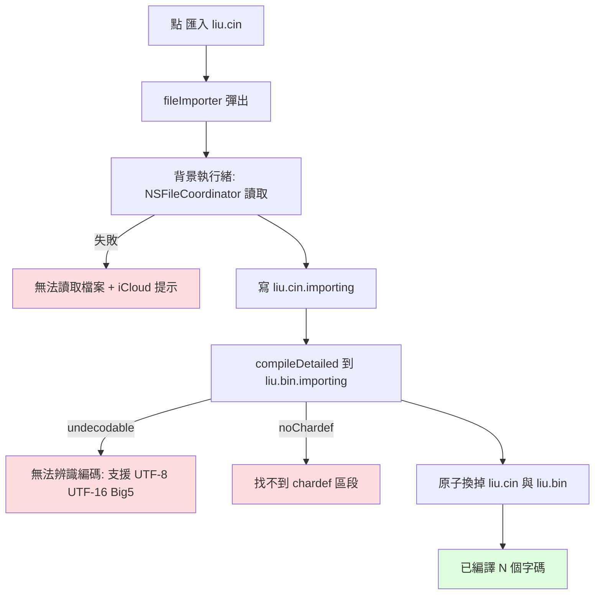

2026-09-02

# ohmybias-ios：匯入 liu.cin 沒反應／雲端檔匯不進／Big5 檔編譯失敗；⚙「開啟設定」在 iOS 27 失效

## 症狀

兩則回報：部分使用者在設定畫面點「匯入 liu.cin」沒有反應，或選了檔案後顯示「編譯失敗」；
另外鍵盤工具列 ⚙ 面板右下的「開啟設定」在使用者的 iPhone 17 Pro（iOS 27.0 beta）上點了
沒動靜。

## 匯入：三個互相獨立的原因

**同一個 view 掛了兩個 `.fileImporter`。** liu.cin 的 importer 在前、皮膚（.cskin）的在後。
SwiftUI 對這種寫法只會讓最後一個彈出 — Apple DTS 在論壇上的回覆是「目前不支援」。皮膚匯入
是後來加的，加上去那天起「匯入 liu.cin」就等於點了沒事。改成一個 `.fileImporter`，用
`pendingImport` 決定這次是哪種匯入、給哪組 `allowedContentTypes`。

**直接 `copyItem` 選檔器交回的 URL。** iCloud Drive 裡尚未下載到本機的檔案、Google Drive／
Dropbox 這類 file provider 的檔案，未經協調就讀會拿到「檔案不存在」或「沒有權限」。
改走 `NSFileCoordinator.coordinate(readingItemAt:)`，協調讀取才會觸發下載／實體化。

**編譯器只認 UTF-8。** 網路上流傳的 liu.cin 有不少是早年 Windows 版嘸蝦米流出的 Big5 檔；
記事本另存又常帶 UTF-8 BOM，或直接存成 UTF-16。這些全被判成「無效的 .cin」。
`CINCompiler.decode` 現在依序試 UTF-8（去 BOM）→ 帶 BOM 的 UTF-16 → Big5；指令列改以任意
空白分隔，`%chardef<tab>begin` 也認得。`CINTable` 的文字 fallback 共用同一個解碼。

流程同時改成背景執行緒（liu.cin 數 MB、雲端來源下載時間不定），讀取與編譯都先到暫存檔，
兩者成功才換掉現用字表 — 中途失敗不動現有的 liu.cin／liu.bin。`compile` 保留回傳 Int 的
簽名給鍵盤 extension 用，新增 `compileDetailed` 丟出具體原因，畫面提示分別對應讀不到、
編碼、找不到 `%chardef`、寫入失敗。

## 開啟設定：一代封一條路

鍵盤 extension 開 URL 沒有文件化的 API。iOS 18 封了走 responder chain 找 `openURL:` 的老路，
社群（KeyboardKit 8.8.6 起）改用 SwiftUI `Link` 的系統路徑；iOS 27 beta 上連那條也不通，
而使用者的手機正是 iOS 27.0。

沒有裝置可以逐條驗證哪一條在 iOS 27 上還活著，所以改成全部都走：`Link` 掛自訂
`OpenURLAction`，回 `.systemAction` 保留原本的系統路徑，同時把 URL 交給 controller 再試
`extensionContext.open`（唯一有文件的 API，鍵盤通常回 false）→ `EnvironmentValues().openURL`
（2026 年社群回報在 extension 內可用）。最後一條也回報失敗才 toast 提示從主畫面開啟。
若前面某條其實成功了，app 已切到前景，多出來的 toast 沒人看到。

## 驗證

- `Tests/run_tests.sh` 155 過 0 敗，新增 `testCINCompileEncodings`（UTF-8 BOM＋CRLF、UTF-16、
  Big5、tab 分隔指令列、`noChardef`、`unreadable`）。
- 模擬器：兩個匯入按鈕都彈出選檔器。
- 開啟設定那段只能在使用者的 iOS 27 裝置上確認；若仍失敗會看到 toast，代表三條路都被封。
