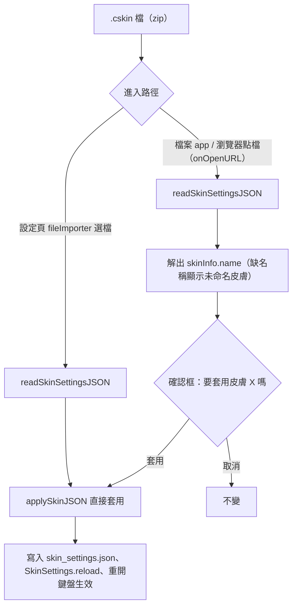

2026-08-16

# OhMyBias iOS：皮膚設計器連結＋ .cskin 檔案關聯

## 這是什麼

把 Android 版 `7e0c399` 的兩個皮膚功能移植到 iOS，兩平台行為與文案一致：

1. **設計器連結**：設定頁「皮膚」區新增「皮膚設計器（網頁）」，
   開啟 https://plateaukao.github.io/ohmybias-skin/ — 使用者在網頁設計、匯出 .cskin
   後回設定頁匯入。iOS 用 SwiftUI `Link`（等價於 Android 的 `ACTION_VIEW` intent；
   Safari 必存在，不需 Android 那種找不到瀏覽器的 fallback）。
2. **.cskin 檔案關聯**：在檔案 app 或瀏覽器下載列表點 .cskin 檔可直接開啟本 app，
   顯示皮膚名稱確認框後套用。

## 兩條匯入路徑、一套套用邏輯

關鍵設計（沿用 Android 版的判斷）：**選檔匯入不確認、點檔開啟要確認** —
使用者在 fileImporter 裡挑檔案已經表達套用意圖，再問一次是煩人的；
但從檔案 app 點檔進來是「開啟」不是「套用」，先秀出皮膚名稱讓使用者反悔。

原本 `handleSkinImport` 一路做到底，這次拆成 `readSkinSettingsJSON`（開 zip 取
`jsonnet/settings.json`，fallback 任意 `settings.json`）＋ `applySkinJSON`（寫檔、
reload、更新狀態訊息），兩條路徑共用 — 對應 Android 版拆出的
`readSkinSettingsJson`/`applySkinJson`。

## iOS 端的宣告方式

Android 用 manifest 的 VIEW intent-filter＋pathPattern 比對副檔名；iOS 對應做法是
`Info.plist` 宣告：

- `UTExportedTypeDeclarations`：exported UTI `info.plateaukao.ohmybias.cskin`，
  綁副檔名 `cskin`、conform to `public.data` + `public.archive`。用 exported（而非
  imported）因為 .cskin 是本 app 家族自有格式（ohmybias-skin 設計器定義）。
- `CFBundleDocumentTypes`：`LSHandlerRank = Owner` 宣告本 app 是該類型的擁有者。

開檔事件由 SwiftUI `onOpenURL` 進來。注意本 app 既有 `ohmybias://` URL scheme
（鍵盤跳設定頁用），同一個 `onOpenURL` 會收到兩種 URL — 以
`url.isFileURL && pathExtension == "cskin"` 過濾，scheme URL 不受影響。
`startAccessingSecurityScopedResource` 防禦性呼叫：inbox 複製進來的檔回傳 false 也無害。
