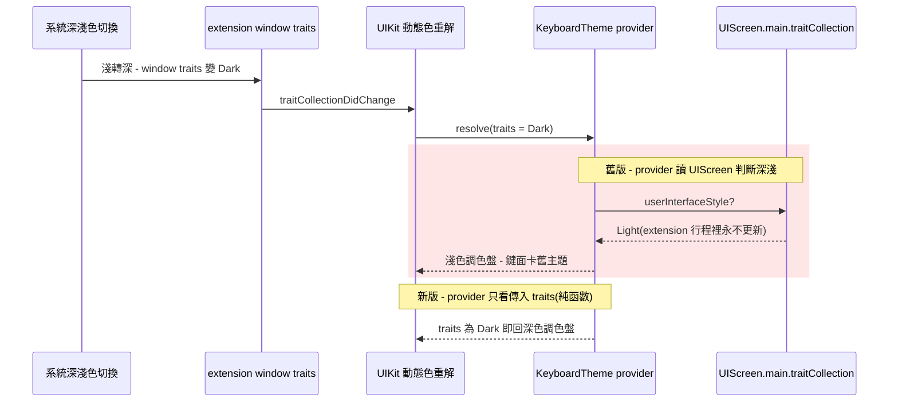

2026-08-15

# OhMyBias iOS：深淺色切換偶發卡舊主題 — 色彩 provider 改為 traits 純函數

## 問題

系統深淺色切換時，鍵盤偶發只換背板、鍵面卡在舊主題：深色模式下出現白鍵黑字
（淺色調色盤）浮在深色背板上，按一顆鍵那顆鍵自己變回正確顏色，收合重開鍵盤
才整個恢復。iPhone 17 Pro（iOS 27）與 iPhone 16（iOS 26.4）皆重現。

## 根因（lldb 附掛實測，非推論）

`KeyboardTheme` 所有動態色的 provider closure 以
`UIScreen.main.traitCollection.userInterfaceStyle` 判斷深淺（原意是「host app
強制淺色時仍依系統外觀顯示深色鍵盤」）。lldb 附掛模擬器上執行中的鍵盤
extension 行程直接對質：系統已切深色、extension window 的 traitCollection
已是 `Dark`，但 **`UIScreen.main.traitCollection` 仍回報 `Light` — 在
extension 行程裡它根本不跟著系統外觀更新**，只反映行程啟動當下的狀態。

UIKit 動態色的契約是 provider 必須為傳入 trait collection 的純函數：視圖
trait 改變時 UIKit 才會重解。provider 改讀 UIScreen 這個凍結的全域值，等於
每次重解都回啟動時的調色盤 — 鍵面永遠卡在舊主題，而背板等系統管理的部分
正常切換，就成了半深半淺的畫面。

## 修正

- **`KeyboardTheme`**：`pal()`（調色盤取色）與 `solid()`（iOS 27 玻璃模式
  鍵面壓不透明的合成）的 provider 只看 UIKit 傳入的 `traits` — 純函數，
  重解契約成立後深淺切換由 trait 系統自動驅動。`borderWidth` 改為
  `borderWidth(for: traits)`，由呼叫端視圖提供 traits（皮膚淺/深邊框寬可
  不同，例如蝦米皮膚淺色 1pt、深色 0）。
- **`CandidateBar`**：補上缺的 `traitCollectionDidChange`，重解選中候選的
  邊框 `CGColor`（layer 邊框色是解好的快照不會自動跟色；且 `setCandidates`
  內容未變時短路，不能靠它刷新）。
- **`KeyButton`**：邊框寬從 init 移入 `applyColors()`，trait 改變時一併重設。

## 過程中排除的第二個陷阱

第一版修正嘗試以 `textDocumentProxy.keyboardAppearance` 處理「host 明確指定
鍵盤外觀」：實測 Spotlight 搜尋框在系統深色下仍回報 `.light`（host 給的
快照會過期），而系統鍵盤在同一個輸入框照樣顯示深色 — 依它設
`overrideUserInterfaceStyle` 反而把鍵盤釘在錯誤主題。結論：外觀一律跟隨
繼承的 trait，`UIScreen.main` 與 `keyboardAppearance` 都不可作為深淺依據
（原因已寫進 `KeyboardViewController` 註解）。原「host 強制淺色仍顯示深色
鍵盤」的行為隨 hack 一併移除 — 該 hack 即本 bug 起源，移除後與系統鍵盤
行為一致。

## 驗證

iPhone 16 模擬器（iOS 26.4、匯入蝦米輸入法皮膚）鍵盤保持開啟：淺轉深、
深轉淺、連續快速切換六次，鍵面/工具列/候選列均即時跟上正確調色盤。
引擎測試 68/68 通過，兩 target 建置成功。
