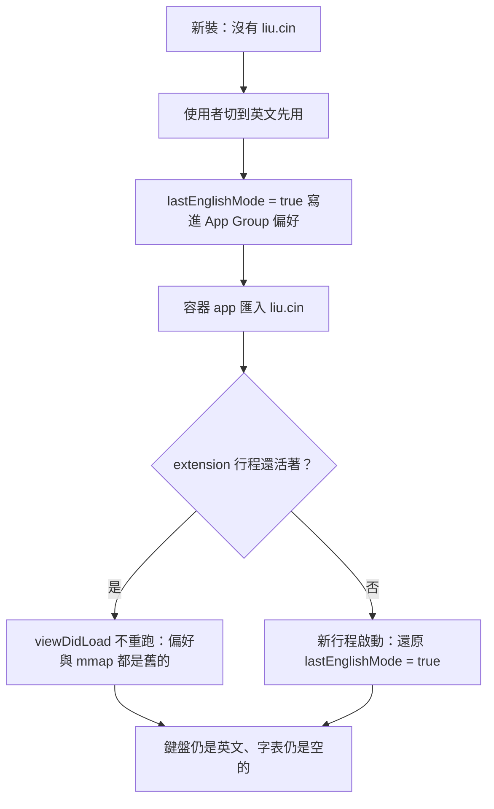
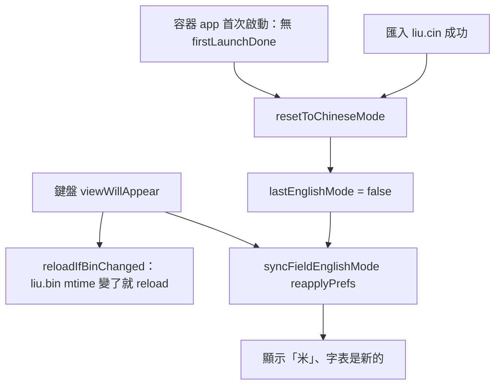

2026-09-03

# OhMyBias iOS：安裝／首次啟動／匯入 liu.cin 後預設輸入法回到嘸蝦米（米）

## 壞掉的行為

鍵盤裝好、或匯入 liu.cin 之後，第一次叫出來就是英文（工具列顯示「英」），
使用者得自己按一下才回到嘸蝦米。預期是：新裝、首次啟動、字表剛匯入，一律從「米」開始。

## 根因

鍵盤 extension 每次啟動都從 App Group 偏好還原 `lastEnglishMode`，而那個值只有一個寫入點：
使用者按工具列的中英切換。從來沒有任何地方把它歸零。

實際的觸發路徑是：新裝的鍵盤還沒有 liu.cin，中文打不出來，使用者理所當然切到英文先用；
這一下就把 `lastEnglishMode = true` 寫進偏好，之後回容器 app 匯入字表，鍵盤再叫出來
仍然是英文 — 那個「沒字表時的權宜狀態」被當成使用者偏好永久保留。

還有第二層：extension 行程在匯入期間常常還活著（切到容器 app 只是把鍵盤收起來），
而它只在 `viewDidLoad` 讀一次偏好、`loadTable()` 也只跑一次。容器 app 用 `replaceItemAt`
換 liu.bin 是換 inode，舊的 mmap 仍指著舊檔。所以就算偏好被歸零，這個行程也看不到，
字表也還是舊的（空的），得等系統把行程殺掉才生效。

## 修法

三個歸零點加兩個即時重載：

- `OhMyBiasPrefs.resetToChineseMode()` 把 `lastEnglishMode` 設回 false。
- **容器 app 首次啟動**（`OhMyBiasApp.init`）：沒有 `firstLaunchDone` 標記就歸零並立標記。
  App Group 偏好會跟著 iCloud 備份還原、也會在 Xcode 覆蓋安裝時留下來，
  舊裝置／舊 build 的英文狀態不該變成新裝置的預設。
- **匯入 liu.cin 成功**（`ContentView.importCin`，liu.cin／liu.bin 都換好之後）：歸零。
- **鍵盤每次出現**（`viewWillAppear`）：
  - `CINTable.reloadIfBinChanged()` — 載入時記下 liu.bin 的修改時間，不一樣（含從無到有）就整個 `reload()`。
  - `syncFieldEnglishMode(reapplyPrefs: true)` — 連偏好裡的中英狀態一起重套。

`syncFieldEnglishMode` 原本只在「欄位性質改變」（進出密碼／asciiCapable 欄位）時動作，
逐鍵的 `textDidChange` 也走它。重套偏好只能掛在 `viewWillAppear`，不能掛在逐鍵路徑：
在密碼欄手動切回中文是不存偏好的，若每一鍵都重套，下一鍵就會被切回英文。

## 驗證

- `Tests/run_tests.sh` 155 過；模擬器 build 成功。
- iPhone 16 模擬器：往 App Group plist 注入 `lastEnglishMode = 1` 且刪掉 `firstLaunchDone`，
  啟動 app 後讀回 `lastEnglishMode = 0`、`firstLaunchDone = 1`。
- 完整流程：Safari 文字欄叫出鍵盤 → 點「米」切成英文（偏好變 1）→ 切到容器 app 匯入 liu7.cin
  （偏好變 0，extension pid 未變）→ 回 Safari：同一個行程的工具列顯示「米」，打 `a` 出候選「對」。

## 附帶影響

既有安裝升上這個 build 時會被歸零一次成中文（之前沒有 `firstLaunchDone` 標記）。
可接受：本來就想要「米」當預設，且目前還在 0.5.x。

## 模擬器測試的坑（給下次用）

- `simctl spawn <udid> defaults read group.info.plateaukao.ohmybias` 讀到的是**錯的 domain**（sim 使用者的
  per-user plist，不是 App Group 容器）。要用 plist 路徑當 domain：
  `simctl spawn <udid> defaults write <groupContainer>/Library/Preferences/group.info.plateaukao.ohmybias.plist key -bool true`，
  `groupContainer` 用 `simctl get_app_container <udid> info.plateaukao.ohmybias groups` 查。
- 鍵盤 extension 的 view 不在 accessibility tree 裡（sim-use 只看到一個 GenericElement），
  「米／英」與候選只能靠截圖驗證、工具列按鈕靠座標點。
- 軟體鍵盤不出現：quit Simulator.app、`defaults write com.apple.iphonesimulator ConnectHardwareKeyboard -bool false`、再開。
