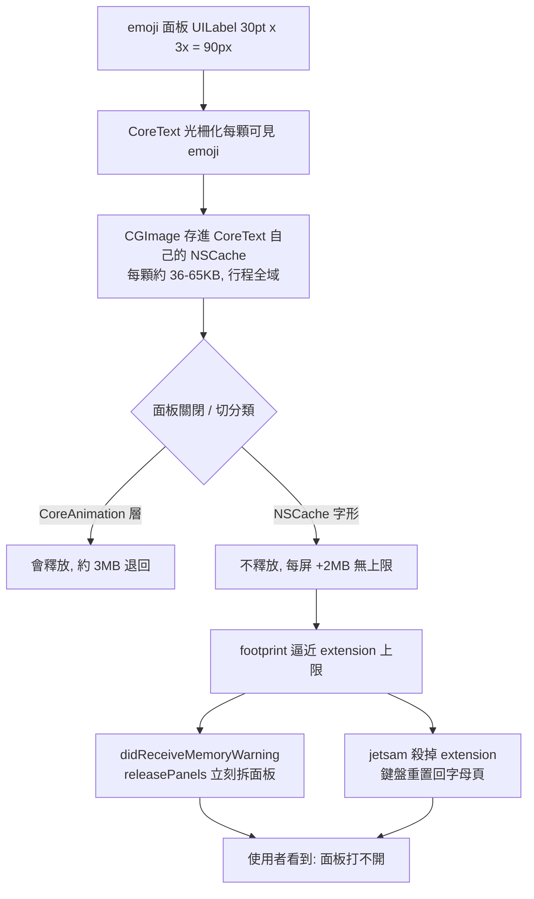
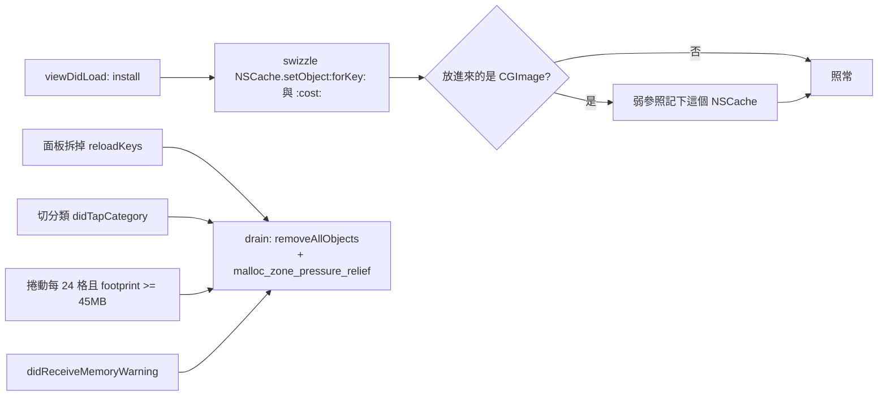

2026-08-30

# OhMyBias iOS：emoji 面板記憶體只增不減 — 主動清 CoreText 字形快取

## 症狀

逛 emoji 面板一陣子後，鍵盤 extension 記憶體居高不下；接著 emoji／顏文字／符號面板「打不開」— 一開就被拆掉回到字母頁，或整個鍵盤重置。使用者的描述是「memory too much、面板開不了」。

之前幾個 perf commit（面板收鍵盤即拆、mmap 語料、接記憶體警告）都做對了，但問題依舊。

## 量測

在 iPhone 16 Pro Max 模擬器上以 `xcrun footprint <pid>` 逐步觀察 extension 行程（模擬器上 appex 是本機行程，可直接量）：

| 步驟 | phys_footprint | MALLOC_MEDIUM | CoreAnimation |
|---|---|---|---|
| 鍵盤閒置 | 38 MB | 1.7 MB | 1.3 MB |
| 開 emoji 面板 | 44 MB | 3.9 MB | 3.1 MB |
| 人物 → 動物 → 飲食 | 50 MB | 9.7 MB | 3.1 MB |
| 返回字母頁 | 52 MB | **11 MB（不退）** | 3.5 MB |
| 再逛三個分類並捲動 | **65 MB** | **22 MB** | 3.6 MB |

- 資料層全是 mmap（clean page，不計入 footprint）— 不是它。
- CoreAnimation 層在面板拆掉後確實會退 — `releasePanels()` 有效，也不是它。
- 一路長、永不退的是 heap 裡的 `MALLOC_MEDIUM`（32KB–8MB 級的配置）：每一屏新 emoji +2MB，沒有上限。符號／顏文字面板幾乎不長（文字字形很小）— 它們「打不開」只是因為行程已經在天花板上。

## 根因

CoreText 把畫過的每顆 emoji 光柵化後以 `CGImage` 存進**它自己的 `NSCache`**（每顆約 36–65KB、行程全域），只在收到記憶體警告時才清。鍵盤 extension 的警告門檻約 55MB、jetsam 約 77MB，常常還沒收到警告就先被殺；就算收到，我們的 `didReceiveMemoryWarning` 會把面板拆掉 — 使用者看到的就是「面板一開就關」。

SwiftKey 在 iOS 上踩過一模一樣的坑，做法也一樣（見參考）。macOS host 上的驗證：畫 600 顆 emoji 有 1,154 次 `CGImage` 被 `setObject` 進同一個 `NSCache`，確認機制。

## 修法：`CoreTextGlyphCache`

- 只用公開 API：ObjC runtime 換掉 `NSCache` 公開方法的實作，偵測 `CFGetTypeID == CGImage.typeID` 就記下該 cache（`NSHashTable.weakObjects`）。不看 call stack — 我們自己的程式碼不會拿 NSCache 存 CGImage，誤抓風險低，就算誤抓也只是多清一個快取。
- CoreText 找不到快取只會重畫一次，沒有其他副作用；若日後 CoreText 不再用 NSCache，這裡自動變成 no-op。
- 清完再呼叫 `malloc_zone_pressure_relief(nil, 0)`：字形 bitmap 釋放後 malloc 仍留著整頁不還 OS，實測關面板殘留從 7MB 降到 3MB。
- 切分類就清（新分類的 cell 稍後才畫，不受影響）；大分類連續捲動時每 24 格檢查一次 footprint，≥ `MemoryBudget.glyphCacheDrainMB`（45）即清 — 避免單次面板 session 內就撞上限。

## 結果

同一段瀏覽腳本（約 30 屏 emoji）：

| | 修前 | 修後 |
|---|---|---|
| 閒置 | 38 MB | 42 MB |
| 逛完 | **65 MB**（字形 heap 22 MB，持續長） | **45 MB**（字形 heap 3.5 MB，持平） |
| 關面板 | 65 MB | 44 MB |

截圖確認清快取後 emoji 顯示正常（捲動中的分類無空白格）。`Tests/run_tests.sh` 141 passed。

## 沒採用的路：直接解 sbix 的 emjc

原本的想法是根本不經 CoreText 畫 emoji — 從字型檔 mmap `sbix` 表自己取點陣。macOS 的 Apple Color Emoji 是 PNG，但 iOS 的 `AppleColorEmoji-160px.ttc` 全是 Apple 私有的 `emjc`：16 byte `emj1` 檔頭 + LZFSE 流，解開是 alpha 平面 + 每列 PNG 式 filter byte + RGB 殘差平面。社群有規格與 C 解碼器（見參考），可行，但程式量大、格式未公開且色彩略有偏差，先不採用；若 Apple 哪天改掉 NSCache 再考慮。

另外試過「私有字型實例（從檔案載入）釋放時連帶釋放快取」— 不成立，快取以字型資料為 key。

## 參考

- SwiftKey：[Fixing CoreText Emoji Glyphs Memory Retention on iOS](https://medium.com/@mohasalah/from-2014-to-now-fixing-coretext-emoji-glyphs-memory-retention-on-ios-1c6a227d592d)
- emjc 規格：[Qiita 496_](https://qiita.com/496_/items/80cfc03ad2ed26c2ab52)、[cc4966/emjc-decoder](https://github.com/cc4966/emjc-decoder)
