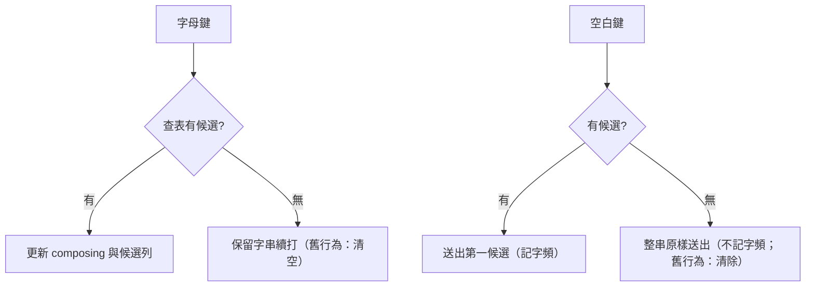

2026-08-16

# OhMyBias iOS：英文直通 — 無候選時續打不清除、空白鍵原樣送出

## 這是什麼

改變 `InputEngine` 在「打出的字串查無候選」時的行為。以前引擎把無候選視為打錯字：
超過 `maxCodeLength` 或下一鍵接不出候選就直接清空 composing，使用者打到一半的英文單字
無聲消失。現在改為**英文直通**：無候選時保留字串讓使用者續打，按空白鍵把整串原樣送出
（不記入字頻學習）。

這讓使用者在中文模式下直接打英文單字（如 "hello"、"iPhone"）不用先切英文模式 —
嘸蝦米字根最長四碼，更長的字串本來就不可能是字根，原樣送出即是使用者要的。

## 實作重點

- `handleLetter`：移除「無候選且達 `maxCodeLength` 就 `_resetComposing()`」的強制重置；
  接不出候選時改為更新 composing 並通知 delegate，讓字串繼續長。
- `handleSpace`：無候選時改走 `delegate?.engineDidCommit(raw)` 送出原始字串，
  取代原本的清除（`engineDidClearComposing`）。
- 順帶移除 **double-space 逃脫**（`_lastWasEmptySpace`）：原本連按兩下空白可清除
  無候選的 composing — 與新行為直接衝突（第一下空白已把字串送出），且已無存在必要。
  逃脫仍可用 Esc／候選列的取消達成。

## 測試

`testEngineEnglishPassthrough`：以 fixture 表（maxCodeLength=2）打 "hello" 驗證
續打不清除、空白原樣送出、送出後 composing 清空、空 composing 再按空白無動作
（該情境由 controller 層直接輸出空白字元）。
