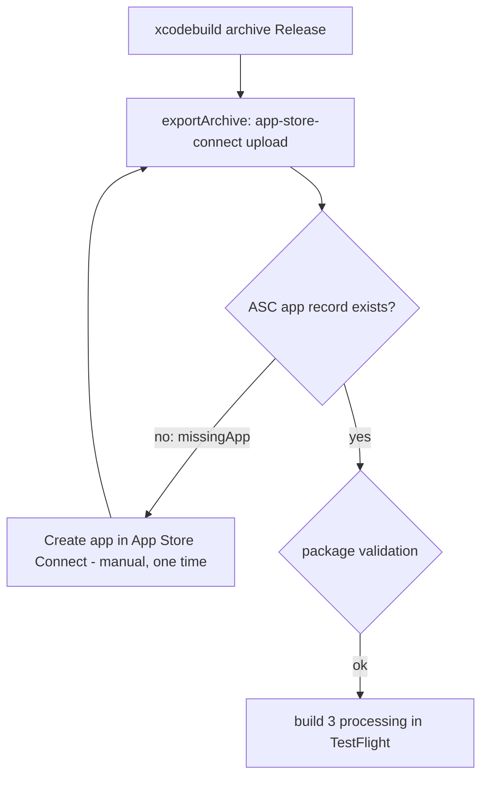

2026-08-21

# OhMyBias iOS：首次 TestFlight 上傳前置與卡關點

## 狀況

0.3.0 (build 3) 第一次嘗試走 EinkBro 已驗證過的無頭上傳流程
（`einkbro-ios-first-appstore-upload.md`）：Release archive 到
`~/Library/Developer/Xcode/Archives/2026-08-21/OhMyBias-0.3.0-3.xcarchive`，
再 `xcodebuild -exportArchive`，`method: app-store-connect`、`destination: upload`、
自動簽章、用 Xcode 已登入的帳號，不需要 API key。

Archive 成功，上傳在第一步就被擋：

```
IDEDistribution.DistributionAppRecordProviderError.missingApp(bundleId: "info.plateaukao.ohmybias")
```

App Store Connect 上還沒有這個 bundle ID 的 **app 記錄**。自動簽章會在開發者
網站登記 identifier，但不會建 app 記錄；建記錄只能在 ASC 網頁手動做，而且
app 名稱、SKU（建後不可改）、主要語言都是該由人決定的事，所以停在這裡。



## 先修好的兩件事（commit `427c08a`）

上傳前順手處理掉 EinkBro 當初踩過、這裡也一定會踩的驗證問題，免得建好
記錄後再被退一次：

- **iPad 四向旋轉**：`TARGETED_DEVICE_FAMILY = "1,2"`，ASC 套件分析要求支援 iPad
  的 bundle 在 `UISupportedInterfaceOrientations` 列齊四個方向（多工需求），
  原本只有三個。補上 `PortraitUpsideDown`。
- **`ITSAppUsesNonExemptEncryption = false`**：app 與鍵盤只用系統的 HTTPS /
  CloudKit，屬於豁免範圍。不標的話每個 TestFlight build 都會卡在
  「Missing Compliance」等人工回答，標了就直接可測。

## 接下來

1. 在 App Store Connect 新增 app：平台 iOS、bundle ID `info.plateaukao.ohmybias`
   （已由自動簽章登記在開發者網站）、名稱／SKU／主要語言自行決定
   （EinkBro 的慣例：SKU 用短 slug 如 `ohmybias-ios`，方便看銷售報表）。
2. 重跑 `xcodebuild -exportArchive`，archive 不必重建——這支 archive 已含
   0.3.0 build 3 與上面兩項 plist 修正。
3. 處理完成後在 TestFlight 加測試者；對外測試需送 TestFlight 審核。
