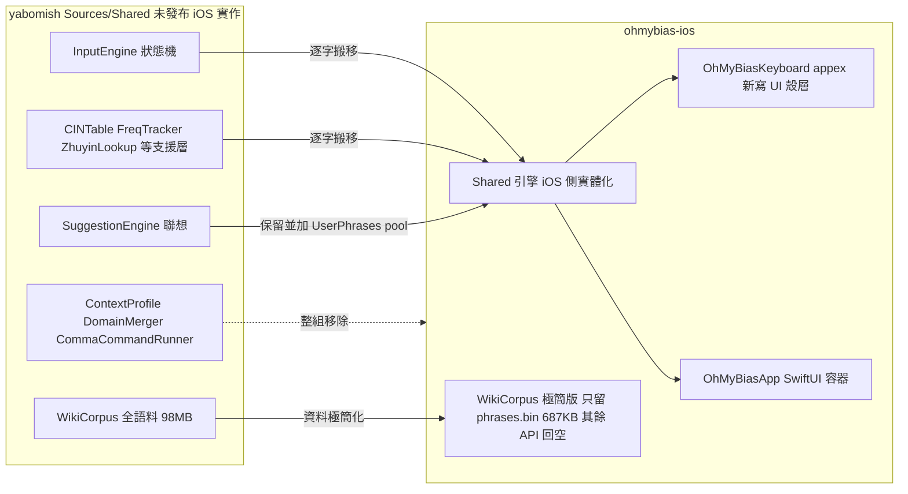

2026-08-14

# OhMyBias iOS — 從 Yabomish Shared 抽出 iOS 極簡版（含基本聯想詞）

新專案 `~/src/ohmybias-ios`：iOS 嘸蝦米鍵盤（app + keyboard extension），把 Yabomish 一直「做了但還沒準備好」的 iOS 版實際落地成可安裝、可打字、有聯想的極簡版本。

## 為什麼這樣抽

Yabomish 的 `YabomishIM/Sources/Shared/` 本來就**是** iOS 實作 — CLAUDE.md 寫明 "shared with an unreleased iOS version"，引擎註解裡是 `called by KeyboardViewController`、log tag 是 `YabomishKB`，`,,H` 說明文字整段在講空白鍵手勢與鍵盤高度。所以抽出的正確來源是 yabomish 的 Shared/（取 `#if os(iOS)` 的 iOS 側），**不是** ohmybias — 那是 macOS 極簡 port，且刻意移除了聯想（桌面不需要）；iOS 上聯想是必要的（「不用一直按」），這正是本專案跟 macOS 極簡版唯一的路線分歧：**保留基本聯想詞**。

「極簡」落在**資料**而非程式碼：`SuggestionEngine` 原封保留（只加一個 UserPhrases 優先 pool），`WikiCorpus` 改為極簡版 — 只無條件載入萌典詞組 `phrases.bin`（PHMM mmap，CC0，687KB），其餘語料 API（詞級 n-gram、專業詞典、NER、emoji、地區用詞）**保留簽名、回傳空結果**，呼叫端因此一行都不用改。隨附資料共約 1.4MB，對照上游 full 版 98MB。

## 怎麼建

- **iOS 側實體化**：App Group 容器（`group.info.plateaukao.ohmybias`）、40MB 記憶體預算、標點配對預設開、UIPasteboard、iCloud 字頻合併；移除 macOS 專屬的 syncFolder、DistributedNotification、HTML→Markdown、外部 shell 指令（`Process` iOS 不可用）。
- **新寫的殼層**（yabomish 裡不存在任何 iOS UI 檔案）：`KeyboardViewController` 實作 `InputEngineDelegate`（引擎註解本來就指名這個角色）、`KeyboardView` 字母／數字／符號／注音四頁、`CandidateBar`（聯想詞藍字、composing 為空時點選直接送出並連鎖下一輪）。
- **容器 app**：SwiftUI — 匯入 `liu.cin`（`CINCompiler` on-device 編譯，版權字表絕不隨附）、偏好 toggle（App Group UserDefaults）、自訂詞編輯。
- **Xcode 16 folder-synced 專案**：`Shared/` 與 `Resources/` 同屬兩個 target，加檔案＝放進目錄，pbxproj 不用改 — 盡量貼近本家族「無 Xcode 專案」的低摩擦習慣（appex 簽章打包無法純 swiftc）。
- **測試**：引擎平台無關，沿用 yabomish 的 swiftc + `check`/`checkEqual` 形式在 macOS host 跑，41/41 通過；唯一 UIKit 檔 `ClipboardProcessor` 以 stub 替換。

## 實作中發現的問題

- **上游潛在 crash（已修，值得回饋 yabomish）**：模擬器第一次按鍵，extension 直接 SIGTRAP、iOS 靜默換成注音鍵盤。原因：`Data.u32/u16` 用 `load(fromByteOffset:)`，Debug build 會 assert 4-byte 對齊，而 CINTable 索引是 6-byte stride — 一半的 entry 天生不對齊。上游從沒踩到只因為出貨都是 `-O`（assert 被編掉、arm64 容忍未對齊讀取）。修法一行：改用 `loadUnaligned`。
- **萌典用「臺」不用「台」**：打「台」不會出聯想、打「臺」才會 — 已寫進專案 CLAUDE.md。
- **單字 fallback 改尊重 skipChars**：上游的單字聯想 fallback 只查精選 domain 詞典（晶晶體等），故意繞過 skipChars；極簡版這條路換成了萌典一般語料，「的」會冒出「的確」這類噪音，因此補上 skipChars 閘門 — 這是對上游行為唯一的刻意偏離，測試有覆蓋。

## 驗證

模擬器全程用軟鍵盤實測（非 hardware key injection）：`do` 組字 → 候選「日」→ 空白送出 → 聯想 本／前／子／常／月（＝萌典 日本／日前／日子／日常／日月）→ 點「本」成「日本」並連鎖下一輪聯想。字表用使用者自己的嘸蝦米 7 `liu.cin` 現場編譯載入。

首 commit：`6d2a21e`（41 檔，+4523 行）。已留待辦：空白鍵滑動手勢、候選網格展開、鍵盤高度調整（引擎與說明文字已預留）。
