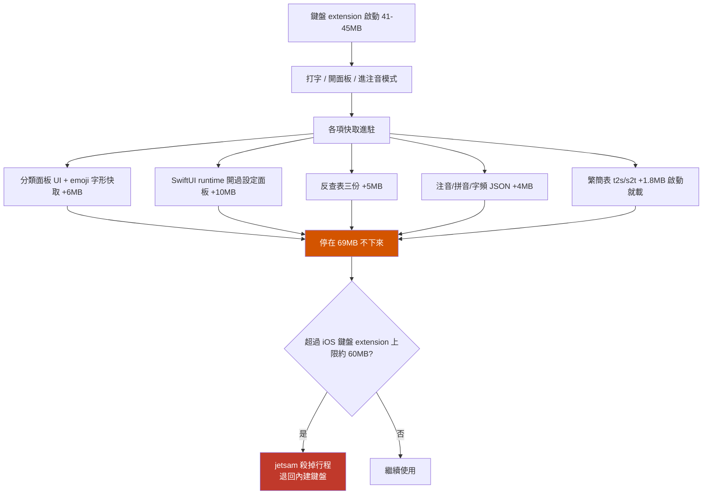
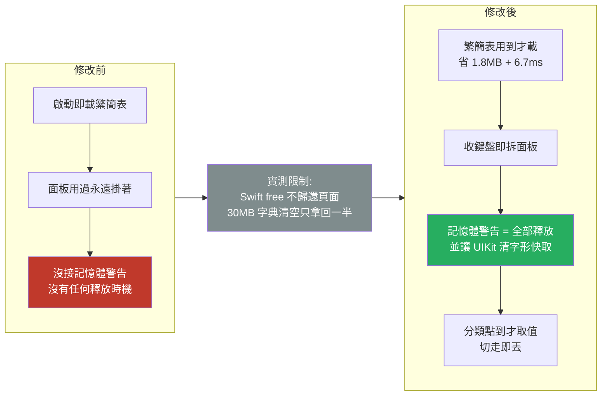

2026-08-20

# 鍵盤被系統換回內建的原因：記憶體只增不減

## 症狀

切換到另一個 app 時，輸入法有時會變回系統內建鍵盤——不是密碼欄那種已知情況，而是一般文字欄位也如此，且發生後會持續一陣子。

## 先排除欄位型別

用一頁含各種 `input type` 的測試網頁在 iOS 26.4 上逐一驗證，結果與直覺相反：

| 欄位型別 | 結果 |
|---|---|
| text、email、url（含 Safari 網址列）、number、search | 我們的鍵盤正常出現 |
| tel／`phonePad`／`numberPad`／`decimalPad` | 強制系統數字鍵盤，連地球鍵都沒有 |
| 密碼欄 | 系統鍵盤 |

`Info.plist` 裡的 `IsASCIICapable = false` 一度是嫌疑，但實測 email 與 URL 欄位都留住了我們的鍵盤，所以它不是主因。純數字鍵盤那條是 iOS 對所有第三方鍵盤的規則，改不掉也不需要改。

結論：除非第一個碰到的正好是電話欄位，欄位型別解釋不了這個症狀。

## 真正的原因：footprint 一路長到上限

改量整個 extension 行程，用 `footprint <pid>` 讀 `phys_footprint`：

| 狀態 | footprint |
|---|---|
| 系統 `kbd` 行程（注音＋英文＋Emoji 全包） | 29 MB |
| OhMyBiasKeyboard 剛啟動 | 41–45 MB |
| 用過分類面板、⚙ 面板、打過字之後 | **69 MB** |

而 iOS 對鍵盤 extension 的上限約 60MB。超過就被 jetsam 殺掉，host app 退回內建鍵盤；反覆被殺後 iOS 會暫時不再載入該鍵盤，這正好解釋「發生後會持續一陣子」。

值得一提的是**模擬器不強制執行這個上限**——所以在模擬器上能一路長到 69MB 而毫無異狀，只有實機才會被殺。這也是為什麼開發時不容易察覺。

另外，使用者拿來對照的「其他鍵盤」是 Apple 自己的注音／英文／Emoji，它們跑在系統共用行程 `/System/Library/TextInput/kbd` 裡，根本不受 app extension 的記憶體上限約束——比較基準本來就不對等。

## 逐項量測：問題不是單項太大，是全都不放

把區段明細（剛啟動 vs 用過之後）拆開比對，成長最多的是 `MALLOC_SMALL`（3MB → 27MB）與 `CoreAnimation`（1.3MB → 6.8MB）。逐項量測各資料結構：

- **繁簡表 t2s/s2t**：1.84 MB、解析 6.7 ms。**每次鍵盤啟動無條件載入**，但只有 `,,S`／`,,TS`／`,,ST` 與拼音簡體顯示用得到。從不打簡體的人是純浪費。
- **反查表三份**：約 5 MB。已是 lazy（第一次 `reverseLookup` 才建），但**離開該模式不會釋放**。
- **注音／拼音／字頻 JSON**：3.55 MB、20 ms。已是 lazy，但 `ZhuyinLookup` **完全沒有釋放方法**，`loaded` 一旦為 true 就持有到行程結束。
- **分類面板資料**：意外地只有 **0.18 MB**。Swift 的 `static let` 本來就是第一次存取才初始化，且字串字面值存在 binary 的 `__TEXT`／`__DATA_CONST`，是檔案支援的 clean page，不算 dirty footprint。所以開面板那 +6MB 幾乎全是 `UICollectionView` 與 emoji 字形的繪製快取，不是資料。
- **面板本身**：收鍵盤時完全不會拆掉，view 一直掛著。

## 一個改變修法方向的實測

原本打算「用完就放」，但先驗證了「放了到底降不降」：

| 情境 | 結果 |
|---|---|
| 清空 4MB 的注音表 | footprint 完全沒降 |
| 再呼叫 `malloc_zone_pressure_relief` | 還是沒降 |
| 清空 30MB 的大 Dictionary | 降 15.9MB，**但 16MB 留在堆積裡** |

Swift 的 `free` 不把頁面還給系統：髒頁留在 malloc 堆積中重用，而 jetsam 看的正是 `phys_footprint`。小結構幾乎拿不回任何東西，大結構約拿回一半。

這直接改變了優先順序——**「一開始就不要載入」遠比「用完再釋放」有效**，因為前者是真的沒發生，後者只能拿回一部分。

## 實作內容

- **t2s/s2t 改 lazy**：`CINTable` 的 `t2s`／`s2t` 改為計算屬性，第一次存取才呼叫 `loadCharMaps()`；`reload()` 不再無條件載入。這是唯一確定省下來的部分（1.84MB ＋ 每次啟動 6.7ms），因為它根本沒發生，不受 malloc 不歸還影響。
- **收鍵盤即拆面板**：`viewWillDisappear` 拆掉 ⚙ 面板與分類面板並回到字母頁（新增 `KeyboardView.releasePanels()`）。
- **接上 `didReceiveMemoryWarning`**：原本完全沒接。這是被 jetsam 殺掉前的最後機會，拆面板同時也讓 UIKit 有機會回收它自己持有的 emoji 字形快取——那是我們沒有 API 直接釋放的部分。
- **分類內容延後取值**：`CollectionPanelView` 改收 `[(String, () -> [String])]`，點到該分類才取值、切走即丟；第 0 個分類（預設顯示）保留快取。
- **`ZhuyinLookup.release()`**：補上釋放方法；`MemoryBudget.trimIfNeeded` 門檻由 65 降到 55（原本 75 的 `canAfford` 門檻比真實上限還高，保護永遠不會先觸發），並新增 `releaseAll` 供記憶體警告使用。

## 誠實的結果

功能面全部驗證通過：emoji 面板正常、分類切換正確、83 個測試全過。

但**關面板與收鍵盤之後 footprint 並沒有下降**（維持 49MB）——這正是上面那個實測預告的結果。前三項的實際效果是「不再繼續長大」，不是「用完會縮回去」。真正會在實機上有差別的是記憶體警告那條路，而它無法在模擬器驗證（模擬器不強制 jetsam，也沒有可靠方式觸發真實記憶體警告）。

若要真正把記憶體拿回來，結構性解法是讓大表不要以 Swift Dictionary 存在——改成像 `liu.bin` 那樣 mmap ＋ 二分搜尋，用 clean page，系統可直接回收。那是下一步，工程量大得多。

## 過程筆記

- `heap`／`leaks` 無法附著模擬器內的行程（回報 minimal corpse），但 `footprint <pid>` 可以，且能給 dirty/clean 分類明細，是這次量測的主力。
- `xcrun devicectl device sysdiagnose` 對這台實機回報空錯誤，拿不到 jetsam 記錄；實機 UI 自動化需要安裝 WebDriverAgent。裝置端的最終確認留給使用者自己看「設定 → 隱私權與安全性 → 分析與改進 → 分析資料」裡的 `JetsamEvent-*`。
