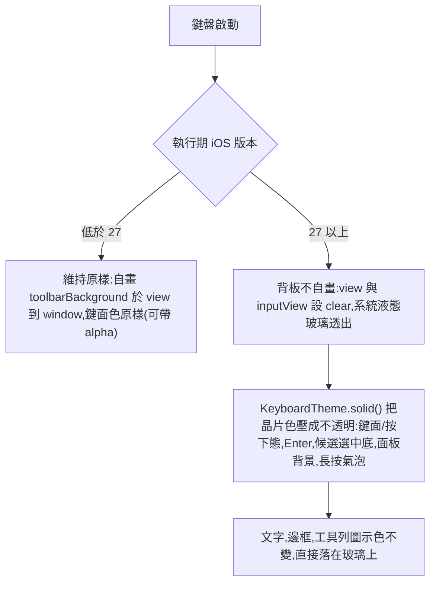

2026-08-15

# OhMyBias iOS：iOS 27 液態玻璃適配 — 背板交給系統、鍵面壓成不透明

## 背景：相容 key 在 iOS 27 上救不了

前一篇（`ohmybias-ios-liquid-glass-optout.md`）用 `UIDesignRequiresCompatibility` 關閉
Liquid Glass — 在 iOS 26 有效，但實機（iPhone 17 Pro，iOS 27 beta）證實 **iOS 27 的鍵盤
host 無視此 key**：系統把第三方鍵盤放進透明玻璃背板，我們自畫在 view/superview/window 的
背景色全數失效，整個鍵盤成半透明鬼影。

方向由使用者拍板：**不對抗，擁抱玻璃** — 背板與工具列讓給系統玻璃，只把按鈕與內容做實。

## 決策流程

## 關鍵洞察：皮膚色帶 alpha 是鬼影的真兇

皮膚（含內建 sweetlime 預設，如 `keySystem = #D6D6D696`）的鍵面色普遍帶 alpha —
設計上假設疊在不透明的自畫背景上。背板變玻璃後，這些半透明色直接透出桌布，
鍵面幾乎隱形。`KeyboardTheme.solid()` 把顏色預先合成在皮膚 `toolbarBackground` 上
（底色自身帶 alpha 時先壓在純白/純黑地上），輸出 alpha=1 的實色 —
**視覺上與舊版疊色結果相同**，但玻璃穿不透。

一切以 `#available(iOS 27, *)` 執行期判斷（`KeyboardTheme.glassHost`），
iOS 26 以下行為位元級不變；以 iOS 26.2 SDK 編譯即可生效，不需 Xcode 27。

## 已知問題與保留決定

- **iOS 27 beta 深色主題未全面生效**。一度懷疑是 `pal()` 依賴已棄用的
  `UIScreen.main.traitCollection` 判深淺，實驗（硬編碼色仍不變深）後使用者判定為
  OS beta 問題，決定**維持原有 UIScreen.main 判定方式**、觀察後續 beta；
  適合提 Feedback Assistant 回報。
- `UIDesignRequiresCompatibility` 保留 — iOS 26 上仍有效且無害。
- 驗證受限：本機僅 Xcode 26.3（無 iOS 27 模擬器，需 Xcode 27 beta），
  故 iOS 27 行為以實機驗證、模擬器只驗證 iOS 26 無回歸。

Commit：ohmybias-ios `81eeada`（依指示僅 commit 未 push）。
