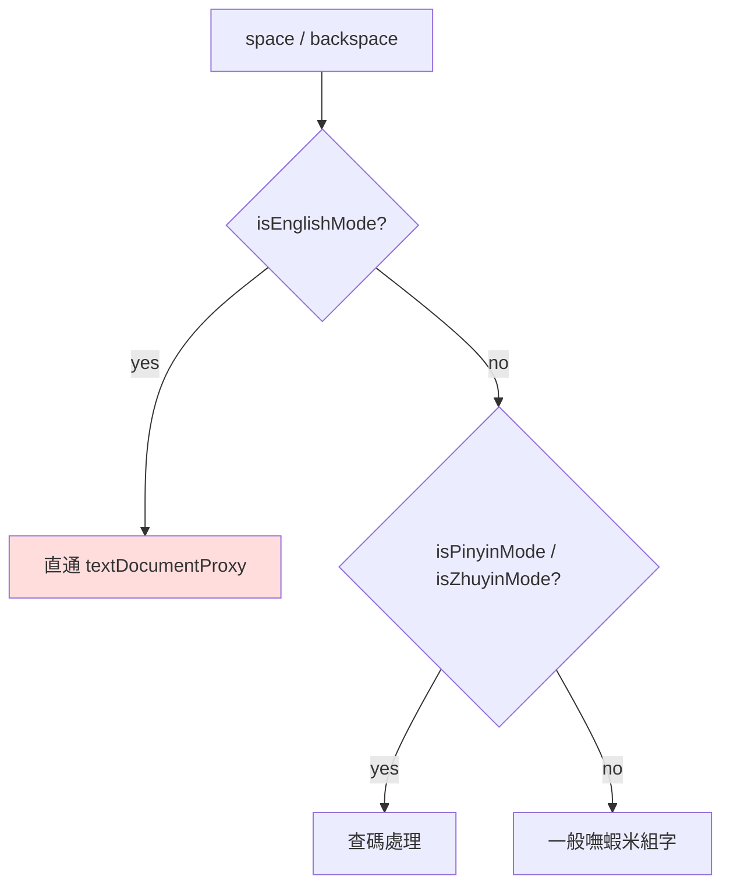
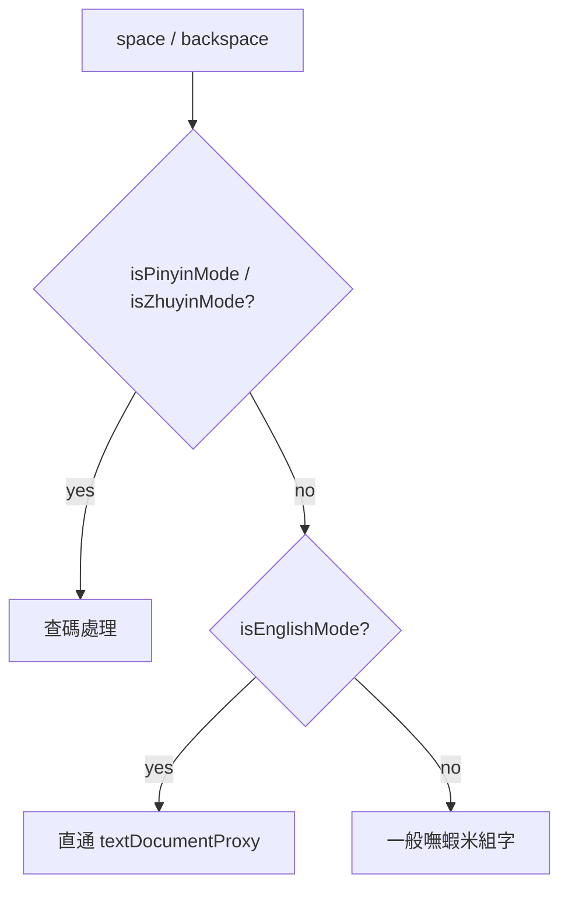

2026-09-02

# ohmybias-ios：英打模式下切查碼，空白／退格改由查碼模式優先

## 問題

鍵盤在英打模式（`isEnglishMode`）時，使用者切到注音或拼音查碼（查嘸蝦米碼），
按空白鍵卻直接插入一個空格、按退格直接刪掉編輯框裡的文字。查碼時空白該是
一聲／觸發查碼、退格該清注音槽，兩者都失效。這是 Android 版 issue #6 的同款
問題，iOS 這邊的 `KeyboardViewController` 也有一樣的分支順序錯誤。

## 根因

`handleSpaceKey` 與 `handleBackspaceKey` 兩個入口都把「英文模式 → 直通
textDocumentProxy」放在最前面，查碼模式的判斷排在後面，因此英打狀態下
查碼分支永遠到不了。

英打時走紅色那條，查碼分支 E 完全被遮住。

## 修法

把查碼模式的判斷移到英文模式之前——查碼是「暫時覆蓋」目前輸入模式的狀態，
理應優先於英／中的底層模式：

退格在注音模式改呼叫 `engine.handleBackspace()`，引擎內本來就有
`_isZhuyinMode` 分支處理注音槽（先清候選、再逐一退注音符號、槽空了才清
組字區），不必在 view controller 另寫一份。拼音退格則沿用既有的
`handlePinyinBackspace()`。

## 備註

引擎邏輯（`Shared/InputEngine.swift`）不需修改，只調整 iOS 鍵盤這層的分派
順序。macOS 版（yabomish / ohmybias）的對應入口若有同樣順序，也該一併檢查。
