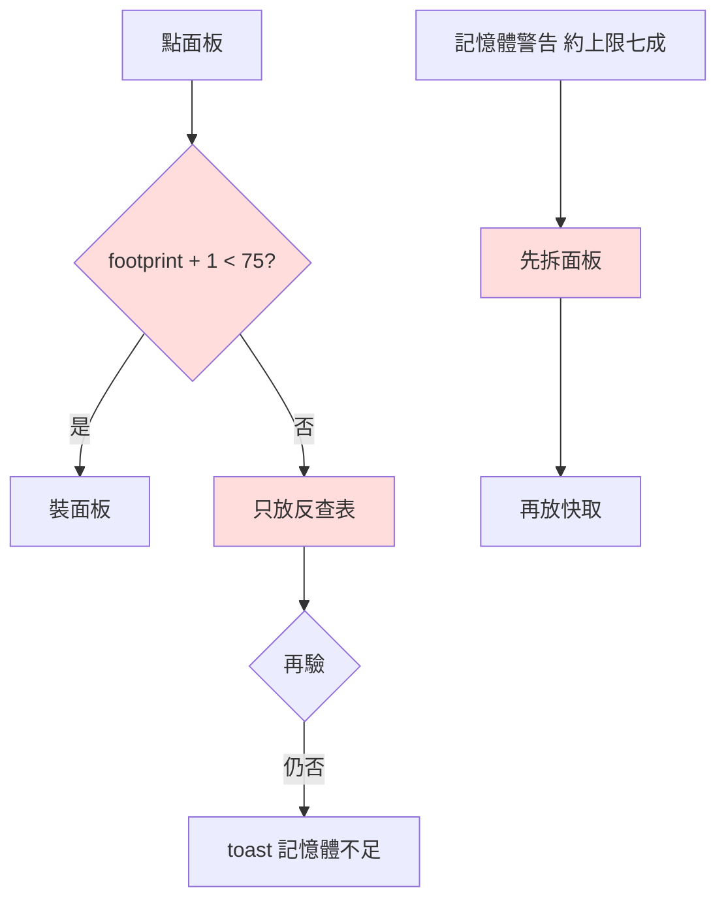
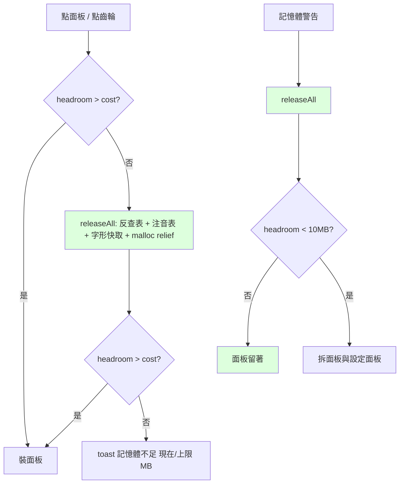

2026-09-02

# ohmybias-ios：面板「記憶體不足」誤判 — 上限改由系統現場量，拒絕前先放光快取

## 症狀

前一輪清 CoreText 字形快取（見 `ohmybias-ios-emoji-coretext-glyph-cache-drain`）之後，
使用者仍回報 emoji／符號／顏文字面板常常開不了：toast 顯示「記憶體不足，暫時無法
開啟面板」，或面板一開就被收回字母頁。

## 根因：三個都和「我們猜的數字」有關

**門檻寫死。** 所有 `MemoryBudget.canAfford` 都是 `footprint + cost < 75`。但鍵盤
extension 的 dirty memory 上限不是常數 — 依機型與 iOS 版本不同（過去在不同文件裡
出現過 60、77 兩個數字，就是各自觀察到的機器不同）。上限比 75 高的機器，面板被
白白拒絕；上限比 75 低的機器，門檻根本來不及生效，行程先被 jetsam。

**拒絕前幾乎沒釋放。** 面板路徑在拒絕前只呼叫 `cinTable.releaseOptionalCaches()`
（反查表）。CoreText 字形快取、注音表、malloc 留在堆積裡的髒頁全都沒動 — 而字形快取
才是前一輪量到的最大變動來源。

**記憶體警告先拆面板。** 警告大約在上限七成就會送到；舊的 `didReceiveMemoryWarning`
第一件事是拆掉使用者正在看的面板，然後才放快取。使用者看到的「面板一開就關」有一
部分是我們自己造成的。

## 修法

全部集中在 `Shared/MemoryBudget.swift`，鍵盤層只是改接：

- **上限現場量。** `availableMB` 用 `os_proc_available_memory()`（iOS 13+ 公開 API：
  回報離目前 dirty memory 上限還剩多少 bytes）。`limitMB = currentMB + availableMB`、
  `headroomMB = availableMB`。模擬器沒有上限（回 0）、macOS 測試沒有這個 API，
  兩者退回 `assumedLimitMB = 75` 推算 — 那些環境的行為與舊版完全一致。
- **一條釋放階梯，所有入口共用。** `makeRoom(for:cinTable:)`：夠就過；不夠先
  `releaseAll` — 反查表、注音表、`extraRelief`（controller 註冊的
  `CoreTextGlyphCache.drain`）、`malloc_zone_pressure_relief` — 再驗一次。拒絕是最後
  一步。分類面板與 ⚙ 設定面板兩個入口都改走這條。
- **警告時先放快取、再決定拆不拆。** `didReceiveMemoryWarning` 先 `releaseAll`，只有
  `isCritical`（剩餘 < 10MB）才拆面板。多數情況光放字形快取就退回安全區，面板留著。
- **toast 帶數字。** 拒絕時顯示「52 / 77 MB」— 下次使用者回報，就能直接看到那台機器
  的真實上限，不必再猜。
- `glyphCacheDrainMB` 改為 `limitMB − 30`（舊版寫死 45，等於假設上限 75）。

## 驗證與沒驗到的部分

- `Tests/run_tests.sh` 141 過 0 敗（`MemoryBudget` 在 macOS host 編譯，
  `os_proc_available_memory` 以 `#if os(iOS)` 隔開）。模擬器建置通過。
- 模擬器上 extension 閒置 45MB、`os_proc_available_memory` 回 0 → 走假設值，跟舊版
  一樣，所以模擬器**驗不出這次的差別**。真正的差別只在實機：安裝後開幾次 emoji 面板，
  若仍被拒絕，toast 上的「現在 / 上限」就是下一步的依據。
- 這次模擬器煙霧測試卡在地球鍵循環一直跳過我們的鍵盤（appex 反覆重裝後 plugin 註冊
  失效，同前 ADR 記錄的坑），面板開啟路徑只以建置確認。

## 還沒動的：FreqTracker 常駐字典

`FreqTracker` 啟動時把 freq／bigram 兩張表整份讀進 Swift Dictionary，沒有任何釋放點，
也不在 `releaseAll` 裡。長期使用者的歷史愈長、基線愈高（估計數 MB）。若實機上面板
仍被拒絕，下一步是把這兩個查詢改回直接查 SQLite（主鍵索引，每鍵一次查詢綽綽有餘），
讓這塊變成可回收的頁面快取而不是常駐堆積。
