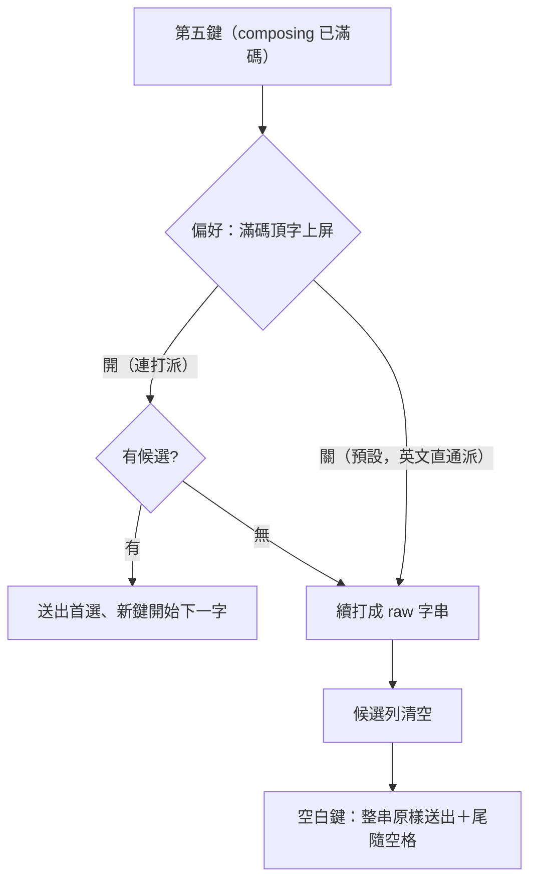

2026-08-16

# OhMyBias iOS：英文直通 vs 頂字上屏 — 改為偏好（預設關）

## 什麼壞了

英文直通上線後實測打 `weekly`，第五個字母 `l` 一按就送出了「斷」。

## 根因

`week` 恰好是有效的四碼字根，首選為「斷」。第五鍵觸發了**頂字上屏**
（上游 yabomish 的既有行為）：composing 滿碼且有候選時，下一鍵自動送出首選、
用新鍵開始下一個字 — 這是桌面嘸蝦米連打不按空白的標準行為。

英文直通先前只救了「滿碼且**無**候選」的分支；前四碼恰為有效字根的英文字
（weekly、might、there…）仍會撞上頂字上屏。兩者在鍵擊層完全同形 —
「英文字的第五個字母」和「下一個中文字的第一碼」引擎無從分辨，
這不是 bug 而是意圖歧義，只能交給使用者決定哪邊優先。

## 決定

新偏好 `overflowAutoCommit`「滿碼頂字上屏」，設定頁「輸入」區，**預設關**：

- 關（預設）：第五鍵永遠續打。手機上使用者本來就逐字按空白／點候選，
  連打不按空白的桌面習慣依賴度低；換來任何英文字都能直通。
- 開：恢復滿碼自動送出首選，給連打派 — 代價是 weekly 這類字無法直通，
  英文得用「英」鍵。

順帶修正：直通的空白送出改為 `raw + " "` — 使用者按空白既是「送出」也是
「打一個空格」，尾隨空格要一起上屏，行為才和英文模式打字一致。
副作用：打錯的無候選字碼按空白也會連空格送出 — 這是直通把「無候選」
視為「字面文字」的本質，可接受。

## 實作備忘

- 閘門在 `InputEngine.handleLetter` 的滿碼分支：`prefs.overflowAutoCommit &&
  !_currentCandidates.isEmpty` 才頂字。直通分支不再提前 return，落到
  `_refreshCandidates()` — 超長字串查無候選，候選列自然清空
  （fuzzy 比對是等長替換，超長碼也不會撈回候選），空白鍵才不會誤送舊首選。
- 測試 fixture 過去的註解寫「maxCodeLength=2」是錯的 — `CINTable` 對
  maxCodeLength 設下限 4（liu 實際值），"hello" 是靠 5 字元超長才通過測試。
  已修正註解並新增真正的四碼字根 `zzzz=龘` 驗證頂字兩態。
