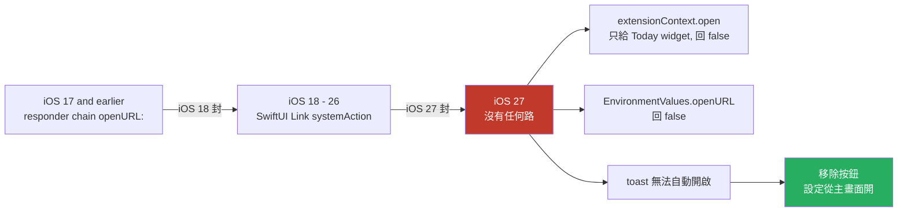

2026-09-03

# ohmybias-ios：移除 ⚙ 面板「開啟設定」按鈕 — iOS 27 起鍵盤 extension 沒有任何能開容器 app 的路

## 症狀

使用者在 iPhone 17 Pro（iOS 27）點工具列 ⚙ 面板右下角的「開啟設定」，只看到 toast
「無法自動開啟 — 請從主畫面開啟「OhMyBias 米」」。那個 toast 是三條路全部失敗才會出現的：
若 SwiftUI `Link` 的系統路徑真的成功，容器 app 已在前景，使用者根本看不到 toast。

## 根因：Apple 一代封一代，這次封到沒路了

鍵盤 extension 開自己的容器 app 從來沒有文件化的 API：

- iOS 18 封了走 responder chain 找 `openURL:` 的老路，社群（KeyboardKit 8.8.6 起）改用
  SwiftUI `Link`，靠使用者親手點擊走系統私有路徑。
- 前一輪（`ohmybias-ios-cin-import-and-open-settings`）已知 iOS 27 beta 連 `Link` 也不通，
  當時沒有裝置可驗證，所以把已知的路全走一遍再提示手動開啟。
- 這次使用者實機確認：全部失敗。查了 KeyboardKit 部落格與 Apple 論壇，2025–2026 沒有任何
  新路；KeyboardKit 走 `LSApplicationWorkspace` 私有 API 的版本也被 App Review 退件。
  趨勢是 Apple 逐版收緊，不是放寬，等 iOS 27 正式版「自己好起來」不是可行的計畫。

## 決定：整顆按鈕拿掉

考慮過依 OS 版本分流（iOS 26 以下保留 `Link`、iOS 27 起顯示說明文字），但使用者的決定是
直接移除 — 一顆在最新系統上只會跳錯誤的按鈕，留著只是誤導。

實作：

- `SettingsPanel.swift`：拿掉 `Link`、`.environment(\.openURL)` 覆寫、`onOpenSettings`
  回呼與 `ohmybias://settings` 常數；底列只剩「返回」。
- `KeyboardViewController.swift`：拿掉 `openContainerApp` 與其
  `extensionContext.open → EnvironmentValues().openURL → toast` 三段 fallback。
- `KeyboardView.swift`：`.openSettings` 動作的註解更正 — 它只負責展開 ⚙ 面板。
- 容器 app 的 `ohmybias://` scheme 仍保留（cskin 檔案關聯等仍用得到），不動。

模擬器建置兩個 target 通過；`Shared/` 沒改，引擎測試不受影響。

## 連帶影響：鍵盤 extension 裡的 SwiftUI 失去唯一存在理由

當初把 ⚙ 面板做成 SwiftUI，**只**是因為 `Link` 必須是 SwiftUI view（見
`ohmybias-ios-settings-panel-and-memory`）；19 顆 `,,` 指令鈕跟著放進同一個 hosting
controller 純粹是順便。`Link` 拿掉後，extension 裡沒有任何東西需要 SwiftUI，但首次點齒輪
仍會載入約 10MB 的 SwiftUI runtime 且永不卸載 — 在 60–77MB 的 extension 上限裡，這是
單筆最大、也是最沒道理的一項。下一步是把 ⚙ 面板改回 UIKit，讓切換輸入模式的常見操作
一毛記憶體都不多付。
