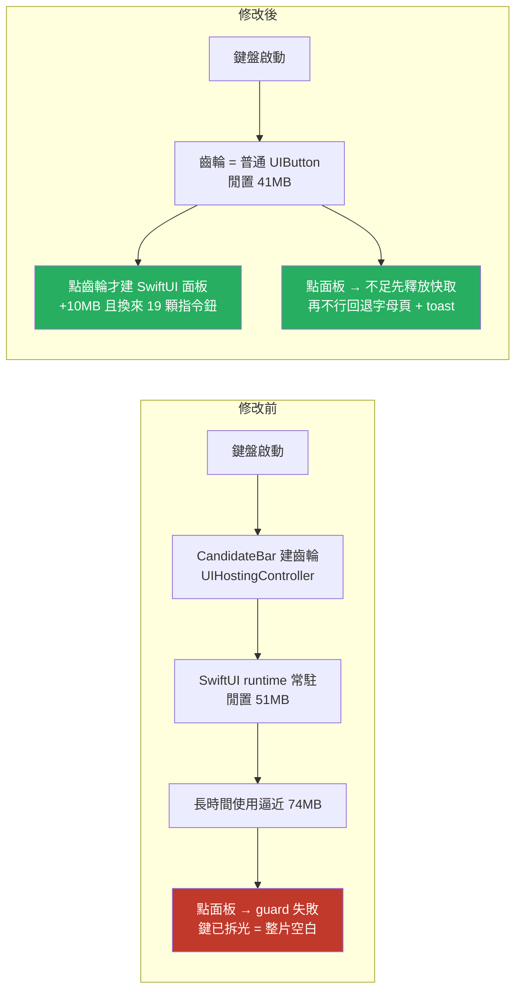
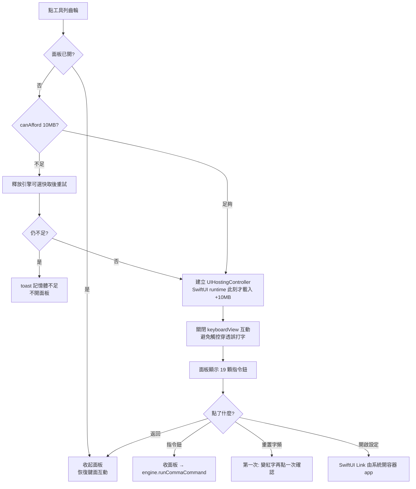

2026-08-19

# 工具列 ⚙ 展開指令面板 — 順手治好「面板偶爾一片空白」

## 從一個間歇性的 bug 開始

回報的症狀是：點工具列的符號面板、常用語（♥）、顏文字（顏）時，**有時候**鍵盤區會變成一整片空白，什麼都不顯示；但「米」模式（字母頁）永遠正常。

根因在 `KeyboardView.reloadKeys()` 的執行順序：它**第一步就把所有按鍵與舊面板從視圖樹移除**，然後才依 `currentPage` 分派。四個面板頁都走 `installPanel`，而它的第一行是

```swift
guard MemoryBudget.canAfford(MemoryBudget.collectionPanel) else { return }
```

guard 失敗就靜默 return——此時按鍵已經拆光、面板沒裝上，於是留下空白。字母頁不經過這個 guard（`letterRows()` 無條件重建），所以「米」模式永遠正常，這和回報的症狀完全吻合。

`canAfford(1)` 在 footprint ≥ 74MB 時失敗。所以真正的問題是：**為什麼一個極簡鍵盤會吃到 74MB？**

## 量測：記憶體到底花在哪

先在 macOS host 上直接編譯 `Shared/` 原始碼，配合使用者真實的 liu.cin（31596 行）逐段量 `phys_footprint`：

| 項目 | 增量 | 備註 |
|---|---|---|
| CINTable 載入 liu.bin | +8.8 MB | mmap |
| 反查表三份（reverse / shortest / longest） | +4.7 MB | 只有字根提示、注音、簡碼模式會建 |
| ZhuyinLookup（三個 JSON） | +6.4 MB | 只有注音/拼音模式會載 |
| phrases.bin 聯想 | ~0 | mmap |
| 打字 4000 字 | +3 MB | freq cache 線性成長 |

引擎側加起來遠不到 74MB，而且使用者根本沒開字根提示、也不用注音——那幾 MB 平常不會產生。

於是改量**整個 extension 行程**（模擬器實裝、真的用手指操作、`footprint` 讀 pid）：

- 鍵盤閒置：**51 MB**
- 把工具列齒輪的 `UIHostingController` 拿掉重建（實驗版）：**40 MB**
- 首次開任一分類面板：再 +6 MB，關掉**不會**歸還
- 之後反覆打字、反覆開關面板 15 輪：持平，**沒有 leak**

結論很清楚：最大單筆是**工具列那顆齒輪按鈕**。為了 iOS 18 的限制（鍵盤 extension 的 `openURL:` 被封，只剩使用者親手點 SwiftUI `Link` 能開容器 app），`CandidateBar` 用 `UIHostingController(rootView: SettingsLinkView())` 放了一顆 SwiftUI Link——這一顆按鈕把整個 SwiftUI runtime + AttributeGraph 拉進鍵盤行程，**每次鍵盤啟動、不管使用者開不開設定都付這 10MB**。

另外發現 `MemoryBudget.trimIfNeeded`（設計上 footprint > 65MB 時釋放可選快取）**整個專案沒有任何呼叫點**，快取只會一路活到行程被殺。

## 設計決定：與其省，不如換成有價值的東西

第一版方案是「兩段式齒輪」——平常是普通 UIButton，點第一下才原位換成真的 SwiftUI Link，第二下才開設定。技術上可行（實測閒置降到 41MB），但第一下對使用者而言是**空按一次**，體驗很怪。

改成現在的做法：**齒輪展開一個 SwiftUI 面板**，把原本要背指令才能用的 `,,` 系列全部做成可點的動作鈕。這樣同樣是「SwiftUI 只在需要時載入」，但第一下點擊換來的是一整頁功能，而不是一句「請再點一次」。原本的 `,,H` 說明指令因此移除——面板本身就是最好的說明，而且比說明更進一步：看到就能點。

面板內容分四組共 19 顆按鈕（輸入模式 / 查碼模式 / 剪貼簿 / 其他），每顆下方以小字標出對應指令（例如「繁體」下面是 `,,T`），順便讓使用者學會鍵盤打法。破壞性的 `,,RS 重置字頻` 用紅字顯示，且需**點兩次確認**（第一次變成「再點一次確認」）——鍵盤 extension 裡跳 alert 很彆扭，inline 兩段確認便宜又安全。

`,,UNPINx` 沒做成按鈕：它需要帶字根碼參數，不是單一動作，維持只能打字下達。



## 面板的完整控制流



引擎端新增 `InputEngine.runCommaCommand(_:)`，讓面板不必偽造組字緩衝就能執行指令——它設好 `_commaCommandBuffer` 後直接呼叫既有的 `_dispatchCommaCommand()`，所有指令行為與打字下達完全一致，不會有兩套邏輯漂移。

## 實作途中撞到的 bug：觸控穿透

第一版面板做好後，在模擬器上點面板按鈕**完全沒反應，反而在輸入框打出亂碼**（實測打出 `会>\/$好c`）。

原因是 `KeyboardView.hitTest` 有一段刻意的後援邏輯：點到按鍵之間的空隙時，找**最近的按鍵**當作命中目標（讓按鍵間距也算可點區域，手感較好）。而 SwiftUI 的 hosting view 在「沒有可命中內容」的位置，`hitTest` 會回 `nil`——觸控於是穿透下去，被 KeyboardView 的最近按鍵邏輯接走，變成打字。

修法有兩層，兩層都留著：

1. 面板開啟時 `keyboardView.isUserInteractionEnabled = false`，收起時還原——這是決定性的一層，不論 SwiftUI 的 hit-test 行為如何，觸控都不可能落到鍵面。
2. 給 hosting view 補上不透明的 `backgroundColor`。

## 驗證

引擎測試 83 過 0 敗。在乾淨的 iPhone 16 模擬器（iOS 26.4）上實測：

- 點「簡體」→ 面板收起、toast 顯示「簡中」、**輸入框沒有誤打任何字**（穿透 bug 確認修好）
- 面板可捲動至全部四組指令
- 「重置字頻」點一次變紅字「再點一次確認」，點返回可取消
- 記憶體：閒置 43–45 MB，**點開面板才升到 54 MB**

一個量測上的注意事項：SwiftUI runtime 一旦載入就不會卸載，所以收起面板後 footprint 不會退回 43MB。這是可接受的——使用者只有在真的要用這些功能時才付，而且付完通常馬上就離開鍵盤（跳去設定或切換模式）。

## 過程中的環境坑（給未來的自己）

- **模擬器反覆重裝 appex 會讓 plugin 註冊卡死**：host app 快取了舊的 plugin UUID，log 出現 `no such plugin (uuid not found)`，之後不管怎麼用地球鍵循環都會跳過該鍵盤。terminate + relaunch host app 有時可解；徹底的解法是換一台從未裝過的模擬器。最後的驗證就是在第二台（iPhone 16）上完成的。
- **`osascript` 送 Cmd+K 叫出軟體鍵盤會被擋**（error 1002），需要在「系統設定 → 隱私權與安全性 → 輔助使用」授權跑 shell 的程式。沒授權時只能靠重開模擬器等笨方法讓鍵盤重新出現。
- **`heap` / `leaks` 無法附著到模擬器內的行程**（回報 minimal corpse），但 `footprint <pid>` 可以，而且能給出 dirty/clean 的分類明細，是這次量測的主力工具。
