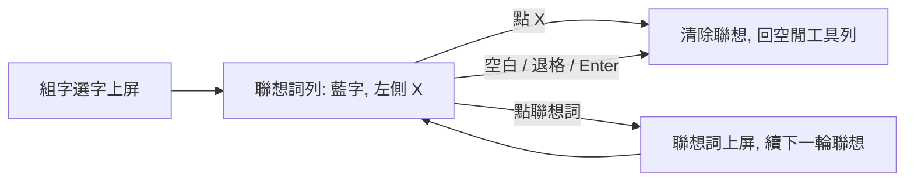

2026-08-17

# OhMyBias iOS：聯想詞列左側加 ✕ 關閉鈕

## 做什麼、為什麼

選字上屏後候選列會顯示聯想詞（藍字）。原本要關掉聯想只能「順帶」清除 — 按空白（會多送一個空格）、退格（會刪字）或 Enter（會換行），沒有一個純粹「我不要聯想」的動作。現在聯想詞顯示時，列的最左側出現一顆小 ✕，點了直接清除聯想、候選列回到空閒工具列，不動到輸入框內容。

## 怎麼做

- `CandidateBar` 新增 `dismissButton`（SF Symbol `xmark`、13pt、`textSub` 淡色）與 `onDismissSuggestions` 回呼。按鈕常駐在 composing 標籤與候選捲動區之間的約束鏈上，**平時寬度約束壓成 0 收起**（聯想顯示時撐開為 30pt、上下貼滿整條 bar 增大點擊區）— 用寬度約束而非單純 `isHidden`，因為普通 subview 的 `isHidden` 不會讓 Auto Layout 收合空間（那是 stack view 專屬行為）。
- 只在 `suggestions && !candidates.isEmpty` 時顯示：一般候選（黑字）**不**顯示 ✕ — 候選是組字狀態的一部分，不能單獨關掉。
- `KeyboardViewController` 把回呼接到既有的 `clearSuggestions()`（清 `showingSuggestions`、`engine.clearCandidates()`、`refreshIdleBar()`）— 與空白/退格/Enter 順帶清除走同一條路徑，不新增狀態。
