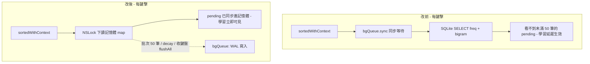

2026-08-15

# ohmybias-ios：sweetlime 效能作法移植 — 與 Android 版同步

## 背景

Android 版剛完成一輪自 sweetlime（LIME HD fork）移植的效能改造
（見 [ohmybias-android-sweetlime-perf-port](ohmybias-android-sweetlime-perf-port.md)）。
iOS 是 Android 的移植來源，兩邊程式碼幾乎逐行對應 — 同樣的坑大多也在 iOS 上，
這次把適用的部分搬回來。有趣的是 iOS 起點比 Android 好（FreqTracker 早就有
WAL、prepared statements、背景寫入 queue），但也有 iOS 才有的獨特問題。

## FreqTracker：查詢退出 SQLite、學習立即可見

iOS 版的寫入早已批次＋背景化，但**讀取**仍是每鍵擊 `bgQueue.sync` 同步等一次
SQLite SELECT（sorted/sortedWithContext 各 1–2 次）。更隱蔽的是正確性問題：
pending 紀錄只存在陣列裡、滿 50 筆才落盤，而查詢只讀 DB —
**剛學的字最多 49 筆內完全看不到**（Android 版當初用「查詢前先 flush」解掉這題，
代價是打穿批次；iOS 版則是根本沒解）。

改法與 Android 相同：三表整份載入記憶體（開檔/JSON 遷移/載入全在 bgQueue，
不佔鍵盤啟動主執行緒；查詢端 DispatchGroup 限時等待首次載入）。記憶體是即時
權威資料 — record 當下就更新，查詢純讀記憶體，兩個問題一次解決。DB 退為持久層，
批次寫入與 decay 照舊在 bgQueue；iCloud merge 後把記憶體快取自 DB 重建。

配套：`flushAll()` 定義了卻**從未被呼叫** — 未滿批次的 pending 會隨 extension
被殺而遺失（與 Android 同病）。新增 `viewWillDisappear` 收鍵盤即落盤；
flushAll 即使 pending 為空也 `bgQueue.sync` 一次，把佇列中未執行的批次一併排空。

## KeyboardTheme：iOS 特有的一坑 — dynamic UIColor 每次 resolve 重查皮膚

Android 版是「每次屬性存取解析一次」；iOS 更糟 — `pal()` 回傳的 dynamic
`UIColor` 閉包在**每次繪製 resolve** 時重查 SkinSettings＋`Scanner` 十六進位解析。
改法：建色時就把淺/深兩色解析完，閉包只依 trait 挑一個；色物件本身再依
`SkinSettings.generation`（新增，reload/apply 時遞增）整批快取。
玻璃模式的 `solid()` 壓色合成維持原樣（其閉包只剩算術）。

## 視圖層（與 Android 逐項對應）

- `viewWillAppear` 原本無條件 `reloadKeys()` → `syncSessionState()` 比對短路
  （🌐 鍵有無、Enter 標籤、皮膚世代；常用語面板停留時例外強制重讀）。
- `isEnglishMode` 改為變更時就地重建的 `didSet` — 不再依賴每次出現的無條件
  reload 事後修正殘留的 英/⇧ 鍵。`showPage` 同頁免重建。
- `CandidateBar.setCandidates` 原本每鍵擊 `removeFromSuperview` + 全新 UIButton
  → 池化重繫結、多餘隱藏備用；內容未變直接 return；`setComposing` 未變不重排。
- `DebugLog.log` 改 `@autoclosure`（Swift 零呼叫端改動），並把原本
  **每行 log 新建一個** 的 `ISO8601DateFormatter` 提成共用實例。
- 連刪/長按節奏對齊 sweetlime：0.4s 起跑、0.05s/字、長按 0.4s（原 0.5/0.08/0.45）。

## 刻意不搬的

CINTable 反查表背景預熱（Android 有搬）在 iOS **不搬** — 鍵盤 extension 有
60MB 記憶體上限，`MemoryBudget` 閘門與 lazy 載入正是為此存在；反查表首用時
現場建表的卡頓，在 iOS 是用記憶體換不起的。

## 驗證

- `Tests/run_tests.sh` 68/68 綠（Shared 引擎於 macOS host）。
- `xcodebuild` 兩 target（app + keyboard appex）模擬器建置成功。
- iPhone 16 模擬器（iOS 26.4）實測，透過真的鍵盤 extension：中英切換即時重建、
  打 `a` 出候選「對」、空白上屏兩次「對對」；收鍵盤後 App Group 的 freq.db
  出現 `a|對|2` 與 bigram `對|對|1`、`freq.db-wal` 即時更新 —
  記憶體快取、批次落盤、viewWillDisappear flush 全鏈驗證通過。
