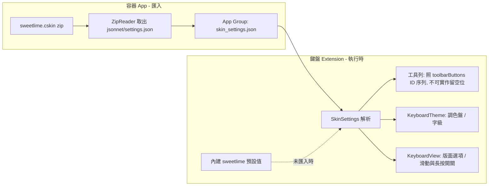

2026-08-14

# OhMyBias iOS：以 sweetlime 皮膚為藍本重構鍵盤，並支援讀取 .cskin 設定

## 這是什麼

把 Hamster 2（仓輸入法）的皮膚「蝦米輸入法」（sweetlime.cskin，作者 Ryan）當作設計規格，
整套移植到 OhMyBias iOS 鍵盤 — 不只外觀，連互動（滑動、長按、工具列、面板頁）一併實作；
並且鍵盤能**執行時讀取使用者匯入的 .cskin 設定層**，而非把設定值寫死在程式裡。

.cskin 是 zip 容器，內含 jsonnet 原始碼與 `jsonnet/settings.json`。完整的 jsonnet
鍵盤佈局編譯（每鍵 YAML）是另一個量級的工程，本次只取 settings.json 這層「配置」—
工具列按鈕序列、light/dark 調色盤、字級、版面選項 — 這正是皮膚可自訂的部分。

## 移植了什麼

- **主題層**：sweetlime 線稿風 — 淺色白鍵黑框、深色黑鍵灰框、功能鍵反白；
  調色盤與字級由 `SkinSettings` 供應，未匯入皮膚時用內建預設。
- **滑動手勢＋鍵帽角標**：上滑符號、下滑數字（角標同皮膚版面）；n/m 上滑次選/三選上屏；
  z/m 下滑句首/句尾、v 下滑貼上、b 下滑 Tab；Enter 上滑跳注音；空白上滑切中英。
  空白鍵另支援水平拖曳移動游標（同系統鍵盤手感）。
- **長按選單**：字母出大小寫＋變音變體（大寫在首位、左右半鍵盤鏡像展開）；
  逗號/句號長按插入日期時間（時間/日期/中文/民國/日本/英文/農曆/時區）—
  皮膚原本靠 Rime 腳本，這裡改用 Foundation 的 republicOfChina/japanese/chinese 曆法原生實作。
- **工具列**：照 cskin `toolbarButtons` ID 序列逐一渲染，做不到的 ID（全選、剪貼本、
  簡繁、Rime 部署等）留空白佔位；SF Symbol 圖示化並補 accessibility labels；
  語言鍵顯示目前輸入法（米/英）。依使用者決定，「全選」這個永遠不可實作的位置固定放
  ♥ 常用語面板（內容為 user_phrases.txt，點選直接上屏）。
- **新頁面**：九宮格數字、Row 半形符號頁、全形符號頁、符號/Emoji/顏文字分類面板。
  面板資料由皮膚 `collectionData.libsonnet` 以腳本轉出成 Swift 靜態表
  （符號 51 分類 3443 項、Emoji 13 分類、顏文字 16 分類），共用一個
  `CollectionPanelView`（左分類欄＋右格狀 grid）。
- **版面**：底列 `[123][,][大空白][.][⏎]` — 無大顆中英/句號鍵；123 與 shift 同寬、
  空白鍵彈性吃掉整排剩餘寬度；Enter 依 host 的 returnKeyType 顯示 搜尋/前往/送出。
- **記住上次中英模式**：存 App Group pref，鍵盤重啟時還原。

## 實作中發現的限制（設計依據）

- **iOS 18 封鎖了鍵盤 extension 開 URL 的 selector 技巧**（`openURL:` responder chain，
  KeyboardKit 亦公告此事）。⚙ 設定鍵改以 UIHostingController 內嵌 SwiftUI `Link` —
  系統允許「使用者點連結」開 URL — 成功開啟容器 app（需在 app Info.plist 註冊
  `ohmybias://` URL scheme）。
- **iOS 鍵盤 extension 沒有文字選取 API**：皮膚的全選/複製/剪下按鈕與滑動動作無法移植，
  一律空位；貼上可行（讀 UIPasteboard，需完整取用權限）。
- **鍵盤頂端的圓角灰色 chrome 帶畫在 host app process**，extension 的 window 樹
  （_UIHostedWindow 以下每一層）塗色、清 effect、藏 shadow view 都影響不到。
  嘗試過整棵 window 樹掃描塗色與向上溢出覆蓋，皆無效，已全數回退。
  可能的正路是讓 root view 背景透明、透出與 chrome 同材質的系統鍵盤 blur（未實作）。
- **UIStackView 逐顆加約束會漏掉每排第一顆鍵**（加入當下排內還沒有單位寬基準鍵），
  導致行首加寬鍵一直以內容寬度渲染 — 這是 123 鍵看起來過寬的真正原因。
  改為整排建完後統一套約束，並讓有空白鍵的排以「上一排的單位鍵寬」為跨排基準、
  空白鍵不設寬度約束吃掉剩餘空間。

## 驗證

Shared 引擎測試 61/61 通過（新增 SkinSettings 解析、setEnglishMode 冪等）；
ZipReader 以真實 sweetlime.cskin 在 macOS host 驗證解出 settings.json；
iPhone 16 模擬器實測：打碼上屏、滑動、長按氣泡、工具列各鍵、♥ 面板、⚙ 開 app、
匯入皮膚後工具列照檔案序列渲染（全選位置空、無 ♥ — 忠於檔案內容）。
